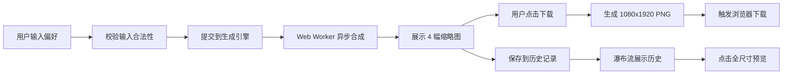

## 1. 产品概述

个性化壁纸生成器是一款基于用户偏好自动生成海报级数字艺术壁纸的 Web 应用。解决普通用户难以快速获得高质量、定制化数字艺术品壁纸的痛点，让每个人都能轻松创造专属视觉作品。

- 目标用户：设计爱好者、普通网民、内容创作者
- 核心价值：通过简单的偏好输入，秒级生成 4 种构图的定制化壁纸，支持下载和历史管理

## 2. 核心功能

### 2.1 功能模块

1. **偏好输入面板**：HSL 色环选取器、关键词输入（1-3 个）、风格选择下拉菜单
2. **壁纸生成网格**：4 列缩略图展示、骨架屏加载动画、下载按钮交互
3. **历史记录面板**：瀑布流布局、悬停放大效果、点击预览
4. **全尺寸预览器**：缩放（0.5x-3x）、拖拽平移

### 2.2 页面详情

| 页面名称 | 模块名称 | 功能描述 |
|-----------|-------------|---------------------|
| 主页 | 导航栏 | 应用标题、清空历史按钮、渐变色背景 |
| 主页 | 输入面板 | HSL 色环选色、关键词输入、风格选择、提交按钮 |
| 主页 | 预览网格 | 4 幅缩略图、骨架屏动画、下载按钮（加载态/完成态） |
| 主页 | 历史面板 | 瀑布流布局（最多 30 条）、悬停放大、点击预览 |
| 主页 | 预览弹窗 | 全尺寸图片、滚轮缩放、鼠标拖拽平移 |

## 3. 核心流程

用户选择主色调 → 输入 1-3 个关键词 → 选择艺术风格 → 点击提交 → 系统异步生成 4 幅壁纸 → 用户点击下载获取全尺寸 PNG → 历史记录自动保存 → 可随时查看历史作品

## 4. 用户界面设计

### 4.1 设计风格

- **主题**：深色科技风
- **主背景**：#0d1117
- **卡片背景**：#161b22
- **边框色**：#30363d（1px 实线）
- **圆角**：8px
- **卡片内边距**：16px
- **强调色**：用户动态选择的主色调
- **导航栏**：从 #0d1117 到 #161b22 的线性渐变，高度 56px
- **清空按钮文字色**：#f85149
- **字体**：现代无衬线字体，层级清晰
- **动效**：所有交互 0.2s 平滑过渡；骨架屏 1.2s 循环动画
- **布局比例**：主预览区 70%，历史面板 30%，中间 1px 实线分隔

### 4.2 页面设计概览

| 页面名称 | 模块名称 | UI 元素 |
|-----------|-------------|-------------|
| 主页 | 导航栏 | 渐变背景、标题文字、清空按钮 |
| 主页 | 输入面板 | HSL 圆形色环（显示十六进制值）、关键词标签输入、风格下拉、提交按钮 |
| 主页 | 预览网格 | 4 列布局、300x500px 缩略图、骨架屏（3 个 #e0e0e0→#f5f5f5 渐变块横向移动）、下载按钮 |
| 主页 | 历史面板 | 瀑布流（列宽 200px、间距 20px）、悬停 scale(1.1) 过渡 0.3s |
| 主页 | 预览弹窗 | 居中显示、滚轮缩放、拖拽平移、关闭按钮 |

### 4.3 响应式设计

- **桌面端**（≥768px）：左右布局，主内容 70% + 历史面板 30%
- **移动端**（<768px）：上下布局，历史面板移至底部，高度 260px，横向滚动

## 5. 性能要求

- 4 幅壁纸生成总耗时 ≤ 8 秒
- 使用 Web Worker 进行图像合成，避免阻塞主线程
- 主线程帧率保持 ≥ 55 FPS
