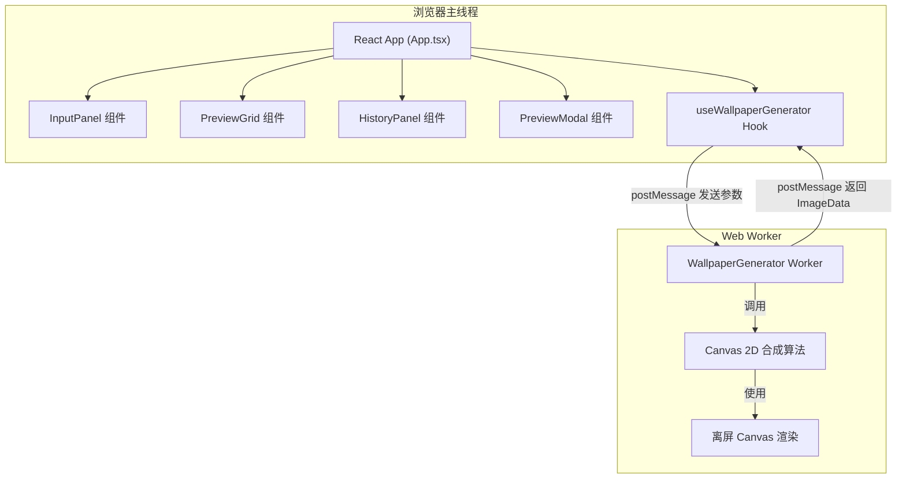

## 1. 架构设计



## 2. 技术描述

- **前端框架**：React 18 + TypeScript
- **构建工具**：Vite
- **图形渲染**：原生 Canvas 2D API + Web Worker
- **状态管理**：React useReducer
- **路径别名**：@ 指向 src 目录
- **开发端口**：5173
- **不使用**：任何外部 UI 组件库、图像处理库

## 3. 目录结构

```
e:\solo\VersionFast\tasks\auto100\
├── index.html
├── package.json
├── vite.config.js
├── tsconfig.json
└── src/
    ├── main.tsx
    ├── App.tsx
    ├── hooks/
    │   └── useWallpaperGenerator.ts
    ├── workers/
    │   └── wallpaperGenerator.worker.ts
    ├── components/
    │   ├── InputPanel.tsx
    │   ├── PreviewGrid.tsx
    │   ├── HistoryPanel.tsx
    │   └── PreviewModal.tsx
    ├── utils/
    │   ├── colorUtils.ts
    │   └── iconLibrary.ts
    └── types/
        └── index.ts
```

## 4. 核心数据类型

```typescript
interface UserPreferences {
  primaryColor: string;      // HEX 格式
  keywords: string[];        // 1-3 个关键词
  style: 'abstract' | 'cyberpunk' | 'minimal' | 'ukiyoe';
}

interface WallpaperItem {
  id: string;
  thumbnailData: ImageData;  // 300x500
  fullDataUrl: string;       // 1080x1920 PNG data URL
  preferences: UserPreferences;
  createdAt: number;
}

interface AppState {
  preferences: UserPreferences;
  isGenerating: boolean;
  wallpapers: WallpaperItem[];
  history: WallpaperItem[];
  previewItem: WallpaperItem | null;
}
```

## 5. 壁纸生成算法说明

### 5.1 抽象几何风格
- 基于主色调生成 HSL 色彩变体
- 随机生成 3+ 层多边形（5-8 个顶点）
- 填充透明度 0.3-0.7
- 边框 1px 实线，亮度 +20%
- 叠加匹配关键词的 SVG 图标

### 5.2 赛博朋克风格
- 霓虹渐变网格（#00f0ff → #ff00ff）
- 网格倾斜 15°，线宽 2px
- 故障效果：随机 5% 像素偏移 3px
- 主色调发光效果叠加

### 5.3 极简风格
- 大面积主色调渐变背景
- 1-2 个核心几何元素居中
- 关键词文字排版点缀

### 5.4 浮世绘风格
- 波浪纹理线条（基于主色调）
- 层叠远山剪影
- 关键词印章效果

## 6. Web Worker 通信协议

```typescript
// 主线程 → Worker
interface GenerateRequest {
  type: 'generate';
  preferences: UserPreferences;
  thumbnailSize: { width: 300; height: 500 };
  fullSize: { width: 1080; height: 1920 };
  seed: number;
}

// Worker → 主线程
interface GenerateResponse {
  type: 'result';
  thumbnails: ImageData[];      // 4 张
  fullDataUrls: string[];       // 4 张 PNG
}
```
