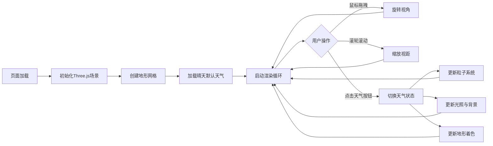

## 1. 产品概述

基于Three.js的3D交互式天气沙盘，在浏览器中创建动态微型地形场景，模拟晴天、雨天、雪天和风暴四种天气的实时切换与粒子效果。适用于气象科普展示或游戏环境预览。

- 核心功能：3D地形渲染、四种天气粒子系统、动态光照与着色、视角交互控制
- 目标用户：气象科普爱好者、游戏开发者、教育工作者

## 2. 核心功能

### 2.1 功能模块

1. **3D地形模块**：100x100单位网格平面，中心随机隆起山丘（峰值约8单位），天气驱动的动态着色
2. **天气粒子系统**：晴天光点、雨天雨滴、雪天雪花、风暴强风粒子群
3. **环境光照系统**：随天气变化的平行光、环境光、点光源、频闪光
4. **交互控制模块**：鼠标拖拽旋转视角、滚轮缩放观察
5. **用户界面模块**：天气切换按钮、实时信息面板、操作提示

### 2.2 功能详情

| 模块名称 | 子功能 | 功能描述 |
|---------|--------|---------|
| 地形模块 | 网格生成 | 100x100单位平面，中心山丘高度随机（峰值约8） |
| 地形模块 | 动态着色 | 晴天草绿(#7ec850)、雨天泥褐(#8b7d5a)、雪天白色(#f0f0f0)、风暴深灰(#4a4a4a)，0.8秒渐变过渡 |
| 粒子系统 | 晴天 | 300个飘浮光点（#ffeaa7，直径0.2，周期4-6秒上下浮动） |
| 粒子系统 | 雨天 | 2000根雨滴（#74b9ff，长1.5半径0.03，速度12u/s，重力15u/s²，风偏5°） |
| 粒子系统 | 雪天 | 1500个雪花（#ffffff，直径0.3-0.6，速度3u/s，左右飘摆幅度1，周期2s） |
| 粒子系统 | 风暴 | 4000雨滴（速度20u/s，风偏15°）+30个旋风粒子环绕边缘 |
| 光照系统 | 晴天 | 强平行光(#fff5d1，强度1.2，阴影1024x1024) + 天空渐变(#87ceeb→#ffffff) |
| 光照系统 | 雨天 | 柔和环境光(#a0b8d0，强度0.6) + 上方点光源(半径50，强度0.8) + 背景(#6b8e9e) |
| 光照系统 | 雪天 | 冷色环境光(#c8d8e8，强度0.4) + 双侧向点光 + 背景(#dcdde1) |
| 光照系统 | 风暴 | 暗红环境光(#4a2e2e，强度0.3) + 频闪光(0.2-0.8随机，10Hz) + 背景(#2d3436) |
| 交互模块 | 视角控制 | 鼠标拖拽旋转、滚轮缩放 |
| 界面模块 | 天气面板 | 左上角半透明面板(rgba(0,0,0,0.3)，圆角12px)，四个主题色按钮 |
| 界面模块 | 信息面板 | 右侧显示粒子数量和FPS（#eee，14px） |
| 界面模块 | 操作提示 | 底部居中提示文字（#aaa，12px，透明度0.7，3秒后渐隐） |

## 3. 核心流程

用户打开页面 → 加载3D场景与默认晴天效果 → 鼠标拖拽/缩放观察地形 → 点击天气按钮切换 → 粒子系统和光照平滑过渡 → 实时查看FPS和粒子数

## 4. 用户界面设计

### 4.1 设计风格

- 主色调：跟随天气动态变化（晴天#fdcb6e、雨天#74b9ff、雪天#dfe6e9、风暴#636e72）
- 按钮风格：圆角矩形，悬浮上浮2px+阴影，点击0.1秒缩放动画
- 字体：无衬线字体，信息面板#eee 14px，提示#aaa 12px
- 布局：全屏Canvas覆盖，UI组件浮动叠加
- 整体氛围：沉浸式3D场景，半透明玻璃拟态UI面板

### 4.2 页面设计

| 区域 | 模块 | UI元素 |
|------|------|--------|
| 全屏 | 3D场景 | Three.js Canvas，地形+粒子+光照 |
| 左上角 | 控制面板 | 半透明黑底圆角面板，四个天气按钮横向排列 |
| 右侧 | 信息面板 | 粒子数量统计、FPS实时显示 |
| 底部居中 | 操作提示 | "拖拽旋转视角 滚轮缩放"，3秒后渐隐 |

### 4.3 响应式

- 全屏Canvas自适应窗口尺寸，监听resize事件实时更新相机和渲染器
- UI面板使用固定定位，不随窗口变化而错位
- 按钮尺寸固定（60x30px），保证触控区域足够

### 4.4 3D场景设计

- 环境：半球光模拟天空盒渐变，背景色随天气切换
- 光照：每种天气独立光照配置，开启阴影映射
- 相机：PerspectiveCamera，初始位置(60, 50, 60)，看向原点
- 交互：OrbitControls实现拖拽旋转和滚轮缩放
- 性能：粒子数≤4000，目标帧率≥55fps，天气切换1秒内完成
