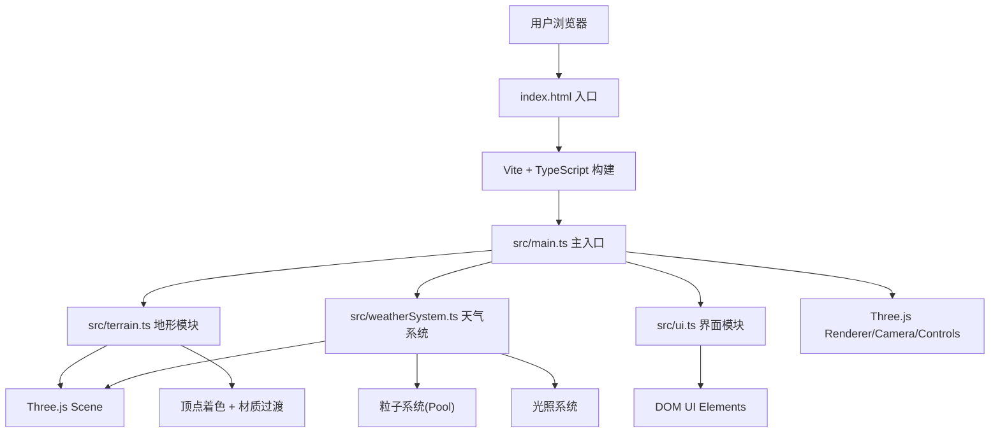

## 1. 架构设计



## 2. 技术说明

- 前端框架：原生 TypeScript + Three.js (无React/Vue，用户明确指定文件拆分)
- 构建工具：Vite 5.x
- 语言标准：TypeScript 严格模式，target ES2020，module ESNext
- 3D引擎：three@0.160.x + @types/three
- 交互控制：OrbitControls（three/examples/jsm/controls/OrbitControls）

## 3. 文件结构

```
auto102/
├── package.json
├── vite.config.js
├── tsconfig.json
├── index.html
└── src/
    ├── main.ts          # 场景初始化、渲染循环、事件绑定
    ├── terrain.ts       # 地形网格创建、动态着色
    ├── weatherSystem.ts # 粒子系统、光照管理、天气切换
    └── ui.ts            # DOM界面、按钮、信息面板
```

## 4. 模块接口定义

### 4.1 terrain.ts

```typescript
export interface TerrainSystem {
  mesh: THREE.Mesh;
  update: (delta: number) => void;
  setWeatherColor: (targetColor: string, duration?: number) => void;
  dispose: () => void;
}

export function createTerrain(): TerrainSystem;
```

### 4.2 weatherSystem.ts

```typescript
export type WeatherType = 'sunny' | 'rainy' | 'snowy' | 'stormy';

export interface WeatherInfo {
  particleCount: number;
  name: string;
  nameCN: string;
}

export interface WeatherSystem {
  root: THREE.Group;
  switchWeather: (type: WeatherType, duration?: number) => Promise<void>;
  update: (delta: number, elapsed: number) => void;
  getCurrentWeather: () => WeatherType;
  getWeatherInfo: () => WeatherInfo;
  dispose: () => void;
}

export function createWeatherSystem(scene: THREE.Scene): WeatherSystem;
```

### 4.3 ui.ts

```typescript
export type WeatherChangeHandler = (type: WeatherType) => void;

export interface UISystem {
  setWeatherName: (name: string) => void;
  updateStats: (particleCount: number, fps: number) => void;
  dispose: () => void;
}

export function createUI(onWeatherChange: WeatherChangeHandler): UISystem;
```

## 5. 性能策略

- **粒子对象池**：预分配最大粒子数(4000)，切换时复用mesh而非销毁重建
- **InstancedMesh**：同类粒子(雨滴、雪花、光点)使用InstancedMesh减少Draw Call
- **颜色插值**：使用THREE.Color.lerp在0.8秒内平滑过渡地形颜色
- **材质复用**：粒子系统共享材质，仅更新uniform或矩阵
- **帧率监控**：requestAnimationFrame计时计算FPS，实时显示

## 6. 天气数据配置

```typescript
const WEATHER_CONFIG = {
  sunny: {
    terrainColor: '#7ec850',
    bgColor: '#87ceeb',
    ambientColor: '#fff5d1',
    particleCount: 300,
  },
  rainy: {
    terrainColor: '#8b7d5a',
    bgColor: '#6b8e9e',
    ambientColor: '#a0b8d0',
    particleCount: 2000,
  },
  snowy: {
    terrainColor: '#f0f0f0',
    bgColor: '#dcdde1',
    ambientColor: '#c8d8e8',
    particleCount: 1500,
  },
  stormy: {
    terrainColor: '#4a4a4a',
    bgColor: '#2d3436',
    ambientColor: '#4a2e2e',
    particleCount: 4030,
  },
} as const;
```
