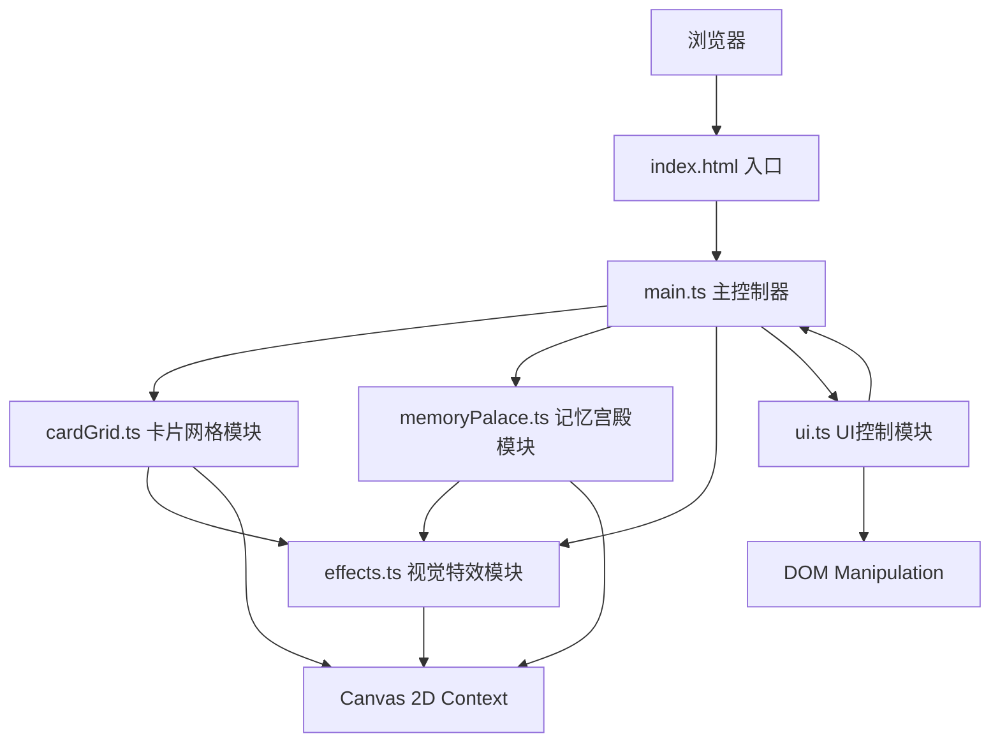
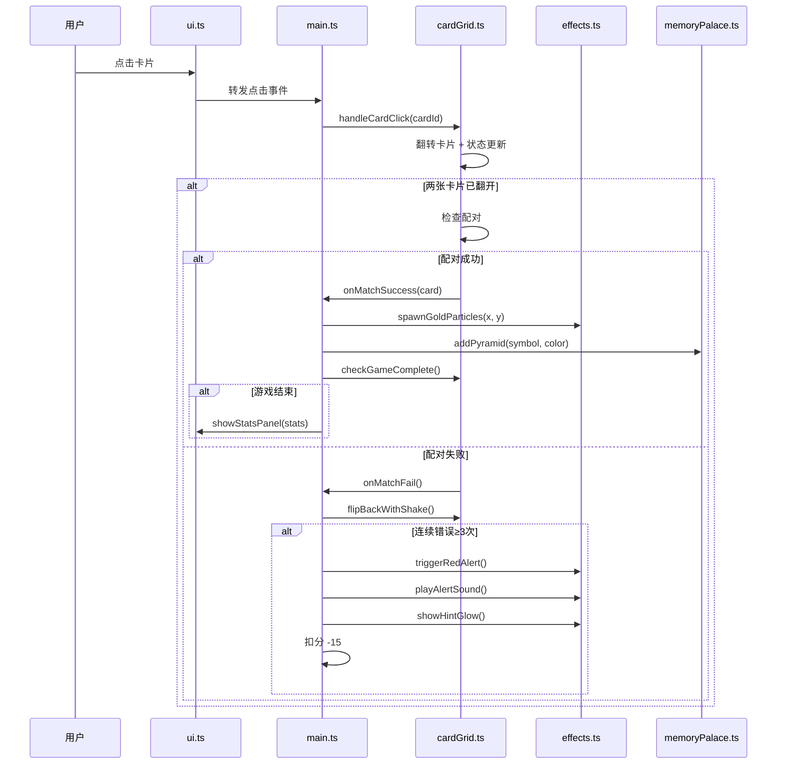

## 1. 架构设计



## 2. 技术描述

- **前端框架**：无框架（原生 TypeScript），按用户要求使用原生 Canvas + DOM
- **构建工具**：Vite 5.x
- **编程语言**：TypeScript 5.x（严格模式，target ES2020，module ESNext）
- **渲染方式**：
  - 卡片、UI面板：DOM + CSS3（3D变换、动画）
  - 粒子特效、三棱锥、统计图表：原生 Canvas 2D API
- **音频**：Web Audio API（警报音生成、背景音乐播放）
- **后端**：无（纯前端项目）

## 3. 文件结构定义

| 文件路径 | 职责描述 |
|----------|----------|
| `package.json` | 项目依赖配置（typescript, vite），启动脚本 |
| `vite.config.js` | Vite 基础配置（输出 dist，端口 5173，开启 HMR） |
| `tsconfig.json` | TypeScript 配置（严格模式，ES2020，ESNext） |
| `index.html` | 入口 HTML，完整 DOM 结构，背景色 #111 |
| `src/main.ts` | 入口文件：游戏循环、事件绑定、Canvas 上下文初始化 |
| `src/cardGrid.ts` | 卡片网格管理：翻转、配对逻辑、状态机 |
| `src/memoryPalace.ts` | 记忆宫殿渲染：三棱锥生成、飘移、碰撞检测 |
| `src/effects.ts` | 视觉特效：粒子爆炸、红色闪烁、光环提示 |
| `src/ui.ts` | UI 控制：设置面板、统计面板、齿轮按钮 |

## 4. 核心数据模型

### 4.1 卡片数据结构

```typescript
interface Card {
  id: number;
  symbol: string;       // Unicode 符号或自定义标识
  colorIndex: number;   // 对应颜色索引 0-9
  isFlipped: boolean;   // 是否翻开
  isMatched: boolean;   // 是否已配对
  gridX: number;        // 网格X位置
  gridY: number;        // 网格Y位置
  element: HTMLElement; // DOM元素引用
}
```

### 4.2 游戏状态

```typescript
interface GameState {
  cards: Card[];
  gridCols: number;
  gridRows: number;
  firstCard: Card | null;
  secondCard: Card | null;
  isChecking: boolean;
  matchCount: number;
  errorCount: number;
  consecutiveErrors: number;
  startTime: number;
  matchTimes: number[];  // 每次配对用时
  lastMatchTime: number;
  matchInterval: number; // 当前配对间隔（3s→1s递减）
  totalScore: number;
  hintUsed: number;
  difficulty: 'easy' | 'normal' | 'hard';
}
```

### 4.3 三棱锥数据

```typescript
interface Pyramid {
  id: number;
  x: number;
  y: number;
  vx: number;
  vy: number;
  rotation: number;
  rotationSpeed: number;
  color: string;
  symbol: string;
  size: number;
}
```

### 4.4 粒子数据

```typescript
interface Particle {
  x: number;
  y: number;
  vx: number;
  vy: number;
  life: number;
  maxLife: number;
  color: string;
  size: number;
}
```

## 5. 模块间数据流



## 6. 性能优化策略

- **Canvas 渲染优化**：使用 requestAnimationFrame 统一渲染循环，脏矩形区域重绘
- **DOM 动画优化**：CSS 3D 变换启用 GPU 加速（transform: translateZ(0)）
- **内存管理**：粒子生命周期结束后及时回收，三棱锥对象池复用
- **帧率监控**：目标 55fps+，卡片翻转和粒子特效不得卡顿
- **事件委托**：卡片网格使用事件委托减少监听器数量
