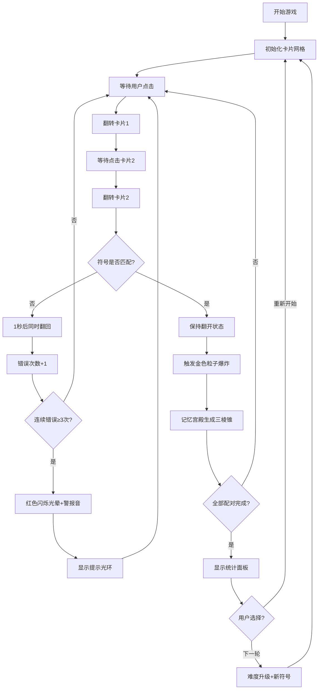

## 1. 产品概述

记忆宫殿元素配对训练应用——通过沉浸式视觉记忆法提升用户短期记忆力的训练工具。核心玩法是将抽象符号与随机几何图案进行配对，通过逐步增加难度来锻炼大脑的记忆能力和反应速度。

- 目标用户：希望提升短期记忆力、专注力和大脑反应速度的普通用户
- 产品价值：将枯燥的记忆力训练转化为沉浸式的游戏体验，通过视觉化的"记忆宫殿"概念让用户建立空间记忆联结

## 2. 核心功能

### 2.1 用户角色

| 角色 | 注册方式 | 核心权限 |
|------|----------|----------|
| 普通用户 | 无需注册，直接进入 | 完整游戏体验、设置调整、成绩统计查看 |

### 2.2 功能模块

1. **游戏主界面**：4x4/5x4/6x6卡片网格、翻转交互、配对逻辑
2. **统计面板**：评分计算、总耗时、正确率、平均反应时间、难度曲线图
3. **记忆宫殿可视化**：三棱锥漂浮动画、碰撞检测、符号标签展示
4. **设置控制面板**：卡片尺寸、背景音乐、难度级别调节
5. **视觉特效系统**：粒子爆炸、红色闪烁警报、光环提示、卡片翻转动画

### 2.3 页面详情

| 页面名称 | 模块名称 | 功能描述 |
|----------|----------|----------|
| 主游戏页 | 卡片网格 | 展示16/20/36张卡片，支持3D翻转动画，配对逻辑判断 |
| 主游戏页 | 记忆宫殿区 | 右侧/底部区域，展示配对成功的三棱锥漂浮群 |
| 主游戏页 | 设置齿轮 | 右下角悬浮按钮，点击打开设置面板 |
| 统计面板 | 成绩展示 | 0-100分评分、耗时、正确率、平均反应时间 |
| 统计面板 | 难度曲线图 | Canvas绘制折线图，展示每次配对耗时 |
| 统计面板 | 操作按钮 | 重新开始、下一轮难度升级 |
| 设置面板 | 卡片尺寸 | 小/中/大三档切换（40px/56px/72px） |
| 设置面板 | 背景音乐 | 开关控制 + 音量滑块（0-100） |
| 设置面板 | 难度级别 | 简单(4x4)/普通(5x4)/困难(6x6) |

## 3. 核心流程

用户进入游戏 → 卡片全部背面朝上 → 点击翻转第一张卡片 → 点击翻转第二张卡片 → 判断是否配对 → 配对成功：保持翻开+金色粒子+记忆宫殿生成三棱锥 → 配对失败：1秒后翻回+轻微颤动 → 全部配对完成 → 显示统计面板 → 选择重新开始或下一轮升级

## 4. 用户界面设计

### 4.1 设计风格

- **主色调**：深空蓝 #0d1117 → #16213e 径向渐变背景
- **强调色**：#55ddff（交互元素主色），悬停变亮 #77eeff
- **卡片背面**：深蓝 #1a2332，带微弱星点闪烁动画
- **毛玻璃效果**：backdrop-filter: blur(8px)，背景半透明白色 0.05
- **按钮反馈**：点击缩放到 95%，0.1s 过渡动画
- **字体**：现代无衬线字体，数字使用等宽字体

### 4.2 页面设计概述

| 页面名称 | 模块名称 | UI元素 |
|----------|----------|--------|
| 主游戏页 | 卡片网格 | 居中布局，间距12px，圆角12px，3D翻转动画0.6s |
| 主游戏页 | 记忆宫殿区 | 占宽30%（最小300px），<768px折叠到下方占40%高 |
| 主游戏页 | 齿轮按钮 | 右下角固定，悬浮旋转360°/2s，#55ddff 图标色 |
| 统计面板 | 数据卡片 | 毛玻璃背景，数据突出显示，曲线图透明背景 |
| 统计面板 | 折线图 | Canvas绘制，线条色 #55ddff，点半径3px |
| 设置面板 | 控制面板 | 浮动弹窗，缩放+淡出动画0.25s，右上角关闭按钮 |

### 4.3 响应式设计

- **桌面端（≥768px）**：卡片网格居左，记忆宫殿区居右（30%宽）
- **移动端（<768px）**：记忆宫殿区折叠到卡片网格下方，占全宽40%高度，卡片网格等比例缩小
- **适配范围**：320px ~ 1920px 宽度全覆盖

### 4.4 视觉特效详细规格

- **卡片翻转**：CSS 3D变换，backface-visibility，时长0.6s
- **配对成功粒子**：30粒子，扩散半径120px，生命周期1.2s，金色
- **配对失败**：1秒后翻回，卡片轻微颤动动画
- **连续错误警报**：红色光晕从中心扩散到视口50%宽，透明度0.6→0，周期1s重复3次 + 800Hz锯齿波0.2s警报音
- **提示光环**：淡蓝色脉动光环围绕卡片，周期0.8s，持续3s
- **三棱锥**：棱长30px，10种预设色，0.2rad/s自转，5px/s飘移速度，边界反弹，间距≥40px
