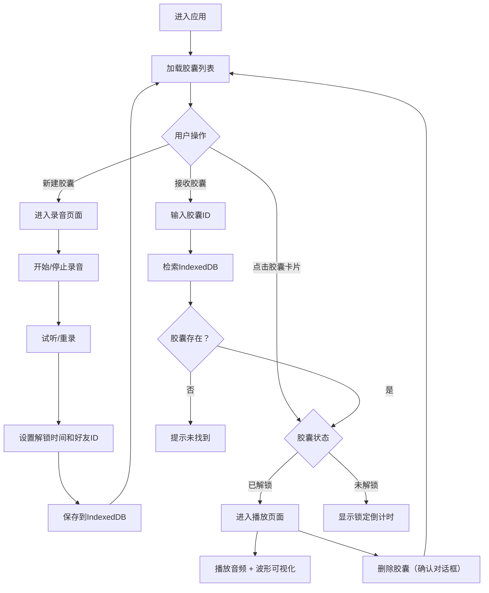

## 1. 产品概述

时间胶囊是一款基于浏览器WebRTC和本地存储的多人异步录音留言应用，用户可以录制音频消息并将其封装成数字时间胶囊，设定未来某个时间解锁后分享给指定好友收听。

- 核心价值：为用户提供一种富有仪式感的异步沟通方式，让声音在指定时间被"寄往"未来
- 目标用户：希望给未来的朋友或自己留下声音纪念的用户群体
- 解决问题：传统即时通讯缺乏时间维度的仪式感，而邮件又缺少声音的温度

## 2. 核心功能

### 2.1 用户角色
| 角色 | 注册方式 | 核心权限 |
|------|---------|---------|
| 普通用户 | 无需注册，直接使用 | 录制胶囊、查看胶囊列表、播放已解锁胶囊、删除胶囊、接收分享胶囊 |

### 2.2 功能模块
1. **胶囊列表页**：导航栏、胶囊卡片网格、新建胶囊入口、接收胶囊入口
2. **录音封装页**：录音控制、实时波形显示、试听重录、解锁时间设置、好友ID输入
3. **播放详情页**：锁定状态展示、解锁后播放、波形可视化、进度条、删除功能

### 2.3 页面详情
| 页面名称 | 模块名称 | 功能描述 |
|---------|---------|----------|
| 胶囊列表页 | 导航栏 | 应用名称、新建胶囊按钮、接收胶囊按钮（毛玻璃效果） |
| 胶囊列表页 | 胶囊卡片网格 | 3列网格布局，展示所有胶囊，响应式适配 |
| 胶囊列表页 | 接收胶囊输入框 | 输入胶囊ID，检索并播放/显示锁定状态 |
| 录音封装页 | 录音控制区 | 圆形录音按钮（80px）、录音状态指示、60秒时长限制 |
| 录音封装页 | 波形显示区 | Canvas实时绘制录音波形（#6c63ff，透明背景，120px高） |
| 录音封装页 | 提交表单区 | 日期时间选择器（精确到分钟，≥当前30分钟）、好友ID输入（3-20字符） |
| 播放详情页 | 锁定状态区 | 锁定图标、倒计时、剩余时间显示 |
| 播放详情页 | 播放控制区 | 耳机图标（呼吸动画）、圆形播放/暂停按钮、进度条 |
| 播放详情页 | 波形可视化区 | Web Audio AnalyserNode频率柱状图（64柱，渐变色） |
| 播放详情页 | 删除确认对话框 | 背景模糊、确认删除（#f50057）/取消（#6c63ff）按钮 |

## 3. 核心流程

用户进入应用后，首先看到胶囊列表页面。用户可以选择创建新胶囊或通过ID接收胶囊。创建胶囊时录制音频→设置解锁时间→输入好友ID→保存到IndexedDB。列表中点击胶囊卡片，若已解锁则进入播放页面，若未解锁则显示锁定倒计时。好友通过分享的ID可以检索并在解锁后收听。

## 4. 用户界面设计

### 4.1 设计风格
- 主色调：紫罗兰 #6c63ff
- 辅色调：玫红 #f50057
- 背景：径向渐变 #0d0d2b → #1a1a4e
- 文字：白色
- 卡片背景：#1a1a4e，圆角 12px
- 按钮风格：圆形为主，圆角过渡，悬停缩放效果
- 字体：Inter
- 图标风格：Lucide React 线性图标

### 4.2 页面设计概览
| 页面名称 | 模块名称 | UI元素 |
|---------|---------|--------|
| 胶囊列表页 | 导航栏 | 高度64px，半透明毛玻璃 backdrop-filter: blur(10px)，左对齐标题，右对齐两个按钮 |
| 胶囊列表页 | 胶囊卡片 | 3:2宽高比，好友ID（前8位+省略号），倒计时，状态图标（锁/解锁），悬停上移4px+阴影 |
| 录音封装页 | 录音按钮 | 直径80px圆形，#f50057，录音时0.5秒闪烁动画 |
| 播放详情页 | 耳机图标 | 80x80px，#6c63ff，2秒周期呼吸缩放动画 |
| 播放详情页 | 播放按钮 | 直径60px圆形，#6c63ff，悬停缩放1.1倍，点击切换播放/暂停图标 |
| 播放详情页 | 进度条 | 高度4px，填充#6c63ff，背景#333366 |

### 4.3 响应式设计
- 桌面端优先（≥768px）：3列网格
- 平板端（<768px）：2列网格
- 移动端（<480px）：1列网格
- 卡片内文字最小12px，自适应缩放
- 触摸设备：取消hover效果，保留tap反馈（点击缩小0.95倍）
- 所有交互动画：0.2秒 ease-out 过渡

### 4.4 动效设计
- 录音按钮闪烁：0.5秒周期，透明度0.5-1交替
- 耳机图标呼吸：2秒周期，缩放0.9-1.1交替
- 卡片悬停：上移4px + box-shadow 深度0.3
- 按钮点击：缩放0.95倍
- 解锁倒计时：实时更新
- 波形可视化：30fps以上流畅绘制
