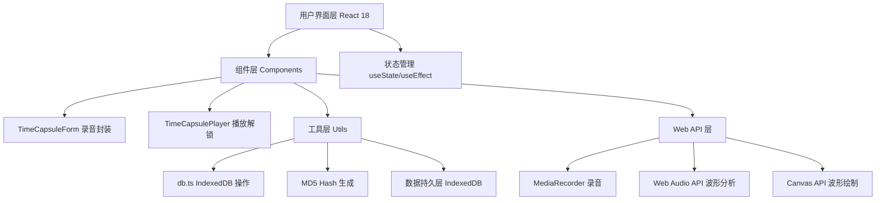
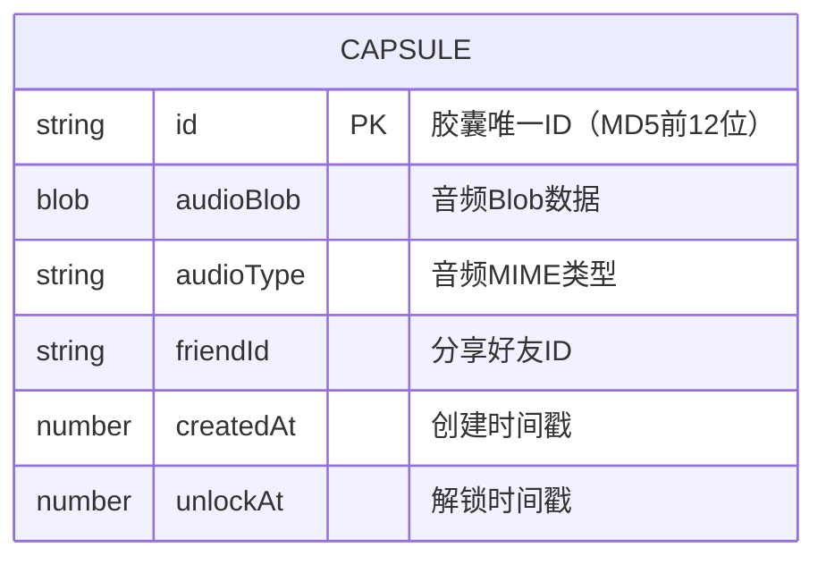

## 1. 架构设计



## 2. 技术描述

- 前端框架：React 18 + TypeScript 5
- 构建工具：Vite 5 + @vitejs/plugin-react
- 数据库：浏览器 IndexedDB（timeCapsuleDB）
- 图标库：lucide-react
- 状态管理：React useState/useEffect（轻量级场景无需额外状态库）
- 音频处理：MediaRecorder API + Web Audio API (AnalyserNode)
- 数据可视化：Canvas 2D API

## 3. 路由定义

| 视图状态 | 触发条件 | 内容展示 |
|---------|---------|---------|
| LIST | 默认 | 胶囊卡片列表 + 导航栏 |
| CREATE | 点击"新建胶囊" | 录音表单组件 |
| PLAYER | 点击已解锁胶囊卡片 | 播放器组件 |
| LOCKED | 点击未解锁胶囊卡片 | 锁定倒计时展示（Player组件内处理） |
| RECEIVE | 点击"接收胶囊" + 输入ID | 检索后进入PLAYER或LOCKED |

注：本应用采用单页面内部视图切换（使用React状态管理），不引入 react-router-dom。

## 4. 数据模型

### 4.1 数据模型定义



### 4.2 IndexedDB 配置

- 数据库名：timeCapsuleDB
- 对象存储名：capsules
- 主键：id（字符串）
- 索引：
  - `createdAt`：按创建时间排序
  - `unlockAt`：按解锁时间排序
  - `friendId`：按好友ID检索

### 4.3 胶囊ID生成规则

```
id = MD5(friendId + createdAt).substring(0, 12)
```

## 5. 文件结构

```
project/
├── index.html                    # 入口HTML，挂载点+背景色
├── package.json                  # 依赖与脚本
├── tsconfig.json                 # TS严格模式配置
├── vite.config.js                # Vite配置（端口5173，HMR开启）
└── src/
    ├── main.tsx                  # React入口
    ├── App.tsx                   # 主应用，路由+全局状态
    ├── components/
    │   ├── TimeCapsuleForm.tsx   # 录音封装表单
    │   └── TimeCapsulePlayer.tsx # 胶囊解锁播放器
    ├── utils/
    │   └── db.ts                 # IndexedDB CRUD工具
    └── styles/
        └── global.css            # 全局样式+CSS变量
```

## 6. 性能优化策略

### 6.1 IndexedDB 优化
- 所有读写操作使用异步事务（IDBTransaction）
- 首次加载时批量获取所有胶囊（≤100条，<200ms目标）
- 超出100条记录时自动清理最旧的**未锁定**胶囊

### 6.2 音频处理优化
- 录音波形：Canvas requestAnimationFrame，节流至30fps
- 播放波形：AnalyserNode.getByteFrequencyData，每帧处理64个频段
- 主线程阻塞控制：<16ms/帧，避免UI卡顿

### 6.3 渲染优化
- React.memo 包裹胶囊卡片组件（列表渲染优化）
- Canvas 绘制使用离屏缓冲或脏矩形优化
- 倒计时使用 setInterval 但仅在可见时更新（requestAnimationFrame配合）

## 7. 类型定义

```typescript
interface TimeCapsule {
  id: string;
  audioBlob: Blob;
  audioType: string;
  friendId: string;
  createdAt: number;
  unlockAt: number;
}

interface DBOptions {
  dbName: string;
  storeName: string;
  version: number;
}
```
