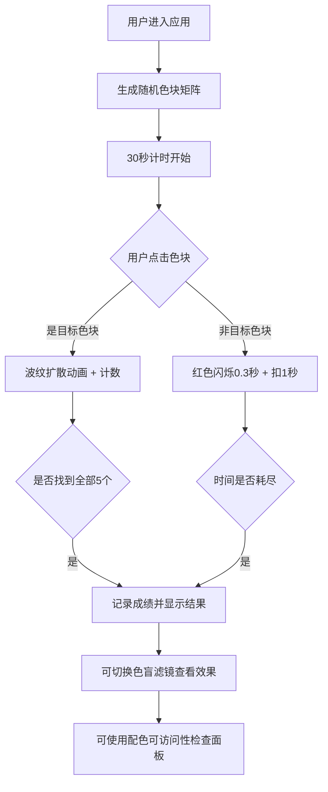

## 1. 产品概述

交互式色彩感知与色盲辅助测试应用，帮助普通用户和色觉异常者提升日常浏览网页时的颜色辨识能力，同时为设计师提供配色方案可访问性检测工具。

- 核心价值：通过游戏化的色彩训练、色盲模拟滤镜和 WCAG 对比度检测，提升大众对色彩可访问性的认知
- 目标用户：网页设计师、前端开发者、色觉异常人群、对色彩感知训练有需求的普通用户

## 2. 核心功能

### 2.1 功能模块

1. **色彩感知测试模块**：随机色块矩阵找不同游戏，训练用户细微色彩差异辨别能力
2. **色盲模拟滤镜模块**：三种色盲类型视觉效果模拟（红色盲、绿色盲、蓝黄色盲），帮助理解色觉差异
3. **配色可访问性检查模块**：WCAG 对比度比率计算、配色实时预览、替代颜色建议

### 2.2 功能详情

| 模块名称 | 子功能 | 功能描述 |
|-----------|--------|----------|
| 色彩感知测试 | 色块矩阵生成 | 5行8列共40个色块，每个100x100px，间隙8px，HSL色彩空间随机生成 |
| 色彩感知测试 | 目标色块标记 | 随机选取5个目标色块，色相仅与周围相差±5度以内 |
| 色彩感知测试 | 计时机制 | 30秒倒计时，点击正确无惩罚，错误扣除1秒并闪烁红色0.3秒 |
| 色彩感知测试 | 动画反馈 | 找对时淡蓝色圆形波纹扩散动画（半径0→60px，透明度0.6→0，0.5秒） |
| 色彩感知测试 | 成绩记录 | LocalStorage 存储最近5次正确率和平均耗时 |
| 色盲模拟滤镜 | 红色盲模拟 | Protanopia 滤镜，通过 CSS filter + SVG 矩阵变换实现 |
| 色盲模拟滤镜 | 绿色盲模拟 | Deuteranopia 滤镜，平滑过渡动画 0.8 秒 |
| 色盲模拟滤镜 | 蓝黄色盲模拟 | Tritanopia 滤镜 |
| 色盲模拟滤镜 | 颜色信息标注 | 色块下方显示 HEX 值和中文色名（如"珊瑚红 #FF7F50"） |
| 配色可访问性检查 | 颜色对输入 | 支持 #RRGGBB 格式或标准颜色名称，逗号分隔 |
| 配色可访问性检查 | 对比度计算 | WCAG AA (4.5:1) / AAA (7:1) 标准对比度比率计算 |
| 配色可访问性检查 | 实时预览 | 200x120px 矩形并排展示，间距20px |
| 配色可访问性检查 | 警告提示 | 对比度不足时显示红色"当前对比度不足"警告 |
| 配色可访问性检查 | 替代颜色建议 | 生成3个色相偏移±15度以内的接近替代色 |

## 3. 核心流程

## 4. 用户界面设计

### 4.1 设计风格

- **主题色**：深色主题，背景径向渐变 #0d1117 → #161b22
- **主容器**：圆角 16px，0.5px 边框 #30363d
- **标题字体**：Montserrat，32px，加粗，颜色 #c9d1d9
- **数字字体**：Fira Code 等宽字体，28px，颜色 #f0f6fc
- **按钮样式**：圆角 8px，内边距 12px 24px，背景 #21262d，边框 #30363d，悬停背景 #30363d，边框 #58a6ff
- **分隔线**：标题下方 2px 渐变线，从 #58a6ff 到 #1f6feb（左到右）

### 4.2 页面设计概述

| 区域 | 模块 | UI元素描述 |
|------|------|------------|
| 顶部 | 标题栏 | Montserrat 字体标题 + 渐变分隔线 + 功能切换标签 |
| 左侧 | 统计面板 | 固定宽度 280px，向右滑入动画（0.3s），Fira Code 数字显示最近5次成绩 |
| 中间 | 色块矩阵 | 居中布局，8列网格，悬停放大1.1倍+外发光，点击缩放0.95 |
| 色块下方 | 颜色标注 | 显示 HEX 值和中文色名 |
| 底部/侧边 | 配色检查面板 | 颜色对输入框 + 预览矩形 + 对比度数值 + 警告/建议 |

### 4.3 响应式设计

- **桌面端（≥768px）**：色块 100x100px，8列布局，左侧固定统计面板 280px
- **移动端（<768px）**：色块缩小至 80x80px，5列布局，统计面板移至底部固定高度 160px 横向滚动

### 4.4 动画与性能

- 色块悬停：scale(1.1) + box-shadow 外发光（4px 扩散，颜色与色块相同）
- 色块点击：scale(0.95) 按下效果
- 找对反馈：淡蓝色圆形径向波纹扩散，0.5s 完成
- 找错反馈：色块红色闪烁 0.3s
- 滤镜切换：CSS filter + SVG 矩阵变换，0.8s 平滑过渡
- 统计面板：右侧滑入动画 0.3s
- 性能目标：首屏渲染 ≤ 800ms，动画帧率稳定 60fps
