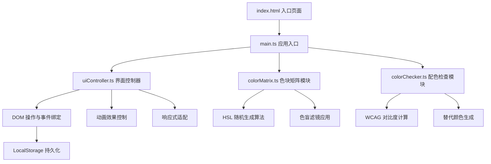

## 1. 架构设计



## 2. 技术说明

- **前端框架**：原生 DOM 操作（无框架）
- **语言**：TypeScript（严格模式）
- **构建工具**：Vite 5.x
- **模块标准**：ESNext，target ES2020
- **字体资源**：Google Fonts CDN（Montserrat + Fira Code）
- **数据存储**：LocalStorage（浏览器本地存储成绩记录）
- **无后端服务**，纯前端单页应用

## 3. 文件结构

```
auto109/
├── .trae/
│   └── documents/
│       ├── PRD.md
│       └── architecture.md
├── index.html              # 入口页面，含字体引入和容器结构
├── package.json            # 依赖配置（typescript, vite）
├── vite.config.js          # Vite 配置（端口5173，输出dist，开启HMR）
├── tsconfig.json           # TypeScript 严格模式配置
└── src/
    ├── main.ts             # 应用入口，初始化布局和事件
    ├── colorMatrix.ts      # 色块矩阵生成与管理
    ├── colorChecker.ts     # 对比度计算与配色检查
    └── uiController.ts     # 界面交互、动画、响应式控制
```

## 4. 模块职责定义

### 4.1 colorMatrix.ts

| 方法/属性 | 类型 | 描述 |
|-----------|------|------|
| `ColorBlock` | interface | 色块数据类型：hsl, hex, name, isTarget, row, col |
| `generateMatrix(rows, cols, targetCount)` | function | 生成指定行列的色块矩阵，随机标记目标色块（色相差≤5°） |
| `applyFilter(type, container)` | function | 对容器应用色盲滤镜（protanopia/deuteranopia/tritanopia/none） |
| `getColorName(hex)` | function | 根据 HEX 值返回中文色名 |
| `matrix` | property | 当前色块数组 |

**核心算法**：
- HSL 随机生成：先随机基础色相 H（0-360），饱和度 S（60-90%），亮度 L（40-70%）
- 目标色块差异：在基础 H 上 ±(1-5)° 偏移，保持 S 和 L 基本一致
- 色盲模拟：通过 SVG `<feColorMatrix>` 实现 RGB 通道矩阵变换

### 4.2 colorChecker.ts

| 方法/属性 | 类型 | 描述 |
|-----------|------|------|
| `ContrastResult` | interface | 对比度结果：ratio, passAA, passAAA, alternatives[] |
| `calculateContrast(color1, color2)` | function | 计算两个颜色的 WCAG 对比度比率 |
| `parseColor(input)` | function | 解析颜色输入（#RRGGBB 或颜色名称）为 HEX |
| `suggestAlternatives(baseColor, targetColor)` | function | 生成3个色相偏移≤15°的高对比度替代色 |
| `getRelativeLuminance(rgb)` | function | 计算 sRGB 相对亮度（WCAG 标准） |

**核心算法**：
- WCAG 对比度：`(L1 + 0.05) / (L2 + 0.05)`，L1/L2 为较亮/较暗颜色的相对亮度
- 相对亮度：`L = 0.2126 * R + 0.7152 * G + 0.0722 * B`（线性化 sRGB）
- 替代颜色生成：在 HSL 空间围绕基础色相 ±15° 范围内迭代，优先调整亮度以满足 ≥4.5:1

### 4.3 uiController.ts

| 方法/属性 | 类型 | 描述 |
|-----------|------|------|
| `AppState` | interface | 应用状态：gameActive, timeLeft, foundCount, scores |
| `initLayout()` | function | 初始化 DOM 结构，创建各区域容器 |
| `bindEvents()` | function | 绑定色块点击、滤镜切换、颜色输入等事件 |
| `renderMatrix(blocks)` | function | 渲染色块矩阵到 DOM |
| `showRipple(x, y, parent)` | function | 播放淡蓝色波纹扩散动画 |
| "flashError(block)" | function | 色块红色闪烁动画 |
| `updateStats()` | function | 更新统计面板数据显示 |
| `handleResize()` | function | 响应式布局处理（<768px 切换移动端布局） |
| `saveScore(accuracy, time)` | function | 成绩写入 LocalStorage（保留最近5条） |

**DOM 引用缓存**：所有频繁操作的元素（矩阵容器、统计面板、计时器、输入框等）以私有属性缓存，避免重复 querySelector。

### 4.4 main.ts

- 应用启动入口，负责模块组装
- 创建 colorMatrix、colorChecker、uiController 实例
- 调用 uiController.initLayout() 构建界面
- 建立事件桥接：uiController 的用户操作 → 调用 colorMatrix / colorChecker 的业务方法 → 结果返回 uiController 渲染

## 5. 关键类型定义

```typescript
interface ColorBlock {
  hsl: { h: number; s: number; l: number };
  hex: string;
  name: string;
  isTarget: boolean;
  row: number;
  col: number;
  found: boolean;
}

interface ScoreRecord {
  accuracy: number;
  avgTime: number;
  timestamp: number;
}

interface ContrastResult {
  ratio: number;
  passAA: boolean;
  passAAA: boolean;
  color1: string;
  color2: string;
  alternatives: Array<{ color1: string; color2: string; ratio: number }>;
}

type FilterType = 'none' | 'protanopia' | 'deuteranopia' | 'tritanopia';
```

## 6. 性能优化策略

1. **色块批量渲染**：使用 DocumentFragment 一次性挂载 40 个色块 DOM，减少重排
2. **CSS 硬件加速**：transform、opacity 动画启用 GPU 合成（`will-change: transform`）
3. **事件委托**：矩阵容器统一监听 click 事件，不为每个色块单独绑定
4. **防抖处理**：窗口 resize 事件 100ms 防抖，避免频繁重排
5. **缓存计算结果**：颜色解析、对比度计算结果用 Map 缓存，重复输入直接返回
6. **requestAnimationFrame**：所有 DOM 动画通过 rAF 调度，确保 60fps 帧率
