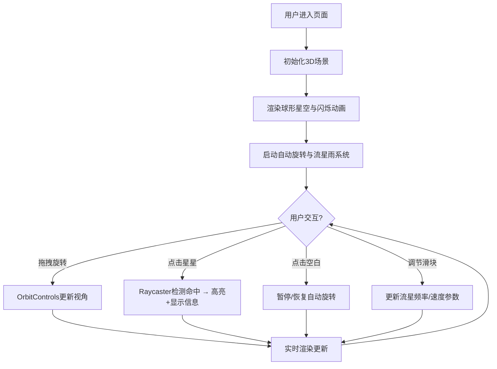

## 1. 产品概述
基于Three.js的3D动态星图与流星雨交互可视化项目，模拟深邃宇宙空间场景，用户可自由旋转视角观察闪烁星星和随机流星雨，点击星星查看虚拟星座信息，适用于天文科普或创意展示。

- 主要目的：提供沉浸式宇宙探索体验，兼具教育科普与视觉展示价值
- 目标用户：天文爱好者、科普教育者、创意展示从业者
- 产品价值：低门槛、高沉浸感的3D宇宙可视化工具

## 2. 核心功能

### 2.1 用户角色
无需用户角色区分，所有访客享有完整交互权限。

### 2.2 功能模块
1. **3D星空场景**：球形星点粒子系统、星星闪烁动画、视角控制
2. **流星雨系统**：多流粒子流、抛物线轨迹、随机爆发机制、参数可调节
3. **交互系统**：星星点击检测、高亮反馈、信息展示
4. **UI面板**：实时信息展示、参数调节滑块、响应式适配

### 2.3 页面详情
| 页面名称 | 模块名称 | 功能描述 |
|-----------|-------------|---------------------|
| 主场景页 | 球形星空 | 8000个白色点粒子组成球形星空，粒子半径0.3-1.2单位，分布在半径200单位球壳内 |
| 主场景页 | 星星闪烁 | 亮度0.3-1.0随机闪烁，周期2-5秒，正弦波控制透明度 |
| 主场景页 | 背景渲染 | 纯黑带深蓝垂直渐变（#0a0a1a到#000010） |
| 主场景页 | 视角控制 | OrbitControls拖拽旋转，阻尼0.05，自动旋转0.002rad/s，点击暂停 |
| 主场景页 | 流星雨系统 | 3条粒子流各200粒子，抛物线轨迹，1.5秒持续，15单位拖尾，白蓝渐变 |
| 主场景页 | 流星爆发 | 每5-15秒随机触发，3倍粒子量持续3秒 |
| 主场景页 | 参数调节 | 滑块控制流星频率（1-30秒）和速度（0.5-2倍） |
| 主场景页 | 信息面板 | 左下角半透明面板，显示视角坐标、星星总数、最近流星时间 |
| 主场景页 | 星星交互 | 点击星星高亮黄色放大1.5倍持续0.8秒，显示编号、亮度、星座名 |

## 3. 核心流程

用户进入页面后，自动渲染3D星空场景并开启缓慢自动旋转。用户可通过鼠标拖拽自由旋转视角，滚轮缩放距离。观察过程中流星雨随机划过，可通过右下角滑块调节流星频率与速度。点击任意星星时，该星星高亮放大并在信息面板展示详细信息。点击场景任意位置可暂停/恢复自动旋转。

## 4. 用户界面设计

### 4.1 设计风格
- **主色调**：深邃宇宙黑 (#000010) 作为基底，渐变至深蓝 (#0a0a1a)
- **强调色**：淡蓝 (#4fc3f7) 用于流星、UI边框；银白 (#ffffff) 用于星点和流星头部；亮黄 (#ffeb3b) 用于星星选中高亮
- **UI风格**：半透明毛玻璃效果 (backdrop-filter: blur(10px))，圆角12px，边框1px solid #4fc3f7
- **动效**：所有UI元素0.2秒淡入动画，流星带发光光晕（点光源泛光强度0.3，范围50单位）

### 4.2 页面设计概述
| 页面名称 | 模块名称 | UI元素 |
|-----------|-------------|-------------|
| 主场景页 | 背景 | 垂直渐变背景（#0a0a1a→#000010），全屏覆盖 |
| 主场景页 | 星空粒子 | 白色点粒子，大小随机，正弦波闪烁 |
| 主场景页 | 流星粒子 | 头部亮白，拖尾淡蓝渐变，透明度线性衰减 |
| 主场景页 | 信息面板 | 左下角，圆角12px，半透明毛玻璃，蓝边，实时数据更新 |
| 主场景页 | 控制滑块 | 右下角，圆角设计，0.2秒淡入，频率与速度两个滑块 |
| 主场景页 | 星星高亮 | 黄色#ffeb3b，1.5倍放大，0.8秒持续 |

### 4.3 响应式
- 桌面端（默认）：完整8000星星 + 600流星粒子，UI正常尺寸
- 移动端：星星和流星粒子自动减少至60%数量以保持60fps
- 竖屏适配：信息面板与滑块位置自动调整避免遮挡
- 触摸优化：支持单指拖拽旋转、双指缩放

### 4.4 3D场景指引
- **环境氛围**：深邃静谧宇宙空间，纯黑深蓝渐变背景，无HDRI
- **光照设置**：无场景光，星星与流星自发光；流星附带点光源泛光（强度0.3，范围50）
- **相机设置**：PerspectiveCamera，初始距离300单位，fov 60°
- **相机动画**：OrbitControls阻尼旋转，默认自动旋转0.002rad/s，点击暂停
- **构图焦点**：球形星空居中，流星雨从边缘进入，信息面板左下角UI浮层
- **交互动画**：星星点击高亮缩放动画，流星拖尾透明度渐变，滑块参数实时响应
- **后处理效果**：无需额外后处理，使用原生Three.js渲染
- **性能预算**：BufferGeometry批量渲染，对象池复用流星粒子，无纹理贴图
