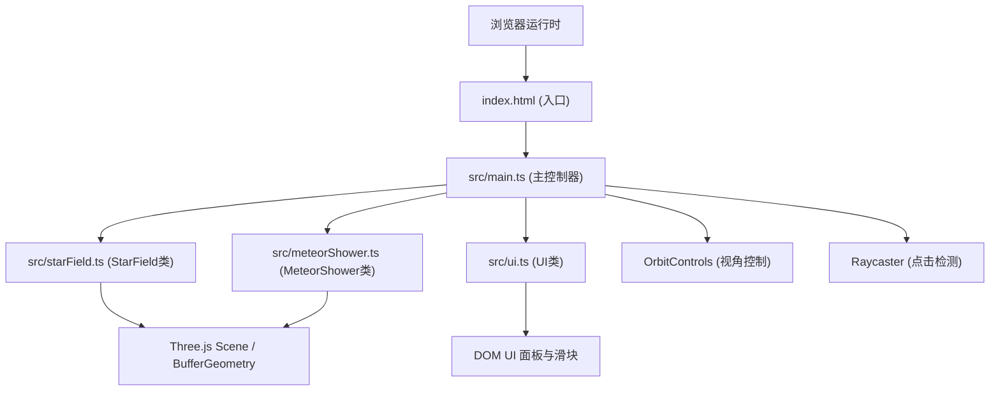

## 1. 架构设计



## 2. 技术说明
- **前端框架**：原生 TypeScript + Three.js (r152+)，无React/Vue框架依赖
- **构建工具**：Vite 5.x，HMR热更新，输出目录 dist
- **类型系统**：TypeScript 严格模式，target ES2020，module ESNext
- **状态管理**：类内部私有状态，UI通过回调函数与3D场景通信
- **无后端**：纯前端项目，所有数据本地生成

## 3. 文件结构
| 文件路径 | 职责说明 |
|----------|----------|
| `package.json` | 项目依赖与脚本定义 |
| `vite.config.js` | Vite基础配置（端口5173、HMR、dist输出） |
| `tsconfig.json` | TypeScript严格模式配置 |
| `index.html` | 入口HTML，全屏容器div#app，defer脚本加载 |
| `src/main.ts` | 场景/相机/渲染器初始化，动画循环，事件绑定，OrbitControls配置 |
| `src/starField.ts` | StarField类：8000星星粒子生成、闪烁动画、点击检测、高亮效果 |
| `src/meteorShower.ts` | MeteorShower类：3条流星流、对象池、爆发机制、频率/速度调节 |
| `src/ui.ts` | UI类：信息面板、滑块控件、状态绑定、响应式适配 |

## 4. 核心类设计

### 4.1 StarField 类
```typescript
class StarField {
  constructor(scene: THREE.Scene, count: number);
  update(time: number): void;           // 每帧更新闪烁动画
  handleClick(intersect: THREE.Intersection): StarInfo | null;  // 点击处理
  highlightStar(index: number): void;    // 高亮选中星星
  get totalCount(): number;              // 星星总数
}

interface StarInfo {
  id: number;
  brightness: number;
  constellation: string;
}
```

### 4.2 MeteorShower 类
```typescript
class MeteorShower {
  constructor(scene: THREE.Scene, streams: number, perStream: number);
  update(delta: number, time: number): void;  // 每帧更新流星位置
  setFrequency(seconds: number): void;        // 设置流星间隔（1-30秒）
  setSpeed(multiplier: number): void;         // 设置速度倍率（0.5-2x）
  get lastMeteorTime(): Date | null;          // 最近一次流星时间
  triggerBurst(): void;                       // 手动触发爆发
}
```

### 4.3 UI 类
```typescript
class UI {
  constructor(container: HTMLElement);
  updateCameraPosition(x: number, y: number, z: number): void;
  updateStarCount(count: number): void;
  updateLastMeteorTime(date: Date | null): void;
  updateSelectedStar(info: StarInfo | null): void;
  onFrequencyChange(callback: (v: number) => void): void;
  onSpeedChange(callback: (v: number) => void): void;
}
```

## 5. 性能优化策略

1. **BufferGeometry批量渲染**：所有星星和流星粒子使用单个BufferGeometry + PointsMaterial，减少Draw Call
2. **Object Pooling对象池**：流星粒子预分配，循环复用，避免频繁GC
3. **移动端降级**：检测设备像素比与屏幕宽度，粒子数量降至60%
4. **无纹理贴图**：纯程序化颜色与透明度，零纹理内存开销
5. **阻尼插值**：OrbitControls启用damping，平滑运动而非每帧强制更新
6. **视锥体剔除**：Three.js内置Frustum Culling自动生效

## 6. 响应式与设备适配
- **断点**：< 768px 视为移动端，粒子数量 × 0.6
- **像素比限制**：`renderer.setPixelRatio(Math.min(window.devicePixelRatio, 2))`
- **窗口resize**：监听resize事件，同步更新相机aspect与渲染器尺寸
- **触摸支持**：OrbitControls原生支持触摸事件
