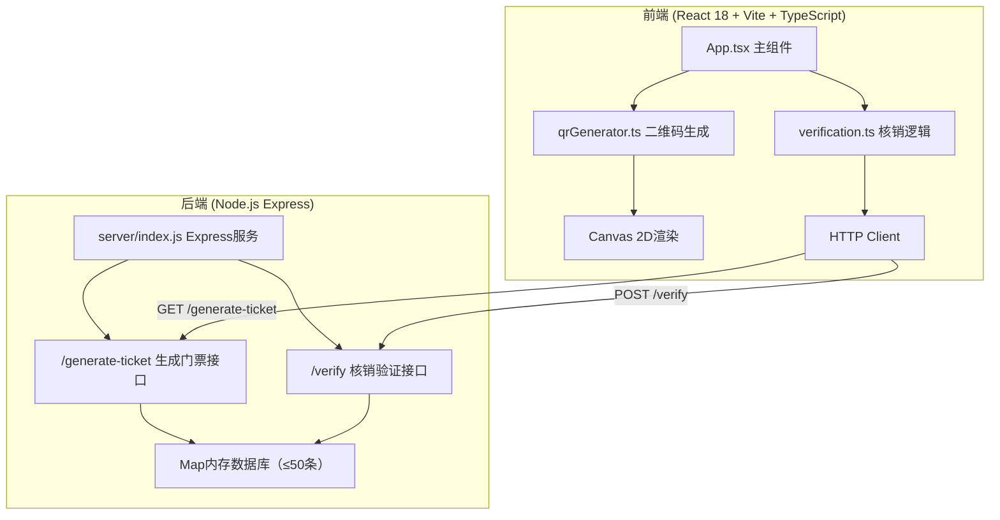
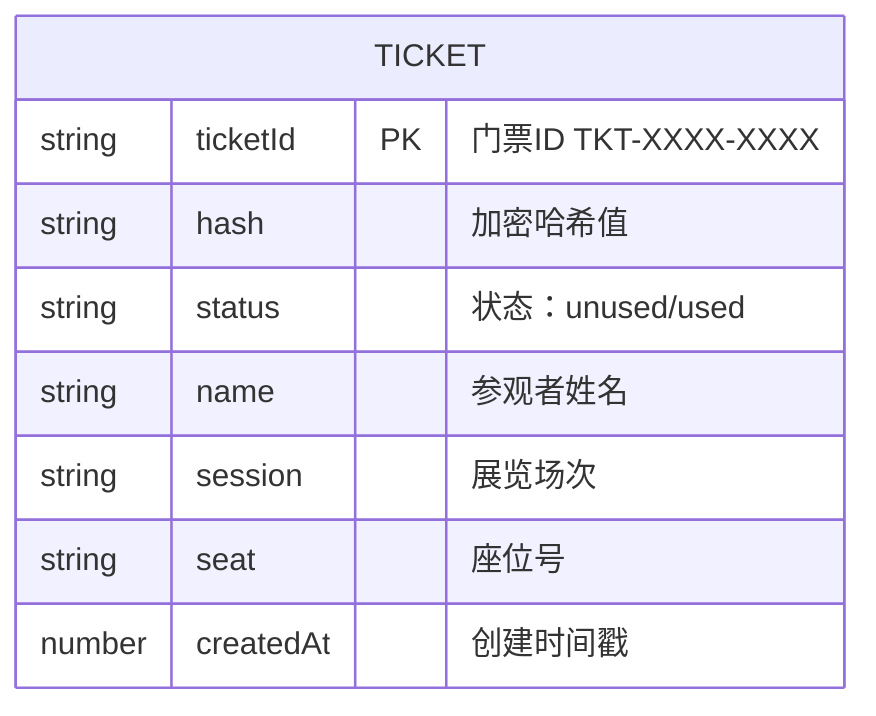

## 1. 架构设计



## 2. 技术描述
- 前端：React@18 + TypeScript + Vite
- 后端：Express@4 + cors + body-parser
- 渲染：Canvas 2D API
- 加密：自定义哈希算法（门票ID+密钥）
- 数据库：内存Map结构（最多50张门票）

## 3. 路由定义
| 路由 | 用途 |
|-------|---------|
| / | 默认页面（含生成/核销切换Tab） |
| /generate | 门票生成页面 |
| /verify | 门票核销页面 |

## 4. API定义

### 4.1 GET /generate-ticket
**响应：**
```typescript
interface GenerateTicketResponse {
  ticketId: string;      // TKT-XXXX-XXXX格式
  hash: string;          // 加密哈希值
  success: boolean;
}
```

### 4.2 POST /verify
**请求：**
```typescript
interface VerifyRequest {
  ticketId: string;
  hash: string;
}
```
**响应：**
```typescript
interface VerifyResponse {
  success: boolean;
  message: string;
  verified?: boolean;
}
```

## 5. 数据模型

### 5.1 数据模型定义


## 6. 文件结构与调用关系

```
├── package.json              # 项目依赖配置
├── vite.config.js            # Vite配置（端口5173，代理到3001）
├── tsconfig.json             # TypeScript配置（严格模式，ES2020）
├── index.html                # 入口页面
├── src/
│   ├── App.tsx              # 主组件（状态管理、页面路由）
│   │   ├── 调用 qrGenerator.ts → generateArtQR()
│   │   └── 调用 verification.ts → verifyTicket()
│   ├── qrGenerator.ts       # Canvas二维码生成
│   │   ├── encryptTicketId() → 自定义加密算法
│   │   ├── generateMatrix() → 像素矩阵生成
│   │   └── drawArtQR() → Canvas绘制艺术二维码
│   └── verification.ts       # 核销验证逻辑
│       ├── extractHashFromImage() → 图片像素提取
│       └── verifyTicket() → POST /verify请求
└── server/
    └── index.js             # Express后端
        ├── /generate-ticket → 生成门票ID并存入Map
        └── /verify → 校验门票并更新状态
```

数据流向：
- **生成流程**：用户输入 → App.tsx → /generate-ticket API → 返回ticketId → qrGenerator.ts加密生成矩阵 → Canvas绘制 → 下载PNG
- **核销流程**：输入/拖入 → verification.ts提取ticketId+hash → POST /verify → 后端Map查找比对 → 返回结果 → 弹窗展示
