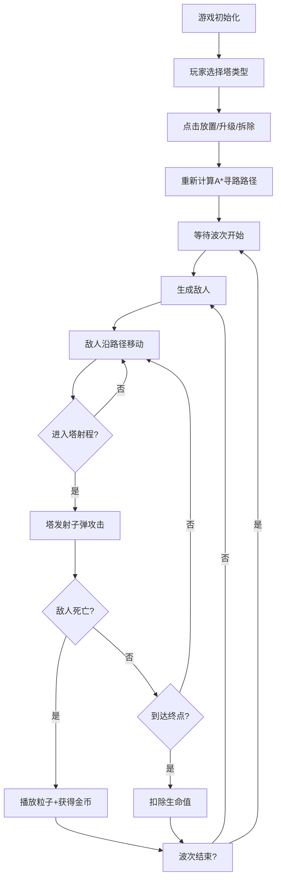

## 1. 产品概述

塔防游戏寻路与攻击交互原型应用，用于直观观察A*寻路算法在不同地形和防御塔布局下的表现，以及防御塔攻击偏好与伤害结算的实时反馈。目标用户为策略游戏开发者和算法学习者。

## 2. 核心功能

### 2.1 功能模块

1. **游戏主场景**：Canvas画布渲染、网格地形、防御塔放置与升级
2. **敌人系统**：波次生成、A*寻路移动、生命值与状态效果
3. **防御塔系统**：三种塔类型、自动攻击、子弹追踪、范围伤害
4. **UI界面**：顶部状态栏（生命/波次/金币）、底部操作栏（塔选择/开始波次）

### 2.2 功能详情

| 模块名称 | 功能描述 |
|-----------|-------------|
| 网格系统 | 10x8网格(800x600px)，每格80x75px，深灰网格线#3a3f4b，1px宽 |
| 防御塔放置 | 鼠标左键点击空白格子放置，三种类型：基础塔(#3498db)、减速塔(#1abc9c)、范围塔(#9b59b6) |
| 防御塔升级 | 点击已有塔升级，每次+15%攻击力，半径+4px，塔顶旋转光环 |
| 防御塔拆除 | 右键点击塔拆除 |
| 敌人生成 | 每30秒一波(5-12个)，从左侧随机Y位置生成，矩形16x20px |
| 敌人移动 | A*算法寻路，塔占格子权重无穷大，邻域(曼哈顿<=2)权重2.5，普通格子权重1 |
| 路径显示 | 黄色#f1c40f虚线，线段3px间隔2px，透明度0.4 |
| 塔攻击 | 基础塔射程120px伤害15，减速塔射程100px伤害8(减速40%持续3秒)，范围塔射程140px溅射10点 |
| 攻击偏好 | 优先攻击血条百分比最低的敌人 |
| 子弹系统 | 圆形半径3px，速度6px/帧，颜色与塔相同 |
| 爆炸效果 | 范围塔爆炸半径40px，半透明紫色环形扩散0.4秒 |
| 敌人血条 | 绿色背景#2ecc71，红色当前血量#e74c3c，30x4px，敌人上方5px |
| 死亡粒子 | 6个白色粒子6px，速度2px/帧，持续0.3秒 |
| 金币系统 | 基础敌人+10，减速敌人+15，后期波次每波+5基础值 |
| 生命值 | 初始20点，敌人到达右侧-1 |
| 顶部信息栏 | 高40px背景#16213e，心形生命图标+红色#e74c3c，白色Wave文字，黄色#f39c12金币图标 |
| 底部操作栏 | 高50px背景#0f3460，三个40x40px塔按钮(悬停上浮3px+阴影)，60x30px绿色#27ae60开始按钮(变灰禁用5秒) |
| 按钮动效 | 点击缩放至0.95倍再恢复，0.15秒 |

## 3. 核心流程

玩家选择防御塔类型 → 点击空白格子放置塔 → 系统重新计算A*路径 → 敌人沿路径移动 → 塔自动攻击范围内敌人 → 敌人死亡掉落金币/到达终点扣除生命 → 波次循环

## 4. 用户界面设计

### 4.1 设计风格
- 整体风格：游戏暗色主题
- 主背景色：画布#1a1a2e，页面#0d0d1a
- 主色调：蓝色#3498db、青色#1abc9c、紫色#9b59b6
- 强调色：红色#e74c3c(生命/危险)、黄色#f39c12(金币)、绿色#27ae60(确认/开始)
- 按钮：微立体设计，悬停上浮效果，点击缩放反馈

### 4.2 页面布局
| 区域 | 位置 | 大小 | 背景色 |
|-----------|-------------|-------------|-------------|
| 顶部信息栏 | 顶部 | 800x40px | #16213e |
| 游戏画布 | 中间 | 800x600px | #1a1a2e |
| 底部操作栏 | 底部 | 800x50px | #0f3460 |

### 4.3 响应式
桌面优先，固定画布尺寸800x600px，居中显示。
