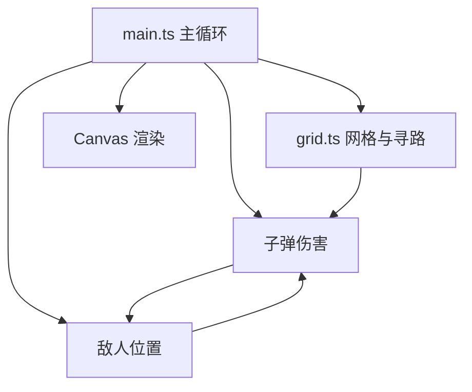

## 1. 架构设计



## 2. 技术栈

- 前端框架：纯TypeScript + Vite
- 渲染引擎：原生Canvas 2D
- 构建工具：Vite 5.x
- 开发语言：TypeScript (严格模式)
- 无后端服务

## 3. 文件结构

```
auto118/
├── package.json
├── index.html
├── vite.config.js
├── tsconfig.json
└── src/
    ├── main.ts      # 游戏主循环、初始化、渲染
    ├── grid.ts      # 网格管理、A*寻路
    ├── tower.ts    # 防御塔、子弹、攻击
    └── enemy.ts    # 敌人、波次、状态效果
```

## 4. 核心数据模型

### 4.1 网格与寻路

```typescript
interface Cell {
  x: number;
  y: number;
  weight: number;
  hasTower: boolean;
}

interface PathPoint {
  x: number;
  y: number;
}
```

### 4.2 防御塔

```typescript
type TowerType = 'basic' | 'slow' | 'aoe';

interface Tower {
  id: number;
  type: TowerType;
  gridX: number;
  gridY: number;
  x: number;
  y: number;
  level: number;
  damage: number;
  range: number;
  cooldown: number;
  lastShot: number;
}

interface Bullet {
  id: number;
  x: number;
  y: number;
  targetId: number;
  speed: number;
  damage: number;
  type: TowerType;
}
```

### 4.3 敌人

```typescript
interface Enemy {
  id: number;
  x: number;
  y: number;
  hp: number;
  maxHp: number;
  speed: number;
  pathIndex: number;
  slowEffect: { active: boolean; duration: number; factor: number };
  reward: number;
}

interface Particle {
  x: number;
  y: number;
  vx: number;
  vy: number;
  life: number;
  maxLife: number;
  size: number;
}

interface Explosion {
  x: number;
  y: number;
  radius: number;
  maxRadius: number;
  life: number;
  maxLife: number;
}
```

## 5. 核心算法

### 5.1 A*寻路算法
- 使用曼哈顿距离作为启发函数 h(n) = |x1-x2| + |y1-y2|
- 开放列表使用二叉堆优化（简化版使用数组排序）
- 权重考虑：塔格子权重无穷大，邻域(曼哈顿<=2)权重2.5，普通格子权重1
- 每次放置/拆除塔后触发重新计算

### 5.2 游戏主循环
- 使用 requestAnimationFrame 驱动
- 固定逻辑更新与渲染分离
- 性能目标：60FPS，每帧逻辑<5ms

### 5.3 碰撞检测
- 塔攻击范围：圆形碰撞检测
- 子弹命中：点与敌人矩形碰撞
- 范围爆炸：圆形与敌人矩形碰撞
