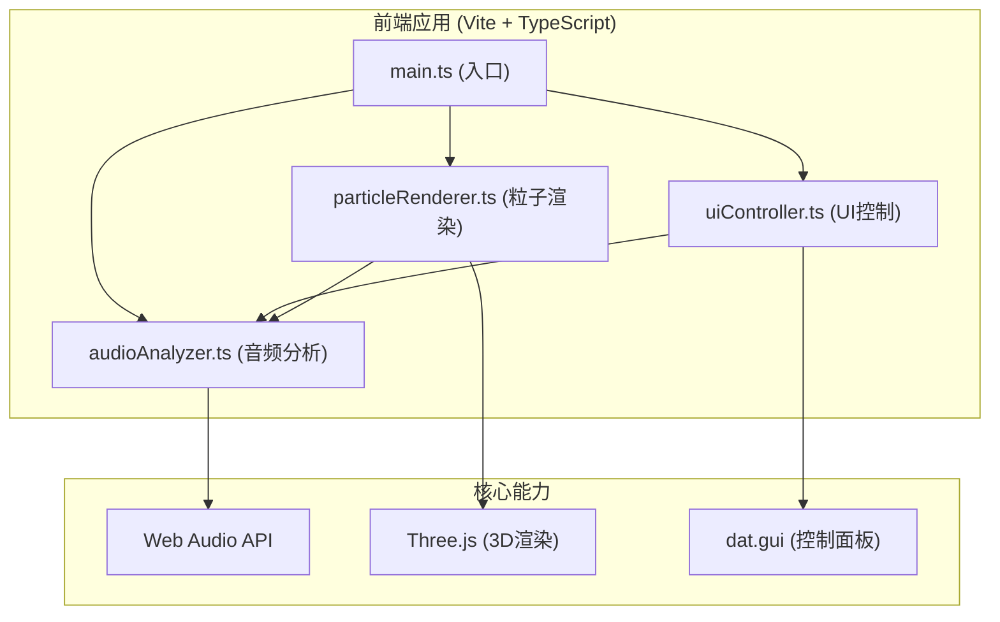

## 1. 架构设计



## 2. 技术说明
- **前端框架**：原生TypeScript (无React/Vue，按用户要求)
- **构建工具**：Vite 5.x
- **3D渲染**：Three.js 最新版 + @types/three
- **音频处理**：原生Web Audio API (AudioContext, AnalyserNode)
- **控制面板**：dat.gui
- **语言**：TypeScript 5.x (严格模式)
- **目标环境**：ES2020，ESNext模块系统

## 3. 项目文件结构
| 文件路径 | 说明 |
|---------|------|
| package.json | 项目依赖配置 (three, @types/three, vite, typescript, dat.gui) |
| vite.config.js | Vite基础配置 (输出dist，端口5173，开启HMR) |
| tsconfig.json | TypeScript配置 (严格模式, target ES2020, module ESNext, bundler解析) |
| index.html | 入口页面 (全屏Canvas, 背景#0a0a1a, Inter字体) |
| src/main.ts | 应用入口 (初始化场景、相机、渲染器，加载各模块) |
| src/audioAnalyzer.ts | 音频分析模块 (AudioContext, AnalyserNode, BPM/音量计算) |
| src/particleRenderer.ts | 粒子渲染模块 (Points粒子系统，音频数据驱动更新) |
| src/uiController.ts | UI控制模块 (dat.gui面板，音频上传，播放控制，实时数据显示) |

## 4. 核心模块设计

### 4.1 AudioAnalyzer (音频分析模块)
```typescript
class AudioAnalyzer {
  audioContext: AudioContext;
  analyser: AnalyserNode;
  source: AudioBufferSourceNode | MediaElementAudioSourceNode;
  gainNode: GainNode;
  
  // 加载音频源
  async loadFromFile(file: File): Promise<void>;
  async loadFromUrl(url: string): Promise<void>;
  
  // 播放控制
  play(): void;
  pause(): void;
  setVolume(value: number): void;
  getCurrentTime(): number;
  getDuration(): number;
  
  // 数据获取
  getFrequencyData(): Uint8Array;      // 频率数据 (0-255)
  getTimeDomainData(): Uint8Array;     // 时域波形数据
  getAverageVolume(): number;          // 平均音量 (0-100)
  getBPM(): number;                    // BPM估算值
  getBassEnergy(): number;             // 低频能量 (20-250Hz)
  getMidEnergy(): number;              // 中频能量 (250-2000Hz)
  getHighEnergy(): number;             // 高频能量 (2000-20000Hz)
}
```

### 4.2 ParticleRenderer (粒子渲染模块)
```typescript
type VisualizationMode = 'sphere' | 'bars' | 'waveform';
type ColorTheme = 'default' | 'cyan' | 'neon';

class ParticleRenderer {
  scene: THREE.Scene;
  particles: THREE.Points;
  starfield: THREE.Points;
  particleCount: number;
  
  constructor(scene: THREE.Scene);
  
  // 创建/重建粒子
  createParticles(count: number): void;
  
  // 设置可视化模式
  setMode(mode: VisualizationMode): void;
  
  // 设置颜色主题
  setColorTheme(theme: ColorTheme): void;
  
  // 每帧更新（根据音频数据）
  update(
    frequencyData: Uint8Array,
    bassEnergy: number,
    midEnergy: number,
    highEnergy: number,
    deltaTime: number
  ): void;
}
```

### 4.3 UIController (UI控制模块)
```typescript
class UIController {
  gui: dat.GUI;
  audioAnalyzer: AudioAnalyzer;
  particleRenderer: ParticleRenderer;
  
  constructor(audioAnalyzer: AudioAnalyzer, particleRenderer: ParticleRenderer);
  
  // 初始化UI
  init(): void;
  
  // 设置事件监听
  setupEventListeners(): void;
  
  // 更新实时显示数据
  updateStats(): void;
}
```

## 5. 性能优化策略
- **粒子渲染优化**：使用BufferGeometry而非Geometry，单Draw Call渲染所有粒子
- **数据更新优化**：直接修改BufferAttribute数组而非重建对象
- **插值平滑**：使用线性插值(lerp)每帧平滑过渡，避免突变
- **音频分析延迟**：AnalyserNode.fftSize = 2048，smoothingTimeConstant = 0.8
- **帧率控制**：使用requestAnimationFrame，deltaTime计算保证运动速度一致
- **响应式Canvas**：ResizeObserver监听窗口变化，及时调整渲染器尺寸

## 6. 运行配置
- **开发启动**：npm run dev (端口5173)
- **生产构建**：npm run build (输出到dist目录)
- **依赖安装**：npm install
