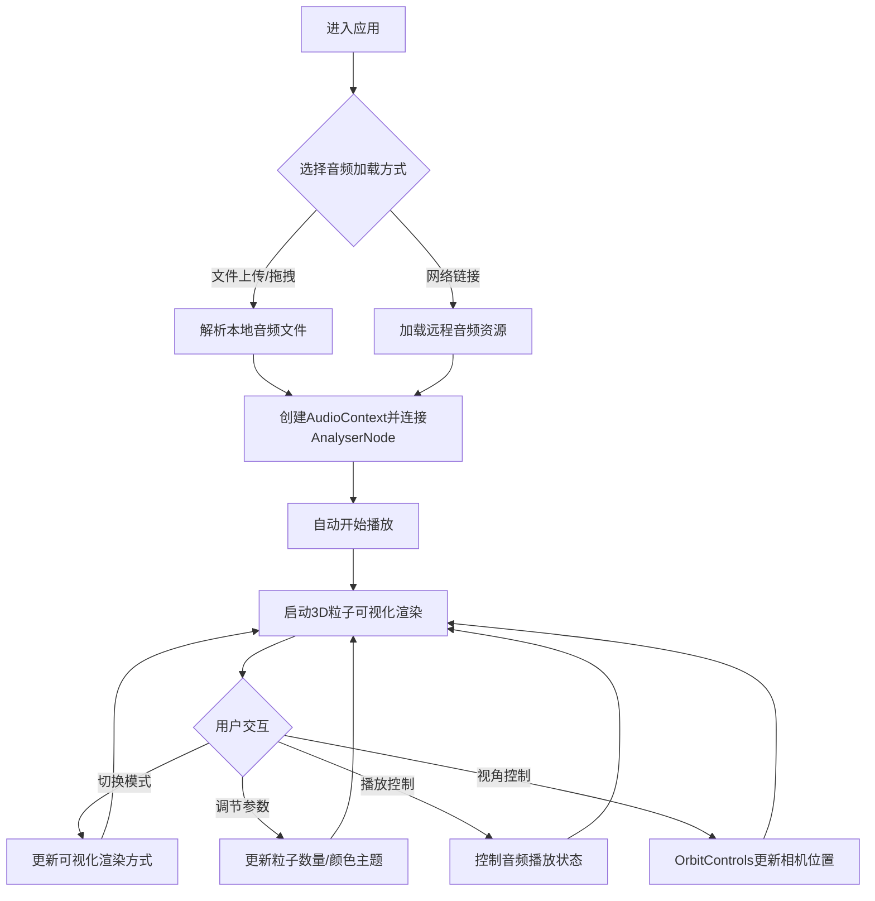

## 1. 产品概述
基于Web Audio API的实时3D音乐可视化与频谱粒子动画应用，将音频节奏和频率动态转换为三维空间中的粒子运动与颜色变化，提供沉浸式视听体验。适用于音乐演出、创意展示等场景。
- 核心目标：实现音频与3D视觉的实时联动，打造沉浸式音乐可视化体验
- 目标用户：音乐人、DJ、视觉艺术家、创意展示从业者

## 2. 核心功能

### 2.1 功能模块
1. **音频加载模块**：支持文件上传（MP3/WAV/OGG拖拽上传）和网络音频链接加载
2. **3D粒子可视化模块**：球状粒子系统、柱状频谱叠加、波形线条环绕三种可视化模式
3. **音频分析模块**：实时频率分析、时域波形分析、BPM估算、音量计算
4. **UI控制面板**：可视化模式切换、粒子数量调节、颜色主题选择
5. **播放控制模块**：播放/暂停、进度条、音量滑块
6. **实时数据显示**：播放时间、平均音量、BPM估算值

### 2.2 页面详情
| 页面名称 | 模块名称 | 功能描述 |
|---------|---------|---------|
| 主页面 | 音频上传区 | 虚线框上传区域，支持拖拽和点击上传，支持粘贴网络音频链接 |
| 主页面 | 3D可视化区域 | 占70%宽度，展示粒子系统动画，支持鼠标拖拽视角控制 |
| 主页面 | 右侧控制面板 | 占30%宽度，包含dat.gui控制面板，支持模式切换、数量调节、主题切换 |
| 主页面 | 底部播放器 | 半透明黑色背景，包含播放/暂停按钮、进度条、音量滑块 |
| 主页面 | 右上角数据面板 | 显示播放时间、平均音量条、BPM估算值 |
| 主页面 | 背景星点 | 500个动态闪烁星点，营造太空氛围 |

## 3. 核心流程
用户进入应用后，可通过文件拖拽上传或粘贴网络链接加载音频。音频加载后自动开始播放并启动3D可视化。用户可通过右侧控制面板切换可视化模式、调整粒子数量和颜色主题，通过底部播放器控制播放状态和音量，通过鼠标拖拽控制3D场景视角。

## 4. 用户界面设计

### 4.1 设计风格
- **主题风格**：深色太空主题
- **主背景色**：#0a0a1a
- **辅助色**：#1a1a2e
- **强调色**：#e94560
- **文字色**：#eaeaea
- **渐变分隔线**：从#e94560透明到#4ecdc4透明（2px宽度）
- **按钮交互**：悬停背景色从#2a2a3e变为#e94560（过渡0.2秒），点击缩放至0.95（持续0.1秒）
- **字体**：'Inter' sans-serif

### 4.2 页面设计概览
| 页面名称 | 模块名称 | UI元素 |
|---------|---------|--------|
| 主页面 | 音频上传区 | 虚线框（背景#1a1a2e，边框#e94560，拖拽发光动画0.3秒），URL输入框（居中，占位符灰色#6c6c80，聚焦边框#e94560） |
| 主页面 | 3D可视化区 | Three.js Canvas，OrbitControls鼠标交互，场景自动旋转（Y轴0.05rad/s，阻尼0.08） |
| 主页面 | 粒子系统 | 1024个粒子（可调512-4096），球壳分布（半径12），粒子半径0.08-0.3随机，色环渐变（#ff6b6b→#4ecdc4→#ff6b6b） |
| 主页面 | 控制面板 | 半透明深色背景#1e1e2eCC，圆角8px，dat.gui控件 |
| 主页面 | 底部播放器 | 半透明黑色#00000080，圆角12px，播放/暂停按钮、进度条、音量滑块 |
| 主页面 | 数据面板 | 右上角半透明面板，播放时间（monospace 14px白色）、音量条（0-100，#00d4aa→#ff6b6b渐变）、BPM值 |

### 4.3 响应式设计
- Desktop-first设计
- 窗口宽度<768px时：右侧面板折叠为底部面板（高度自动），可视化区域占满剩余空间
- 移动设备按钮和控件尺寸缩小至80%
- 滑块样式：轨道4px高度#4a4a5e，滑块圆形直径16px颜色#e94560，悬停轨道高亮#6a6a7e

### 4.4 3D场景指导
- **环境氛围**：纯黑背景带微弱动态星点（500个1-3px小点，透明度0.3-0.7闪烁，分布在半径200球内）
- **粒子动画**：
  - 低频(20-250Hz)：控制粒子远离球心（最大偏移5单位）
  - 中频(250-2000Hz)：控制粒子切向旋转（0.2-1.0 rad/s）
  - 高频(2000-20000Hz)：控制粒子径向抖动（0.5-2单位）
  - 颜色亮度随振幅0.3-1.0线性插值变化
- **性能要求**：2048粒子时帧率≥55FPS，音频分析延迟≤30ms
