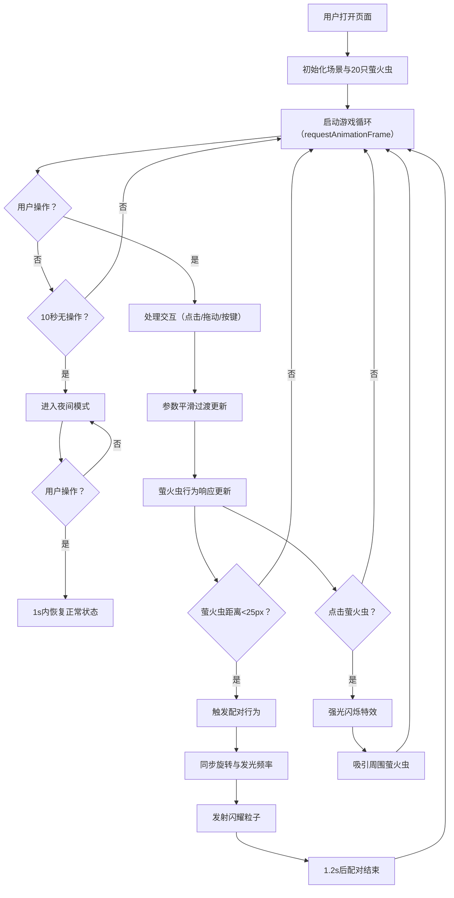

## 1. 产品概述

一个基于浏览器的交互式萤火虫生态夜模拟游戏，用户在深夜森林池塘场景中调控萤火虫数量、飞行轨迹和发光频率，观察它们形成闪烁发光群落的自然生态行为。

- 核心目的：提供沉浸式的自然生态交互体验，让用户通过调控参数观察萤火虫的社交行为模式
- 目标用户：对自然模拟、交互艺术、休闲游戏感兴趣的普通用户
- 产品价值：融合视觉美感与生态模拟，提供治愈系的交互体验

## 2. 核心功能

### 2.1 功能模块

1. **主场景模块**：900x700 Canvas 绘制深夜森林池塘，包含荷叶、树木轮廓、草丛等背景元素
2. **萤火虫模拟模块**：20只萤火虫的贝塞尔曲线飞行、心跳脉冲发光、点击触发强光闪烁与吸引行为
3. **配对交互模块**：萤火虫近距离配对同步旋转、频率同步、闪耀粒子发射
4. **控制面板模块**：浮动毛玻璃面板，提供数量、亮度、速度滑块及吸引行为开关
5. **统计显示模块**：左上角实时显示萤火虫数量、平均发光频率、配对次数、性能负载指示
6. **环境反应模块**：背景元素（荷叶、树木）对全局发光强度产生动态视觉响应
7. **夜间模式模块**：10秒无操作自动进入宁静模式，用户操作后恢复

### 2.2 功能细节

| 模块 | 功能点 | 详细描述 |
|------|--------|----------|
| 主场景 | 背景渐变 | 顶部深蓝 #0d1b2a 到底部墨绿 #1b263b 垂直渐变 |
| 主场景 | 荷叶 | 池塘中心圆形，半径 ≤ 40px，颜色 #2d6a4f，带 #40916c 高光 |
| 主场景 | 树木轮廓 | SVG 路径描边，2px 粗细，透明度 0.3，颜色 #1b4332 |
| 主场景 | 草丛 | 三根细弧线组成，每根 8-15px，颜色 #2d6a4f，随机散布 |
| 萤火虫 | 外观 | 半径 3px，光圈从 #ffea00 到 #a7c957 渐变，最大半径 15px |
| 萤火虫 | 发光脉冲 | 心跳频率脉冲变化，周期 1.5-3.5 秒随机 |
| 萤火虫 | 飞行路径 | 随机贝塞尔曲线，速度 0.3-0.8px/帧，最大转角 45° |
| 萤火虫 | 点击交互 | 发光半径瞬间扩展到 35px，透明度从 0.8 降至 0，持续 0.4s；吸引周围 40px 内萤火虫以 1.5 倍速度靠近 2s |
| 配对行为 | 触发条件 | 两只萤火虫距离 < 25px |
| 配对行为 | 配对效果 | 共同中心点同步旋转（角速度 0.03rad/帧），频率同步为两者平均值，持续 1.2s |
| 配对行为 | 闪耀粒子 | 从配对中心向随机方向射出，#f6e05e，半径 1.5px，速度 1.5px/帧，逐渐消失，持续 0.8s |
| 控制面板 | 数量滑块 | 10-60，默认 20，实时数字更新，轨道 #2d3748，按钮 #ffea00 |
| 控制面板 | 亮度滑块 | 0.5-2.0，默认 1.0 |
| 控制面板 | 速度滑块 | 0.2-1.5，默认 0.5 |
| 控制面板 | 吸引开关 | 开启 #48bb78，关闭 #a0aec0 |
| 控制面板 | 参数过渡 | 所有参数变化在 3s 内 ease-out 平滑过渡 |
| 统计面板 | 显示内容 | 萤火虫数量、平均发光频率、配对次数、性能负载电池图标 |
| 统计面板 | 字体样式 | Rubik Mono One，14px，颜色 #a0aec0 |
| 统计面板 | 性能指示 | 绿色(<30)、黄色(30-50)、红色(>50) |
| 环境反应 | 荷叶变色 | 全局发光 > 亮度×1.2 时，#2d6a4f → #38a169，0.5s 过渡 |
| 环境反应 | 树木变亮 | 透明度 0.3 → 0.5，0.3s 过渡 |
| 夜间模式 | 触发条件 | 连续 10 秒无操作 |
| 夜间模式 | 效果 | 飞行速度降至 50%，发光频率降至 60%，背景加深至 #070e1a，2s 过渡 |
| 夜间模式 | 恢复机制 | 用户任意操作后 1s 内恢复 |

## 3. 核心流程

## 4. 用户界面设计

### 4.1 设计风格

- **主色调**：深色主体（#0d1b2a, #1b263b）配暖黄光线点缀（#ffea00, #f6e05e）
- **配色方案**：
  - 背景深蓝：#0d1b2a
  - 背景墨绿：#1b263b
  - 萤火虫亮黄：#ffea00
  - 萤火虫淡绿：#a7c957
  - 生态绿色：#2d6a4f, #40916c, #38a169
  - UI灰色：#2d3748, #4a5568, #a0aec0
  - 成功绿：#48bb78
- **按钮风格**：圆角毛玻璃效果，半透明背景，点击缩放反馈（1.0 → 0.92 → 1.0，0.15s）
- **字体**：Rubik Mono One（Google Fonts）
- **动效风格**：ease-out 缓动过渡，柔和发光效果

### 4.2 页面布局

| 区域 | 位置 | 内容 | 样式 |
|------|------|------|------|
| 主Canvas | 居中 | 900x700 森林池塘场景 | 背景渐变 #0d1b2a → #1b263b |
| 统计面板 | 左上角 | 数量/频率/配对次数/性能指示 | Rubik Mono One 14px，#a0aec0 |
| 控制面板 | 右下角 | 滑块×3 + 开关×1 + 折叠按钮 | 毛玻璃 rgba(255,255,255,0.05)，边框 #4a5568 1px，圆角 16px，宽 240px，右边缘滑入 0.25s |

### 4.3 响应式

- 桌面端优先设计，固定 900x700 Canvas 居中显示
- 控制面板固定在右下角，统计面板固定在左上角
- 不支持移动端触控操作优化（桌面端浏览器体验）

## 5. 性能要求

- 全程帧率 ≥ 30FPS
- 萤火虫数量 60 只时流畅运行，无卡顿掉帧
- 使用 Canvas 2D 原生 API，避免不必要的重绘和对象创建
