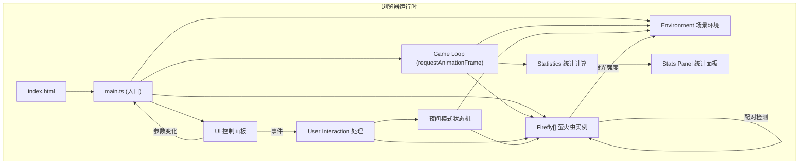

## 1. 架构设计



## 2. 技术选型

- **前端框架**：无（原生 TypeScript，不使用 React/Vue 等框架）
- **构建工具**：Vite@5
- **语言**：TypeScript@5（严格模式，target ES2020，module ESNext）
- **图形渲染**：HTML5 Canvas 2D API（原生，无游戏引擎/图形库依赖）
- **字体**：Google Fonts - Rubik Mono One
- **样式**：原生 CSS（通过 style 标签或 CSS 文件）

## 3. 项目文件结构

```
auto122/
├── package.json          # 项目依赖与脚本
├── index.html            # 入口 HTML，全屏 Canvas
├── tsconfig.json         # TypeScript 配置
├── vite.config.js        # Vite 配置
└── src/
    ├── main.ts           # 入口：初始化、事件绑定、游戏循环
    ├── firefly.ts        # 萤火虫类：位置、速度、发光、配对、吸引
    ├── environment.ts    # 场景背景：树木、荷叶、草丛，环境反应
    └── ui.ts             # UI 控制面板与统计面板
```

## 4. 模块职责与数据流向

### 4.1 main.ts - 入口与游戏循环

**职责**：
- 初始化 Canvas（900x700）与上下文
- 创建萤火虫实例数组
- 实例化 Environment 和 UI 模块
- 绑定全局事件（点击、鼠标移动、键盘、触摸）
- 启动 requestAnimationFrame 游戏循环
- 每帧调用：fireflies.update() → environment.update() → 统计计算 → fireflies.render() → environment.render() → ui.renderStats()
- 处理夜间模式状态机（空闲计时、参数恢复）

**对外接口**：
- `setCount(count: number)` - 更新萤火虫数量
- `setBrightness(brightness: number)` - 更新发光亮度
- `setSpeed(speed: number)` - 更新飞行速度
- `setAttractEnabled(enabled: boolean)` - 启用/禁用吸引行为

### 4.2 firefly.ts - 萤火虫类

**类 Firefly**：
- 属性：
  - `x, y: number` - 位置
  - `vx, vy: number` - 速度向量
  - `speed: number` - 当前速度
  - `baseSpeed: number` - 基础速度
  - `targetSpeed: number` - 目标速度（用于平滑过渡）
  - `pulsePeriod: number` - 脉冲周期（1.5-3.5s）
  - `pulsePhase: number` - 脉冲相位
  - `baseBrightness: number` - 基础亮度
  - `targetBrightness: number` - 目标亮度
  - `radius: number` - 身体半径（3px）
  - `glowRadius: number` - 当前光圈半径
  - `isFlashing: boolean` - 是否处于强光闪烁
  - `flashProgress: number` - 闪烁进度（0-1）
  - `isAttracting: boolean` - 是否在吸引其他萤火虫
  - `attractProgress: number` - 吸引效果进度
  - `isPaired: boolean` - 是否处于配对状态
  - `pairPartner: Firefly | null` - 配对对象
  - `pairProgress: number` - 配对进度
  - `pairCenterX, pairCenterY: number` - 配对中心
  - `pairAngle: number` - 配对旋转角度
  - `bezierTarget: {x, y, cp1x, cp1y, cp2x, cp2y}` - 贝塞尔曲线目标点与控制点
  - `bezierProgress: number` - 当前贝塞尔进度

- 方法：
  - `update(deltaTime: number, allFireflies: Firefly[])` - 每帧更新状态
  - `render(ctx: CanvasRenderingContext2D, globalBrightness: number)` - 渲染萤火虫与发光效果
  - `flash()` - 触发强光闪烁
  - `startPair(partner: Firefly)` - 开始配对
  - `endPair()` - 结束配对
  - `attractNearby(allFireflies: Firefly[])` - 吸引附近萤火虫

### 4.3 environment.ts - 场景环境

**类 Environment**：
- 属性：
  - `lotusPosition: {x, y}` - 荷叶位置
  - `lotusRadius: number` - 荷叶半径
  - `trees: Array<{path: Path2D, x: number, y: number, scale: number}>` - 树木数组
  - `grassBlades: Array<{x: number, y: number, curves: Array<{length: number, angle: number}>}>` - 草丛数组
  - `lotusColor: string` - 当前荷叶颜色
  - `treeOpacity: number` - 当前树木透明度
  - `targetLotusColor: {r: number, g: number, b: number}` - 目标荷叶颜色 RGB
  - `currentLotusColor: {r: number, g: number, b: number}` - 当前荷叶颜色 RGB
  - `targetTreeOpacity: number` - 目标树木透明度
  - `backgroundTopColor: string` - 背景顶部颜色
  - `backgroundBottomColor: string` - 背景底部颜色
  - `targetBgTopColor: {r, g, b}` - 目标背景顶部颜色
  - `targetBgBottomColor: {r, g, b}` - 目标背景底部颜色
  - `nightMode: boolean` - 是否夜间模式

- 方法：
  - `constructor(canvasWidth: number, canvasHeight: number)` - 初始化生成树木、草丛
  - `update(globalGlowAverage: number, brightnessSlider: number, nightMode: boolean)` - 每帧更新环境状态
  - `renderBackground(ctx: CanvasRenderingContext2D)` - 渲染背景渐变
  - `renderTrees(ctx: CanvasRenderingContext2D)` - 渲染树木轮廓
  - `renderLotus(ctx: CanvasRenderingContext2D)` - 渲染荷叶
  - `renderGrass(ctx: CanvasRenderingContext2D)` - 渲染草丛

### 4.4 ui.ts - 用户界面

**类 UI**：
- 属性：
  - `panel: HTMLDivElement` - 控制面板 DOM
  - `countSlider: HTMLInputElement` - 数量滑块
  - `countValue: HTMLSpanElement` - 数量显示
  - `brightnessSlider: HTMLInputElement` - 亮度滑块
  - `brightnessValue: HTMLSpanElement` - 亮度显示
  - `speedSlider: HTMLInputElement` - 速度滑块
  - `speedValue: HTMLSpanElement` - 速度显示
  - `attractToggle: HTMLButtonElement` - 吸引开关按钮
  - `statsPanel: HTMLDivElement` - 统计面板 DOM
  - `countDisplay: HTMLSpanElement` - 数量显示
  - `frequencyDisplay: HTMLSpanElement` - 频率显示
  - `pairDisplay: HTMLSpanElement` - 配对次数显示
  - `batteryIcon: HTMLDivElement` - 性能电池图标
  - `toggleBtn: HTMLButtonElement` - 面板折叠按钮
  - `isPanelOpen: boolean` - 面板是否展开
  - `onCountChange: (count: number) => void` - 数量变化回调
  - `onBrightnessChange: (brightness: number) => void` - 亮度变化回调
  - `onSpeedChange: (speed: number) => void` - 速度变化回调
  - `onAttractToggle: (enabled: boolean) => void` - 吸引开关回调

- 方法：
  - `constructor(container: HTMLElement)` - 创建所有 DOM 元素与样式
  - `updateStats(count: number, avgFrequency: number, pairCount: number)` - 更新统计显示
  - `togglePanel()` - 展开/收起控制面板
  - `private createSlider(label, min, max, step, value)` - 创建滑块通用方法
  - `private addButtonFeedback(btn)` - 添加按钮点击缩放反馈

**配对粒子系统**（在 main.ts 中管理）：
- `sparkParticles: Array<{x, y, vx, vy, life, maxLife}>`
- 每帧更新位置与生命值，渲染时淡出

## 5. 游戏循环架构

```
每帧 (requestAnimationFrame)
├── 计算 deltaTime (与上一帧时间差)
├── 更新夜间模式空闲计时器
├── 处理参数平滑过渡 (ease-out, 3秒)
│   ├── 萤火虫数量增减
│   ├── 亮度过渡
│   ├── 速度过渡
├── 更新所有萤火虫
│   ├── 贝塞尔路径飞行
│   ├── 发光脉冲
│   ├── 配对检测与行为
│   ├── 吸引行为
│   ├── 闪烁特效
│   └── 夜间模式参数修正
├── 更新闪耀粒子
│   ├── 位置更新
│   └── 生命值衰减
├── 计算全局平均发光强度
├── 更新环境状态
│   ├── 荷叶颜色过渡
│   ├── 树木透明度过渡
│   └── 背景颜色过渡 (夜间模式)
├── 渲染
│   ├── 背景渐变
│   ├── 树木轮廓
│   ├── 荷叶
│   ├── 草丛
│   ├── 萤火虫 (光圈 + 身体)
│   └── 闪耀粒子
└── 更新统计面板显示
```

## 6. 关键算法

### 6.1 贝塞尔曲线飞行
- 每只萤火虫维护当前贝塞尔曲线路径（起点、两个控制点、终点）
- 路径完成后随机生成新路径，保证最大转角 45°
- 使用 0 ≤ t ≤ 1 参数沿曲线移动

### 6.2 参数平滑过渡 (Ease-Out)
- 公式：`current += (target - current) * (1 - pow(1 - deltaTime / duration, 3))`
- duration = 3000ms（萤火虫 3 秒过渡），夜间模式恢复 1000ms

### 6.3 配对检测
- 每帧遍历萤火虫对，计算欧几里得距离
- 距离 < 25px 且双方均未配对 → 触发配对

### 6.4 发光脉冲
- 公式：`intensity = 0.5 + 0.5 * sin(2 * PI * time / pulsePeriod)`
- 渲染时半径 = baseRadius * (1 + intensity * brightnessMultiplier)
