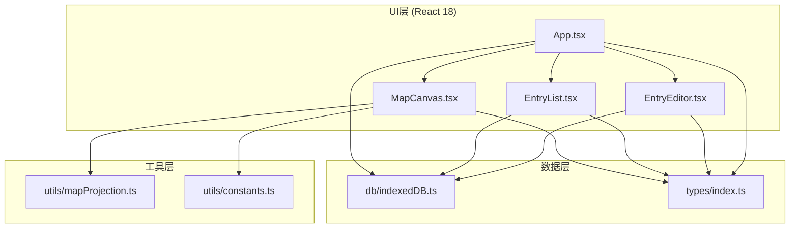
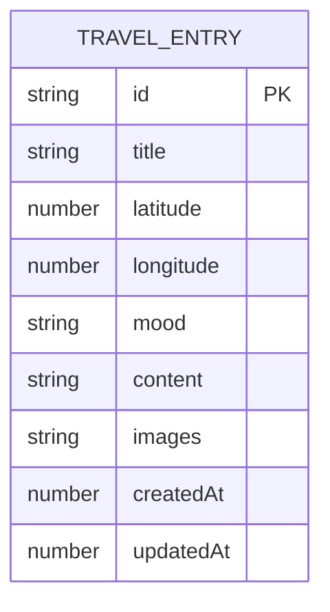

## 1. 架构设计



## 2. 技术说明

- 前端：React 18 + TypeScript + Vite
- 状态管理：React Hooks (useState, useEffect, useRef)，无额外状态管理库
- 数据存储：浏览器 IndexedDB（纯前端本地存储，无后端）
- 地图渲染：HTML5 Canvas API（Equirectangular等距柱状投影）
- 样式方案：CSS Modules + 内联样式（动画使用CSS transition/animation）
- 构建工具：Vite 5.x，端口5173，开启HMR热更新

## 3. 项目文件结构

```
auto123/
├── .trae/documents/
│   ├── PRD.md
│   └── technical-architecture.md
├── index.html
├── package.json
├── tsconfig.json
├── vite.config.js
└── src/
    ├── App.tsx                    # 主组件，全局状态与路由
    ├── main.tsx                   # React入口
    ├── index.css                  # 全局样式
    ├── components/
    │   ├── MapCanvas.tsx          # Canvas地图核心组件
    │   ├── EntryEditor.tsx        # 记录编辑器弹窗
    │   └── EntryList.tsx          # 侧边栏地点列表
    ├── db/
    │   └── indexedDB.ts           # IndexedDB封装层
    ├── types/
    │   └── index.ts               # TypeScript类型定义
    └── utils/
        ├── constants.ts           # 心情颜色、尺寸等常量
        └── mapProjection.ts       # 经纬度↔画布坐标转换
```

## 4. 类型定义

```typescript
type MoodType = 'happy' | 'calm' | 'excited' | 'moved' | 'other';

interface TravelImage {
  id: string;
  dataUrl: string;
  name: string;
  size: number;
}

interface TravelEntry {
  id: string;
  title: string;
  latitude: number;   // -90 ~ 90
  longitude: number;  // -180 ~ 180
  mood: MoodType;
  content: string;
  images: TravelImage[];
  createdAt: number;
  updatedAt: number;
}
```

## 5. 数据模型（IndexedDB）

### 5.1 数据库配置
- 数据库名：`TravelJournalDB`
- 版本：1
- 对象仓库：`entries`（主键：`id`，索引：`createdAt`）

### 5.2 ER图



## 6. 组件数据流向

| 组件 | 输入Props | 输出事件/回调 | 内部依赖 |
|------|-----------|---------------|----------|
| App.tsx | - | - | indexedDB, TravelEntry类型 |
| MapCanvas.tsx | entries: TravelEntry[], highlightId: string \| null | onDblClick(lat, lng), onHover(id \| null) | mapProjection, constants |
| EntryEditor.tsx | entry?: TravelEntry \| null, initialLat?: number, initialLng?: number, visible: boolean | onSave(entry), onClose() | indexedDB, MoodType类型 |
| EntryList.tsx | entries: TravelEntry[] | onSelect(id), onEdit(id), onDelete(id) | MoodType类型, constants |

## 7. 核心算法说明

### 7.1 等距柱状投影（Equirectangular）
```
canvasX = (longitude + 180) / 360 * canvasWidth * scale + offsetX
canvasY = (90 - latitude) / 180 * canvasHeight * scale + offsetY
```

### 7.2 地图渲染性能优化
- 使用 requestAnimationFrame 控制绘制帧率
- 仅在视口变化或数据变化时重绘
- 图钉命中检测使用空间坐标快速计算，避免逐像素检测

## 8. API定义（IndexedDB封装方法）

| 方法名 | 参数 | 返回值 | 说明 |
|--------|------|--------|------|
| initDB() | - | Promise\<void\> | 初始化数据库，创建对象仓库 |
| getAllEntries() | - | Promise\<TravelEntry[]\> | 按时间倒序获取所有记录 |
| addEntry(entry: Omit\<TravelEntry, 'id' \| 'createdAt' \| 'updatedAt'\>) | entry数据 | Promise\<string\> | 新增记录，返回id |
| updateEntry(id: string, data: Partial\<TravelEntry\>) | id和更新数据 | Promise\<void\> | 更新记录 |
| deleteEntry(id: string) | 记录id | Promise\<void\> | 删除记录 |
