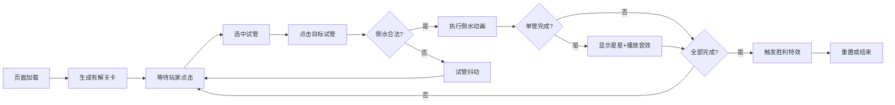

## 1. 产品概述
水排序益智游戏是一款基于物理模拟的浏览器小游戏，玩家需要将不同颜色的液体从一个试管倒入另一个试管，最终使每个试管内只有一种颜色。游戏锻炼玩家的逻辑推理与空间规划能力。

- 目标用户：喜欢益智解谜类游戏的休闲玩家
- 产品价值：提供轻松有趣的脑力锻炼体验，随时随地可玩

## 2. 核心功能

### 2.1 功能模块
1. **游戏主界面**：Canvas游戏画布、步数计数器、重置按钮
2. **试管交互系统**：选中试管、倒水操作、倒水动画、抖动反馈
3. **关卡生成系统**：逆向算法保证有解、随机生成初始布局
4. **胜利系统**：单管完成检测、全关胜利判定、胜利特效

### 2.3 页面详情

| 页面名称 | 模块名称 | 功能描述 |
|---------|---------|---------|
| 游戏主界面 | 游戏画布 | 700x600固定尺寸，居中显示，渐变色背景 |
| 游戏主界面 | 试管渲染 | 8个试管居中排列，高320px宽24px，底部半圆弧形，液体分层显示，表面波动动画 |
| 游戏主界面 | 选中指示器 | 深灰色圆环，半径比试管口大4px，0.2秒出现动画 |
| 游戏主界面 | 步数计数器 | 界面顶部左侧，白色22px字体，带阴影 |
| 游戏主界面 | 重置按钮 | 界面顶部右侧，圆形红色按钮，悬停缩放，点击恢复初始状态 |
| 游戏主界面 | 倒水动画 | 0.4秒液体流动动画，目标试管逐层半透明填充 |
| 游戏主界面 | 抖动反馈 | 无效操作时试管水平偏移±4px，持续0.2秒 |
| 游戏主界面 | 完成星星 | 单管完成时顶部金色旋转星星SVG，每秒30度 |
| 游戏主界面 | 完成音效 | 单管完成时Web Audio API播放440Hz正弦波0.3秒渐弱 |
| 游戏主界面 | 胜利特效 | 背景渐亮1秒、恭喜通关文字、100个彩色粒子向上飘散1.5秒 |

## 3. 核心流程

玩家打开页面 → 系统生成随机有解关卡 → 玩家点击试管选中 → 玩家点击目标试管倒水 → 系统判断倒水合法性 → 执行倒水或抖动反馈 → 检测单管完成（星星+音效）→ 检测全部完成（胜利特效）→ 玩家可点击重置重新开始

## 4. 用户界面设计

### 4.1 设计风格
- 主色调：深灰蓝背景渐变(#2c3e50→#1a252f)，8种亮色液体
- 试管样式：浅灰#bdc3c7半透明管壁，底部圆弧，液体分层清晰
- 按钮风格：圆形红色#e74c3c重置按钮，悬停1.1倍缩放
- 字体：默认系统字体，步数22px白色带细阴影，胜利文字48px黑色带2px白色阴影
- 动效：选中圆环0.2s渐显、倒水0.4s流动、抖动0.2s、星星30°/s旋转、背景1s渐亮、粒子1.5s飘散

### 4.2 页面设计概览

| 页面名称 | 模块名称 | UI元素 |
|---------|---------|--------|
| 游戏主界面 | 整体布局 | 700×600居中画布，垂直方向上20%为信息区，下80%为游戏区 |
| 游戏主界面 | 试管排列 | 8个试管水平居中排列，间距30px，底部对齐 |
| 游戏主界面 | 信息栏 | 左侧步数计数，右侧重置按钮，顶部内边距20px |
| 游戏主界面 | 特效层 | Canvas覆盖层，用于倒水动画、粒子、胜利文字渲染 |

### 4.3 响应式
- 桌面端优先，窗口宽度<768px时所有交互元素缩小至80%
- 同时支持鼠标点击和触摸事件

## 5. 性能要求
- 帧率稳定60FPS，倒水动画期间不低于55FPS
- 粒子数量不超过200个，生命周期结束立即释放内存
