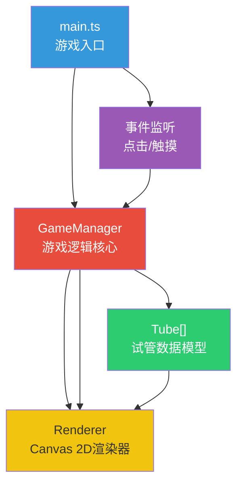

## 1. 架构设计



数据流向：
1. `main.ts` 初始化 `GameManager` 和 `Renderer`，启动 requestAnimationFrame 主循环
2. 用户点击/触摸事件 → `main.ts` 坐标转换 → `GameManager.handleClick()`
3. `GameManager` 调用 `Tube.pour()` / `Tube.receive()` 更新试管状态
4. `GameManager` 触发 `Renderer.render()` 重绘画面
5. `Renderer` 从 `GameManager.getTubes()` 获取最新状态逐帧渲染

## 2. 技术描述
- 前端框架：纯 TypeScript + HTML5 Canvas 2D，无外部游戏引擎
- 构建工具：Vite@5，端口5173，开启HMR
- 语言：TypeScript，严格模式，target ES2020，module ESNext
- 音效：Web Audio API 原生生成正弦波
- 图标：内联SVG（星星）

## 3. 文件职责

| 文件路径 | 职责 | 主要输出/方法 |
|---------|------|-------------|
| `package.json` | 项目依赖与脚本 | typescript, vite, npm run dev |
| `vite.config.js` | Vite配置 | 端口5173，HMR |
| `tsconfig.json` | TypeScript配置 | strict, target ES2020, module ESNext |
| `index.html` | 入口HTML | 700×600 Canvas容器，加载 src/main.ts |
| `src/main.ts` | 游戏入口与主循环 | initGame(), gameLoop(), 事件监听与坐标路由 |
| `src/GameManager.ts` | 游戏逻辑核心 | handleClick(), generateLevel(), checkWin(), pourAnimation |
| `src/Tube.ts` | 试管数据模型 | pour(), receive(), isFull(), isEmpty(), topColor(), isComplete() |
| `src/Renderer.ts` | Canvas渲染 | render(), drawTube(), drawLiquid(), drawUI(), drawParticles() |

## 4. 数据模型

### 4.1 Tube（试管）

```typescript
interface TubeState {
  id: number;
  capacity: number;        // 容量，固定4层
  colors: string[];        // 颜色堆栈，底部在前，顶部在后，最多4个
  x: number;               // Canvas上的X坐标（试管中心）
  y: number;               // Canvas上的Y坐标（试管底部）
  width: number;           // 试管宽度
  height: number;          // 试管高度
}
```

### 4.2 GameState（游戏状态）

```typescript
interface GameState {
  tubes: Tube[];
  selectedTubeId: number | null;
  moves: number;
  isAnimating: boolean;
  isWon: boolean;
  pourAnimation: PourAnimation | null;
  shakeAnimation: ShakeAnimation | null;
  particles: Particle[];
  completedTubeIds: Set<number>;
  initialColors: Map<number, string[]>;  // 用于重置
}
```

### 4.3 动画数据结构

```typescript
interface PourAnimation {
  sourceId: number;
  targetId: number;
  color: string;
  layersToPour: number;
  progress: number;       // 0~1
  duration: number;       // 400ms
  startTime: number;
}

interface ShakeAnimation {
  tubeId: number;
  progress: number;
  duration: number;       // 200ms
  startTime: number;
}

interface Particle {
  x: number;
  y: number;
  vx: number;
  vy: number;
  radius: number;
  color: string;
  life: number;           // 剩余生命（秒）
  maxLife: number;
}
```

## 5. 关卡生成算法（逆向保证有解）

```
1. 初始化：N个试管，前K个装满同色液体（每种颜色4层），其余为空
2. 随机执行3-5步合法移动（从随机源试管倒入随机目标试管）
3. 记录最终状态作为初始布局
4. 保存初始颜色映射用于重置功能
```

## 6. 倒水合法性判定

```typescript
function canPour(source: Tube, target: Tube): boolean {
  if (source.isEmpty()) return false;
  if (target.isFull()) return false;
  if (target.isEmpty()) return true;
  return source.topColor() === target.topColor();
}
```

连续同色层数计算：从顶部向下数连续相同颜色的层数，取可倒入的最大数量（不超过目标试管剩余容量）。
