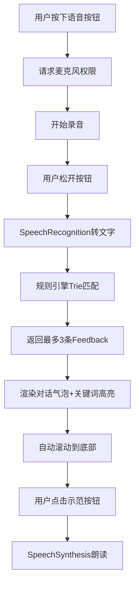

## 1. 产品概述
AI口语陪练工具是一款基于Web Speech API的轻量原型，帮助英语学习者通过浏览器进行实时语音练习。用户对着麦克风说英语句子，系统实时识别语音并通过本地规则引擎给出语法纠错和发音反馈，对话历史以时间轴形式展示。

- 目标用户：英语学习者（学生、职场人士）、英语课堂互动教学
- 核心价值：零安装、实时反馈、隐私保护（本地规则引擎无需联网）

## 2. 核心功能

### 2.1 用户角色
| 角色 | 注册方式 | 核心权限 |
|------|----------|----------|
| 学习者 | 无需注册，直接使用 | 语音输入、文字输入、查看反馈、播放示范发音 |

### 2.2 功能模块
1. **对话展示区**：时间轴式对话气泡，支持关键词高亮，平滑滚动动画
2. **语音交互区**：圆形语音按钮（带涟漪/呼吸动画）、静音模式文字输入框、可拖拽分隔条
3. **语音识别引擎**：封装Web Speech API SpeechRecognition，实时转文字
4. **规则引擎**：内置300条英语语法/发音规则，Trie树前缀匹配优化
5. **语音合成**：SpeechSynthesis朗读标准美式发音示范

### 2.3 页面详情
| 页面名称 | 模块名称 | 功能描述 |
|----------|----------|----------|
| 主界面 | 对话展示区 | 垂直渐变背景(#0f0c29→#302b63)，用户气泡右对齐(#6c63ff)，系统气泡左对齐(#2d3436，文字#a8e6cf)，错误红色下划线，语法橙色波浪线，淡入+右滑0.3秒动画 |
| 主界面 | 语音交互区 | 圆形按钮(80px)，按下涟漪动画(半径0→120px，透明度0.4→0，0.8秒)，识别中红色呼吸脉冲，静音模式文字输入框(200px)，8px柔性分隔条可拖拽调整比例 |
| 主界面 | 反馈展示 | 每条反馈淡黄色背景(#fdcb6e)，感叹号图标，标准读法示范按钮(美式女声，语速0.8，音调1.2) |

## 3. 核心流程
用户按下语音按钮→浏览器请求麦克风权限→开始录音→用户松开按钮→停止录音→SpeechRecognition转文字→规则引擎分析→最多返回3条反馈（按严重程度排序）→渲染用户气泡+反馈气泡→自动滚动到底部→用户可点击示范按钮播放标准发音

## 4. 用户界面设计

### 4.1 设计风格
- 主色调：深紫蓝渐变背景(#0f0c29→#302b63)，品牌紫(#6c63ff)，浅紫(#a29bfe)
- 语义色：错误红(#ff6b6b)，警告橙(#feca57)，成功绿(#a8e6cf)，反馈黄(#fdcb6e)
- 按钮风格：圆形胶囊按钮，大圆角(16px)，按下涟漪扩散动画
- 字体：16px默认，移动端14px，气泡内文字支持高亮样式
- 布局：桌面端上下分区(70%/30%)，移动端上下堆叠，响应式自适应

### 4.2 页面设计概览
| 页面名称 | 模块名称 | UI元素 |
|----------|----------|--------|
| 主界面 | 对话展示区 | 渐变背景、时间轴气泡、圆角16px、小三角尾巴、红色下划线/橙色波浪线高亮、淡入右滑动画 |
| 主界面 | 语音交互区 | 圆形语音按钮(涟漪+呼吸动画)、文字输入框、8px分隔条(拖拽半透明遮罩) |
| 主界面 | 反馈卡片 | 淡黄背景、8px内边距、感叹号图标、示范朗读按钮 |

### 4.3 响应式设计
- **桌面端(≥768px)**：上下分区布局，分隔条可拖拽，气泡最大宽度600px
- **平板/移动端(<768px)**：上下堆叠，气泡宽度=屏宽-32px，语音按钮60px，输入框全宽，分隔条隐藏
- **小屏(<480px)**：字体14px，所有圆角减半，装饰元素隐藏

### 4.4 性能指标
- 语音识别延迟：<800ms（Chrome桌面端）
- 规则引擎匹配：<50ms
- 动画帧率：≥55FPS
- 状态持久化：场景切换/待机恢复不丢失
