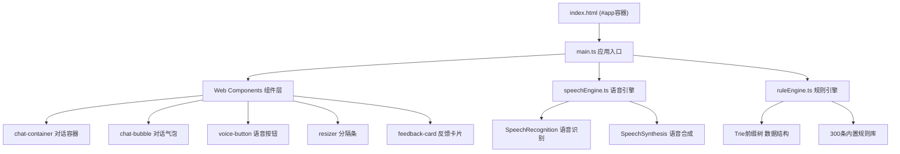

## 1. 架构设计



## 2. 技术栈说明

- **前端框架**：无框架原生 Web Components API (Custom Elements + Shadow DOM)
- **开发语言**：TypeScript 5.x (严格模式)
- **构建工具**：Vite 5.x (HMR热更新，端口5173，输出目录dist)
- **浏览器API**：Web Speech API (SpeechRecognition + SpeechSynthesis)
- **状态持久化**：localStorage 存储对话历史
- **性能优化**：Trie前缀树加速规则匹配，CSS硬件加速动画

## 3. 目录结构

```
project-root/
├── index.html              # 入口HTML页面
├── package.json            # 依赖与脚本配置
├── vite.config.js          # Vite构建配置
├── tsconfig.json           # TypeScript编译配置
└── src/
    ├── main.ts             # 应用初始化入口
    ├── speechEngine.ts     # Web Speech API封装
    ├── ruleEngine.ts       # 规则引擎 + Trie + 300条规则
    └── components/
        ├── ChatContainer.ts    # 对话容器组件
        ├── ChatBubble.ts       # 对话气泡组件
        ├── VoiceButton.ts      # 语音按钮组件
        ├── Resizer.ts          # 拖拽分隔条组件
        └── FeedbackCard.ts     # 反馈卡片组件
```

## 4. 核心数据类型定义

```typescript
// 规则引擎反馈类型
interface Feedback {
  type: 'grammar' | 'word' | 'pronunciation';
  severity: 1 | 2 | 3;  // 1:轻微 2:中等 3:严重
  original: string;     // 原词/原短语
  suggestion: string;   // 建议修正
  description: string;  // 中文描述说明
}

// 对话消息类型
interface ChatMessage {
  id: string;
  role: 'user' | 'system';
  content: string;
  timestamp: number;
  feedbacks?: Feedback[];
}

// 规则条目类型
interface Rule {
  pattern: string;           // 匹配模式(单词/短语/正则)
  type: Feedback['type'];
  severity: Feedback['severity'];
  suggestion: string;
  description: string;
}
```

## 5. 组件定义

| 组件标签 | 类名 | 功能 |
|----------|------|------|
| `<chat-container>` | ChatContainer | 对话展示容器，管理消息列表，自动滚动 |
| `<chat-bubble>` | ChatBubble | 单条对话气泡，支持关键词高亮，小三角尾巴 |
| `<voice-button>` | VoiceButton | 圆形语音按钮，涟漪/呼吸动画，麦克风状态管理 |
| `<resizer-bar>` | ResizerBar | 8px可拖拽分隔条，半透明遮罩提示 |
| `<feedback-card>` | FeedbackCard | 反馈卡片，淡黄色背景，示范朗读按钮 |

## 6. 模块API定义

### speechEngine.ts
```typescript
// 开始监听语音，识别完成回调text
function listen(callback: (text: string) => void): void;
// 停止监听
function stopListen(): void;
// 朗读文本（美式女声，rate=0.8, pitch=1.2）
function speak(text: string): void;
```

### ruleEngine.ts
```typescript
// 分析文本，返回最多3条按严重程度排序的反馈
function analyze(text: string): Feedback[];
// Trie前缀树类
class Trie {
  insert(word: string, rule: Rule): void;
  search(text: string): Rule[];
}
```

## 7. 性能优化策略

1. **Trie前缀树**：300条规则预构建Trie，匹配复杂度O(n)而非O(n*m)
2. **Shadow DOM**：组件样式隔离，避免全局重绘
3. **CSS动画**：transform/opacity属性启用GPU硬件加速
4. **防抖节流**：分隔条拖拽使用requestAnimationFrame
5. **虚拟滚动**：消息超过100条时仅渲染可视区域（预留扩展）
6. **localStorage缓存**：对话历史持久化，页面刷新不丢失
