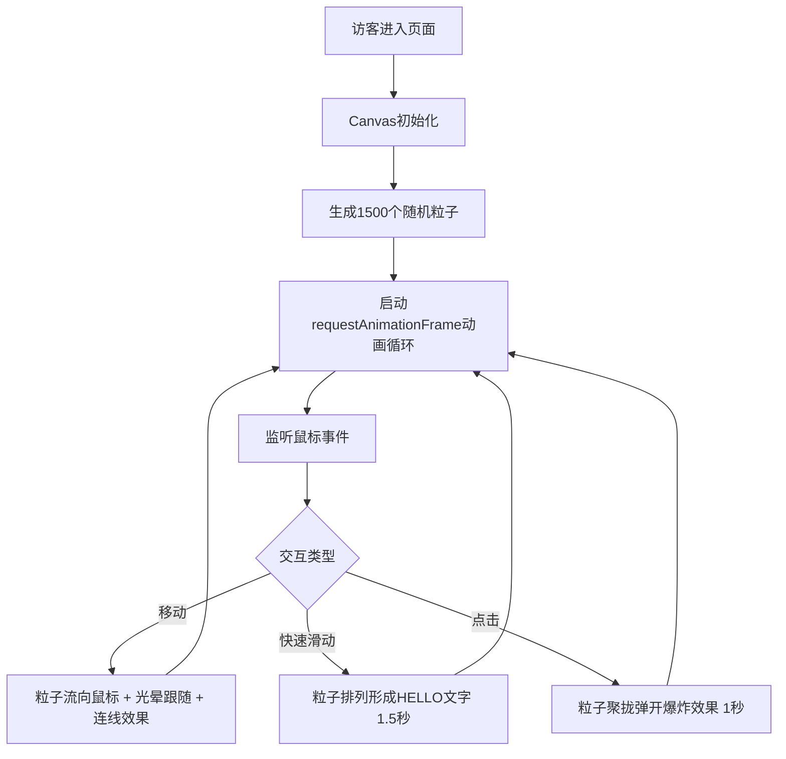

## 1. 产品概述

文字粒子宇宙是一个基于Canvas的沉浸式交互式主页，专为个人博客或作品集网站设计。通过鼠标控制大量悬浮的字母与符号粒子产生流体般的运动轨迹，营造科幻与诗意交融的视觉体验。

- 目标用户：创意设计师、开发者、艺术家，用于展示个人作品和形象
- 核心价值：提供令人难忘的第一印象，通过独特的粒子交互展现个性与品味

## 2. 核心功能

### 2.1 用户角色

| 角色 | 访问方式 | 核心权限 |
|------|----------|----------|
| 访客 | 直接访问URL | 体验粒子动画交互，通过鼠标与粒子系统互动 |

### 2.2 功能模块

1. **粒子流场系统**：1500个字母/数字/符号粒子，受Perlin噪声流场驱动产生流体运动
2. **鼠标交互系统**：
   - 鼠标移动吸引/排斥粒子，形成漩涡和流动感
   - 鼠标快速划过时粒子排列形成"HELLO"文字轮廓
   - 鼠标点击时粒子聚拢弹开的爆炸效果
3. **视觉效果系统**：
   - 粒子连线效果（空间哈希优化）
   - 鼠标光晕效果
   - 粒子颜色闪烁和渐变过渡

### 2.3 页面详情

| 页面名称 | 模块名称 | 功能描述 |
|----------|----------|----------|
| 主页 | Canvas粒子动画 | 全屏Canvas渲染1500个文字粒子，响应鼠标移动、悬停、点击事件，实现流场运动、文字成型、爆炸效果、连线和光晕视觉效果 |

## 3. 核心流程

访客进入页面后，Canvas自动初始化并随机分布1500个粒子。访客通过鼠标与粒子系统进行互动：
- 移动鼠标：粒子被鼠标吸引，沿流场产生流体运动，伴随连线和光晕效果
- 快速滑动：粒子短暂排列形成"HELLO"文字，1.5秒后逐渐消散
- 点击鼠标：粒子向点击位置聚拢后弹开，1秒后恢复流场运动

## 4. 用户界面设计

### 4.1 设计风格

- **主色调**：深空黑 `#0a0a0a` 作为纯黑背景
- **渐变色**：粒子颜色从青色 `#00d4ff` 渐变到紫色 `#7b2ffc`，按Y坐标映射
- **文字/高亮色**：纯白色 `#ffffff`（文字成型、光晕中心、连线高亮）
- **字体风格**：系统默认无衬线字体，字符大小12-24px
- **视觉风格**：极简科幻、沉浸式暗调、流动粒子、梦幻光晕

### 4.2 页面设计概览

| 页面名称 | 模块名称 | UI元素 |
|----------|----------|--------|
| 主页 | Canvas粒子动画 | 全屏视口100vw×100vh、纯黑背景#0a0a0a、1500个半透明渐变文字粒子、粒子连线、60px半径圆形光晕、无任何UI元素保持沉浸感 |

### 4.3 响应式设计

- 采用桌面优先设计，Canvas自适应整个视口尺寸
- 窗口大小变化时自动重新分布粒子以保持密度
- 触摸设备支持触摸移动和触摸点击交互

### 4.4 动画与性能

- 使用requestAnimationFrame保持55fps以上帧率
- 空间哈希优化粒子连线计算
- 鼠标事件每帧最多处理一次避免丢帧
- 所有动画基于Canvas原生API，无额外依赖
