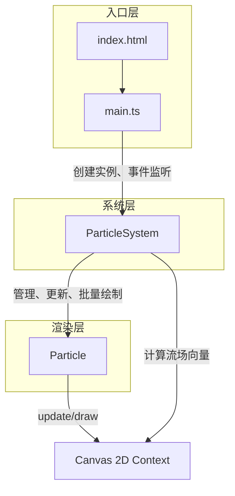

## 1. 架构设计

本项目为纯前端Canvas动画应用，采用TypeScript + Vite构建，不依赖任何外部渲染库。架构分为三层：入口层、系统层和渲染层。



**数据流向说明：**
- `main.ts` → 接收鼠标事件 → 传递坐标给 `ParticleSystem`
- `ParticleSystem` → 计算Perlin噪声流场 → 为每个 `Particle` 提供向量
- `Particle` → 接收流场向量和鼠标位置 → 更新速度和位置 → 绘制到Canvas

## 2. 技术描述

- **前端构建**: Vite@5（端口5173，开启HMR）
- **语言**: TypeScript@5（严格模式，target ES2020，module ESNext）
- **渲染**: HTML5 Canvas 2D API（零第三方库依赖）
- **启动命令**: `npm run dev`

## 3. 文件结构与职责

| 文件路径 | 职责 | 调用关系 |
|----------|------|----------|
| `package.json` | 项目依赖与脚本配置 | - |
| `vite.config.js` | Vite开发服务器配置（端口5173, HMR） | - |
| `tsconfig.json` | TypeScript编译配置（严格模式, ES2020, dom lib） | - |
| `index.html` | 入口HTML页面，全屏黑色背景，引入主脚本 | 加载 `src/main.ts` |
| `src/main.ts` | 初始化Canvas，创建粒子系统，启动动画循环，监听鼠标事件 | 调用 `ParticleSystem` 构造函数和方法 |
| `src/particle.ts` | 单个粒子类定义：位置、速度、字符、颜色、大小、更新方法、绘制方法 | 被 `ParticleSystem` 管理和调用 |
| `src/particleSystem.ts` | 粒子系统管理：粒子创建、流场计算、批量更新绘制、空间哈希连线、文字成型、爆炸效果 | 管理 `Particle` 实例数组 |

## 4. 核心数据结构

### 4.1 Particle 类字段

```typescript
class Particle {
  x: number;              // X坐标
  y: number;              // Y坐标
  vx: number;             // X方向速度
  vy: number;             // Y方向速度
  char: string;           // 显示的字符(A-Z, 0-9, ., ,)
  baseColor: string;      // 基础颜色(基于初始Y坐标的渐变)
  currentColor: string;   // 当前颜色(带色相偏移)
  baseSize: number;       // 基础大小(12-24px)
  currentSize: number;    // 当前大小(文字成型时为20px)
  opacity: number;        // 透明度(0.5-0.8)
  explosionVx: number;    // 爆炸速度X
  explosionVy: number;    // 爆炸速度Y
  isExploding: boolean;   // 是否处于爆炸状态
  targetX: number;        // 文字成型目标X
  targetY: number;        // 文字成型目标Y
  hasTarget: boolean;     // 是否有成型目标
}
```

### 4.2 ParticleSystem 类字段

```typescript
class ParticleSystem {
  canvas: HTMLCanvasElement;
  ctx: CanvasRenderingContext2D;
  particles: Particle[];              // 粒子数组(1500个)
  mouseX: number;                     // 鼠标X坐标
  mouseY: number;                     // 鼠标Y坐标
  mouseActive: boolean;               // 鼠标是否在画布内
  mouseSpeed: number;                 // 鼠标移动速度
  lastMouseX: number;                 // 上一帧鼠标X
  lastMouseY: number;                 // 上一帧鼠标Y
  time: number;                       // Perlin噪声时间参数
  textMode: boolean;                  // 是否处于文字成型模式
  textModeTimer: number;              // 文字模式剩余帧数
  explosionMode: boolean;             // 是否处于爆炸模式
  explosionTimer: number;             // 爆炸模式剩余帧数
  explosionCenterX: number;           // 爆炸中心X
  explosionCenterY: number;           // 爆炸中心Y
  glowX: number;                      // 光晕X坐标(平滑跟随)
  glowY: number;                      // 光晕Y坐标(平滑跟随)
  spatialHash: Map<string, Particle[]>; // 空间哈希表
  cellSize: number;                   // 空间哈希单元格大小(30px)
}
```

## 5. 关键算法

### 5.1 Perlin噪声流场（简化版）
由于不允许外部库，实现简化的2D伪噪声函数：
- 使用多组正弦函数叠加模拟Perlin噪声
- 根据粒子位置和时间参数计算角度
- 将角度转换为单位向量作为流场方向
- 鼠标位置叠加吸引/排斥力向量

### 5.2 空间哈希优化连线
- 将Canvas划分为30px×30px的网格单元
- 每帧将粒子按坐标分配到哈希表
- 连线时只检查当前粒子所在及相邻8个单元内的粒子
- 时间复杂度从O(n²)降为O(n)

### 5.3 文字成型算法
- 预计算"HELLO"文字在离屏Canvas中的像素点
- 随机选取足够数量的像素位置作为目标点
- 粒子从当前位置线性插值移动到目标位置（0.1缓动系数）
- 1.5秒后取消目标，粒子回归流场运动

### 5.4 爆炸效果
- 点击瞬间记录爆炸中心
- 所有粒子先获得一个朝向中心的加速（聚拢）
- 500ms后切换为向外的随机速度（弹开，3-6px/帧）
- 1秒后恢复正常流场控制

## 6. 性能优化策略

1. **requestAnimationFrame**: 使用浏览器原生动画循环，与显示器刷新率同步
2. **鼠标事件节流**: 鼠标事件只更新状态，实际处理在每帧动画循环中，确保每帧最多处理一次
3. **空间哈希**: 粒子连线使用空间分桶，避免O(n²)全量比较
4. **离屏Canvas预渲染**: 文字像素预计算缓存，避免每帧重绘文字
5. **颜色缓存**: 渐变色和偏移色预计算，减少实时字符串拼接开销
6. **双精度限制**: 速度最大2px/帧，避免粒子飞离画布后开销增大
