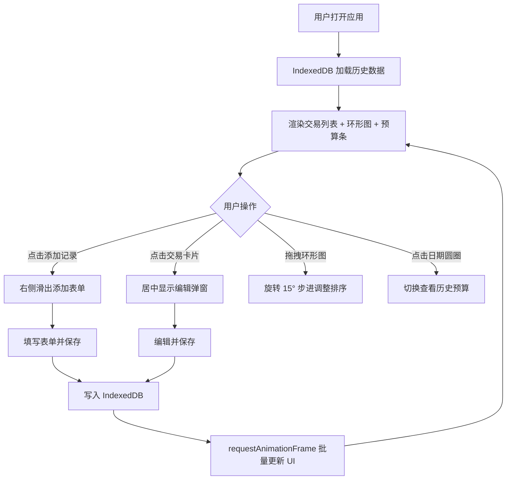

## 1. 产品概述

SlimLedger 是一款轻量级的个人记账与预算管理侧边工具，专注于让用户快速记录每日收支，并通过可视化图表直观了解消费情况。所有数据本地存储，无需账号注册，保护用户隐私。

- 核心目标：提供随手记、可视化、轻提醒的极简记账体验
- 产品价值：3 秒记录一笔消费，图表一眼看懂财务状况，预算提前预警超支风险

## 2. 核心功能

### 2.1 功能模块

1. **交易记录管理**：添加、编辑、删除收支记录，按时间倒序展示
2. **类别统计环形图**：按餐饮、交通、购物、其他四大类别统计支出，支持拖拽排序
3. **每日预算管理**：设置每日预算，展示剩余金额，低于 20% 触发闪烁警告
4. **历史日期切换**：通过周历圆圈切换查看任意日期的预算和消费情况
5. **本地数据持久化**：所有数据存储在浏览器 IndexedDB，刷新不丢失

### 2.2 页面详情

| 页面名称 | 模块名称 | 功能描述 |
|-----------|-------------|---------------------|
| 主页面 | 顶部导航栏 | 应用名展示、添加记录按钮（点击右侧滑出表单） |
| 主页面 | 交易记录列表 | 左侧 35% 宽度的流式卡片列表，展示所有交易记录，悬停上浮，点击编辑 |
| 主页面 | 类别环形图 | 右上方 300px 直径 SVG 环形图，中心显示本月总支出，可拖拽旋转排序 |
| 主页面 | 每日预算条 | 右下方纵向预算条，渐变色填充，7 天选择器切换日期 |
| 主页面 | 添加记录表单 | 从右侧滑入，宽度 40%，输入金额、类别、收支类型、备注 |
| 主页面 | 编辑弹窗 | 居中模态框，宽 400px，编辑已有交易记录，保存时带压缩动画 |

## 3. 核心流程

## 4. 用户界面设计

### 4.1 设计风格

- **主色调**：深蓝 #2c3e50（顶栏背景）、绿色 #2ecc71（收入/添加按钮）、红色 #e74c3c（支出/警告）
- **辅助色**：蓝色 #3498db、橙色 #e67e22、紫色 #9b59b6（类别色）
- **中性色**：#fafafa（卡片背景）、#ecf0f1（标签背景）、#f5f6fa（侧栏背景）
- **按钮风格**：圆角 20px 添加按钮，点击缩小 0.95 再弹回（0.15s 动画）
- **字体**：系统无衬线字体，标题粗体 600，正文常规
- **布局风格**：顶部固定导航栏 + 左右分栏（左列表 35%，右可视化 65%）

### 4.2 页面设计概览

| 页面名称 | 模块名称 | UI 元素 |
|-----------|-------------|-------------|
| 主页面 | 交易卡片 | 圆角 12px，左侧 4px 类别色竖条，悬停上浮 3px，阴影 #00000015 |
| 主页面 | 环形图 | 直径 300px，SVG 绘制，中心加粗 28px 总额，拖拽 0.4s 平滑动画 |
| 主页面 | 预算条 | 高度 24px，从底部向上填充，绿到红渐变，<20% 闪烁警告（0.3s 频率） |
| 主页面 | 7 天选择器 | 一排圆圈，当日 #2ecc71 粗 2px 边框高亮 |
| 主页面 | 添加表单 | 右侧滑入，宽度 40%，背景 #f5f6fa |
| 主页面 | 编辑弹窗 | 居中，宽 400px 高 320px，遮罩 0.4 半黑，取消/保存按钮 |

### 4.3 响应式设计

- 桌面端优先设计，左右分栏布局
- 移动端适配：交易列表最小宽度 280px，屏幕过窄时自动调整比例
- 触摸设备：拖拽环形图支持触摸事件

## 4.4 性能要求

- 使用 requestAnimationFrame 批量渲染图表和列表，避免单独渲染卡顿
- 目标 FPS ≥ 55
- IndexedDB 操作异步化，不阻塞主线程
- 页面刷新自动恢复上次浏览状态（环形图排序、当前选中日期）
