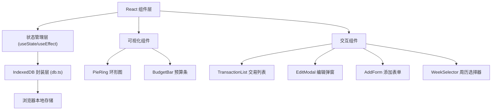
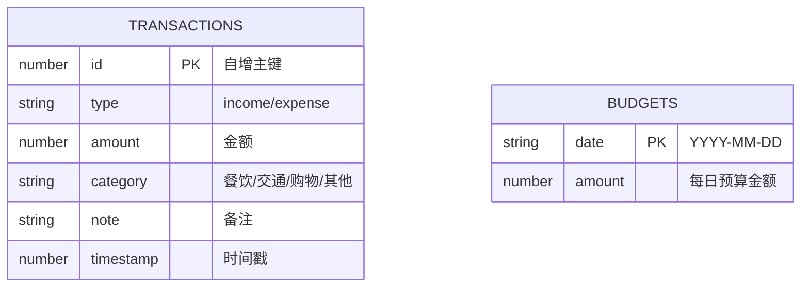

## 1. 架构设计



## 2. 技术说明

- **前端框架**：React 18 + TypeScript
- **构建工具**：Vite（端口 5173，开启 HMR）
- **数据存储**：浏览器原生 IndexedDB API（不依赖第三方库）
- **样式方案**：原生 CSS + CSS 变量（不使用 Tailwind，保持用户指定样式）
- **动画方案**：CSS Transitions + requestAnimationFrame 批量更新
- **初始化工具**：手动创建项目结构（用户指定具体文件列表）

## 3. 文件结构

| 文件路径 | 作用说明 |
|---------|---------|
| `package.json` | 项目依赖与脚本（npm run dev） |
| `index.html` | 入口 HTML，meta viewport，内置加载动画 |
| `tsconfig.json` | TS 严格模式，target ES2020，module ESNext |
| `vite.config.js` | Vite 基础配置，端口 5173，HMR |
| `src/db.ts` | IndexedDB 封装类，CRUD 异步方法 |
| `src/App.tsx` | 主组件，全局状态管理，子组件编排 |
| `src/components/PieRing.tsx` | 环形图组件，SVG 绘制 + 拖拽排序 |
| `src/components/BudgetBar.tsx` | 预算条组件，渐变填充 + 闪烁警告 + 7 天选择 |
| `src/components/TransactionList.tsx` | 交易记录流式列表组件 |
| `src/components/TransactionCard.tsx` | 单条交易卡片组件 |
| `src/components/EditModal.tsx` | 编辑交易弹窗组件 |
| `src/components/AddForm.tsx` | 添加记录滑入表单组件 |
| `src/types.ts` | TypeScript 类型定义（Transaction、Budget 等） |
| `src/main.tsx` | React 入口文件 |
| `src/index.css` | 全局样式与 CSS 变量 |

## 4. 数据模型

### 4.1 数据模型定义



### 4.2 IndexedDB 配置

- **数据库名**：`slimledger`
- **版本号**：1
- **表 transactions**：
  - 主键：`id`（自增）
  - 索引：`timestamp`（按时间查询）、`category`（按类别查询）
- **表 budgets**：
  - 主键：`date`（YYYY-MM-DD 字符串）

### 4.3 TypeScript 类型

```typescript
type TransactionType = 'income' | 'expense';
type Category = '餐饮' | '交通' | '购物' | '其他';

interface Transaction {
  id?: number;
  type: TransactionType;
  amount: number;
  category: Category;
  note: string;
  timestamp: number;
}

interface Budget {
  date: string;
  amount: number;
}

interface AppState {
  transactions: Transaction[];
  budgets: Record<string, number>;
  selectedDate: string;
  categoryOrder: Category[];
  isAddFormOpen: boolean;
  editingTransaction: Transaction | null;
}
```

## 5. 性能优化策略

1. **批量渲染**：使用 `requestAnimationFrame` 调度图表和列表的批量更新，避免每笔记录单独触发重渲染
2. **组件 memo 化**：交易卡片、环形图扇区等使用 `React.memo` 避免不必要的重渲染
3. **异步数据库**：所有 IndexedDB 操作为异步 Promise，不阻塞 UI 线程
4. **状态持久化**：浏览状态（选中日期、类别顺序）存入 `localStorage`，刷新立即恢复
5. **CSS 硬件加速**：动画使用 `transform` 和 `opacity`，触发 GPU 合成层

## 6. 状态恢复策略

页面加载时按以下顺序恢复：
1. 从 `localStorage` 读取 `selectedDate` 和 `categoryOrder`
2. 从 IndexedDB 并行加载 `transactions` 和 `budgets`
3. 使用 `requestAnimationFrame` 批量更新所有子组件
