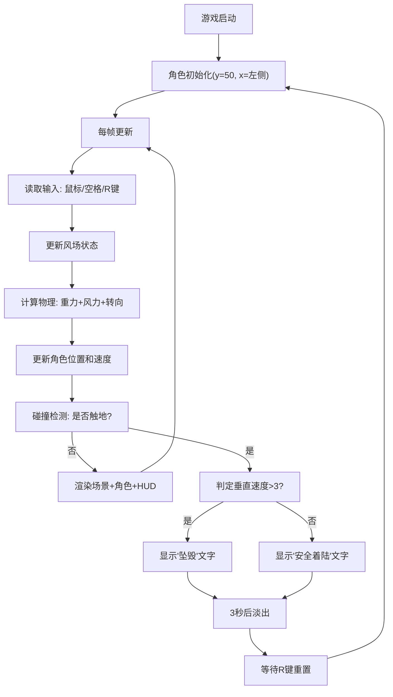

## 1. 产品概述
《塞尔达传说》风格滑翔伞物理飞行浏览器交互原型，用于直观验证物理参数调优与手感反馈。
- 核心目标：解决角色控制、风力影响、地形碰撞和高度指示等系统集成时的参数验证问题
- 目标用户：游戏设计师、物理系统开发人员

## 2. 核心功能

### 2.1 功能模块
1. **主场景渲染**：800x600 Canvas，远山、草地、树木等低多边形自然风景
2. **角色控制系统**：鼠标转向、空格收伞、R键重置
3. **物理模拟系统**：重力、风力、滑翔/收伞加速度差异、速度限制
4. **环境系统**：动态风场、正弦波等高线地形、碰撞检测
5. **HUD显示系统**：实时飞行参数面板、着陆结果提示、高度警告

### 2.2 功能详细描述
| 模块名称 | 子功能 | 功能描述 |
|---------|--------|---------|
| 主场景 | 背景渲染 | 天空从天蓝#87CEEB到日落橙#f4a460渐变 |
| 主场景 | 远山渲染 | 渐变#5b8a72到#2d4a3e |
| 主场景 | 草地渲染 | #4a7c59颜色地面 |
| 主场景 | 树木渲染 | 棕色树干+绿色树冠，稀疏分布 |
| 角色控制 | 鼠标转向 | 鼠标移动控制左右转向，转向角限制±30度 |
| 角色控制 | 收伞/开伞 | 空格键收起滑翔伞加速下降，松开恢复滑行 |
| 角色控制 | 重置 | R键平滑重置到初始位置（0.5秒缓冲动画） |
| 物理模拟 | 重力 | 垂直加速度0.05px/帧²，滑翔时减半为0.025 |
| 物理模拟 | 速度上限 | 滑翔时垂直速度上限2px/帧，收伞时5px/帧 |
| 物理模拟 | 基础速度 | 基础水平速度2px/帧 |
| 环境系统 | 风场 | 每3秒随机切换方向，风速加成-1到+1px/帧 |
| 环境系统 | 风向指示 | 左上角半透明蓝色箭头实时显示 |
| 环境系统 | 等高线 | y=500起，正弦波波动，振幅30px，周期200px |
| 环境系统 | 碰撞检测 | 角色触碰地面点判定着陆 |
| HUD系统 | 参数面板 | 右侧200px宽度，显示高度、速度、风力、飞行距离 |
| HUD系统 | 着陆提示 | 坠毁/安全着陆文字显示3秒后淡出 |
| HUD系统 | 高度警告 | 高度低于100px时面板闪烁 |

## 3. 核心流程
玩家进入页面 → 角色从左侧高空出发 → 鼠标控制转向 + 空格控制收伞 → 受风力和重力影响飞行 → 触地判定成功/坠毁 → 按R键重新开始

## 4. 用户界面设计

### 4.1 设计风格
- **主色调**：天空蓝#87CEEB、日落橙#f4a460、森林绿#4a7c59、角色橙#e67e22
- **UI风格**：扁平材质风格，圆角8px，阴影模糊4px
- **字体**：14px/48px，白色#ffffff为主，红色#e74c3c表示危险，绿色#27ae60表示安全

### 4.2 页面布局
| 区域 | 位置 | UI元素 |
|-----|------|-------|
| 主画布 | 全屏居中 | 800x600 Canvas，低多边形自然风景 |
| 风向指示 | 左上角 | 半透明蓝色箭头#3498db，长度40px |
| 参数面板 | 右侧 | 200px宽，背景#2c3e50(0.8不透明度)，白色文字 |
| 着陆提示 | 画布中央 | 48px大号文字，3秒显示后淡出 |

### 4.3 响应式设计
- 桌面优先设计，最小支持640x480分辨率
- Canvas 自适应居中显示

## 5. 性能要求
- 主循环稳定60fps（requestAnimationFrame驱动）
- 帧率低于30fps时自动降低更新频率
- 单帧计算量不超过5ms
- 首次加载后动画流畅无卡顿
