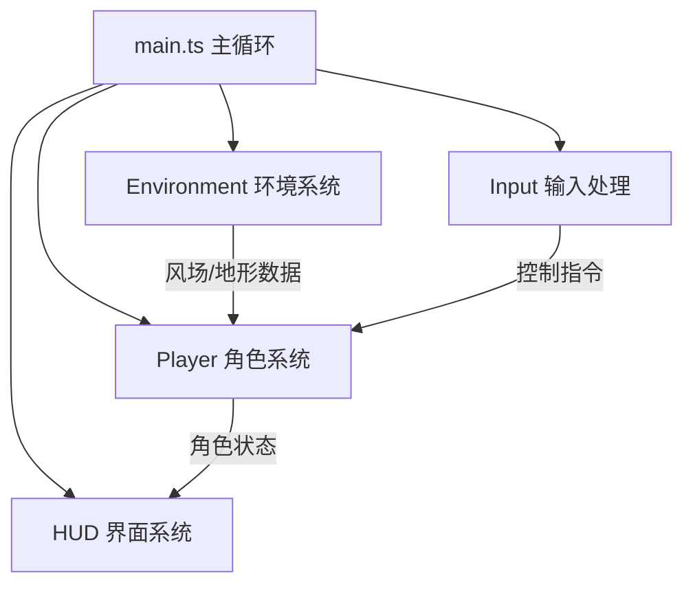

## 1. 架构设计



## 2. 技术描述
- **前端框架**：原生 TypeScript + Canvas 2D API
- **构建工具**：Vite@5
- **开发语言**：TypeScript（严格模式，target ES2020，module ESNext）
- **渲染方式**：Canvas 2D Context 直接绘制
- **动画驱动**：requestAnimationFrame，目标帧率60fps

## 3. 文件结构定义

```
project-root/
├── package.json          # 项目依赖和脚本
├── vite.config.js        # Vite 配置
├── tsconfig.json         # TypeScript 配置
├── index.html            # 入口页面
└── src/
    ├── main.ts           # 主循环、输入处理、系统集成
    ├── player.ts         # 角色状态、物理计算、渲染
    ├── environment.ts    # 风场、地形高度计算、等高线渲染
    └── hud.ts            # 参数面板、着陆提示、淡出动画
```

## 4. 模块接口定义

### 4.1 Player 模块 (src/player.ts)
```typescript
export interface PlayerState {
  x: number;
  y: number;
  vx: number;
  vy: number;
  angle: number;        // 转向角度（弧度）
  isGliding: boolean;   // 是否滑翔中（true=开伞，false=收伞）
  isLanded: boolean;
  landResult: 'safe' | 'crash' | null;
  landResultTimer: number;
  distance: number;     // 累积飞行距离
  isResetting: boolean;
  resetProgress: number;
  resetStartX: number;
  resetStartY: number;
}

export class Player {
  state: PlayerState;
  constructor(startX: number, startY: number);
  update(dt: number, wind: WindState, groundHeight: (x: number) => number, input: InputState): void;
  render(ctx: CanvasRenderingContext2D): void;
  reset(): void;
  startResetAnimation(): void;
}
```

### 4.2 Environment 模块 (src/environment.ts)
```typescript
export interface WindState {
  direction: number;   // 风向角度（弧度，0=向右）
  strength: number;    // 强度 -1 ~ +1 px/帧
  timer: number;       // 距离下次切换的剩余时间
}

export class Environment {
  wind: WindState;
  constructor();
  update(dt: number, lowFpsMode: boolean): void;
  render(ctx: CanvasRenderingContext2D, width: number, height: number): void;
  getGroundHeight(x: number): number;
  renderWindIndicator(ctx: CanvasRenderingContext2D): void;
}
```

### 4.3 HUD 模块 (src/hud.ts)
```typescript
export class HUD {
  constructor();
  update(dt: number, playerState: PlayerState, wind: WindState, canvasHeight: number): void;
  render(ctx: CanvasRenderingContext2D, canvasWidth: number, canvasHeight: number): void;
}
```

### 4.4 主循环 (src/main.ts)
```typescript
interface GameState {
  player: Player;
  environment: Environment;
  hud: HUD;
  input: InputState;
  lastTime: number;
  frameCount: number;
  fps: number;
  lowFpsMode: boolean;
}

// InputState 定义
interface InputState {
  mouseX: number;
  spacePressed: boolean;
  resetPressed: boolean;
}
```

## 5. 核心物理公式

### 5.1 运动学
- 水平速度：`vx = baseSpeed * cos(angle) + windStrength`
- 垂直加速度：`ay = isGliding ? 0.025 : 0.05`
- 垂直速度上限：`vy_max = isGliding ? 2 : 5`
- 位置更新：`x += vx; y += vy`

### 5.2 地形高度函数
```
groundHeight(x) = 500 + 30 * sin(2 * π * x / 200)
```

### 5.3 碰撞检测
```
if player.y >= groundHeight(player.x) => 着陆
if vy > 3 => 坠毁，否则安全着陆
```

## 6. 性能优化策略
- 帧率监测：每30帧计算平均FPS，低于30时启用lowFpsMode
- lowFpsMode下：风场更新频率减半，减少不必要的重绘计算
- 所有渲染使用Canvas原生API，避免DOM操作
- 预计算地形采样点，避免每帧重复计算sin值
