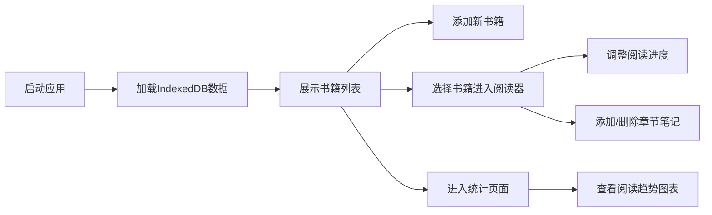

## 1. 产品概述

个人阅读进度追踪与笔记管理应用，帮助用户记录每本书的阅读进度、管理章节笔记、标注重点段落，并生成可视化阅读统计报表。所有数据存储于浏览器本地，无需后端服务。

- 目标用户：热爱阅读、需要系统化管理阅读进度和笔记的个人用户
- 产品价值：提供简洁直观的阅读管理体验，让阅读数据可视化、可追溯

## 2. 核心功能

### 2.1 功能模块
1. **书籍列表页**：书籍卡片网格展示、添加书籍模态框、进度显示
2. **阅读器页**：书籍内容展示、圆环进度条、滑块控制、章节笔记时间线
3. **统计页**：近7天阅读页数折线图、各本书完成进度柱状图

### 2.2 页面详情

| 页面名称 | 模块名称 | 功能描述 |
|---------|---------|---------|
| 书籍列表页 | 添加书籍按钮 | 圆角8px、背景#6c63ff、悬停#5a52d5，点击弹出模态框 |
| 书籍列表页 | 添加书籍模态框 | 书名、作者、总页数、10种预设封面颜色盘（40px方格，选中带3px白色边框） |
| 书籍列表页 | 书籍卡片网格 | 每行4张，卡片220×320px，圆角12px，底部白字14px显示书名和进度%，悬停上浮6px加深阴影 |
| 阅读器页 | 书籍内容区 | 左侧70%宽度滚动区，行高1.8，字体#2c3e50 |
| 阅读器页 | 进度控制区 | 右侧圆环进度条（直径100px，已读#6c63ff，未读#e0e0e0），0-100滑块和输入框，0.5秒动画过渡 |
| 阅读器页 | 笔记输入区 | 底部80%宽80px高输入框，边框#ccc聚焦#6c63ff，圆角8px，提交按钮紫色白字 |
| 阅读器页 | 笔记时间线 | 左侧绿色圆点#2ecc71，右侧#f9f9f9卡片，悬停#f0f0f0，右上角删除X带0.2秒淡出 |
| 统计页 | 折线图 | Canvas绘制近7天阅读页数，面积填充#6c63ff20透明度 |
| 统计页 | 柱状图 | Canvas绘制各本书完成进度%，柱宽40px间距20px，颜色取封面色，悬浮显示tooltip |

## 3. 核心流程

用户打开应用 → 加载本地IndexedDB数据 → 浏览书籍列表 → 添加/选择书籍 → 进入阅读器 → 调整阅读进度/添加笔记 → 查看统计报表

## 4. 用户界面设计

### 4.1 设计风格
- **主色调**：紫色#6c63ff，背景#f5f3ff，卡片#ffffff
- **按钮风格**：圆角8px，悬停变色过渡
- **字体**：系统无衬线字体，正文14px，标题18px
- **布局**：顶部导航 + 卡片网格布局
- **动效**：0.3秒淡入动画，0.2秒页面滑动过渡，毛玻璃模态框

### 4.2 页面设计概览

| 页面名称 | 模块名称 | UI 元素 |
|---------|---------|---------|
| 书籍列表页 | 导航栏 | 三个Tab，紫色强调色，平滑切换 |
| 书籍列表页 | 卡片网格 | 220×320px圆角卡片，色彩封面，悬停上浮 |
| 书籍列表页 | 模态框 | 毛玻璃效果，半透明遮罩#00000050 |
| 阅读器页 | 双栏布局 | 70%内容区 + 30%控制区，小屏堆叠 |
| 阅读器页 | 进度圆环 | SVG圆环动画，0.5秒过渡 |
| 阅读器页 | 笔记时间线 | 垂直时间线，绿色圆点指示器 |
| 统计页 | Canvas图表 | 折线图+柱状图，交互式tooltip |

### 4.3 响应式设计
- **桌面端优先**，768px断点：书籍列表变单列（卡片宽90%）
- **600px断点**：阅读器左右布局变纵向堆叠
- **500px断点**：统计图表canvas缩至屏宽90%（保持2:1宽高比）
