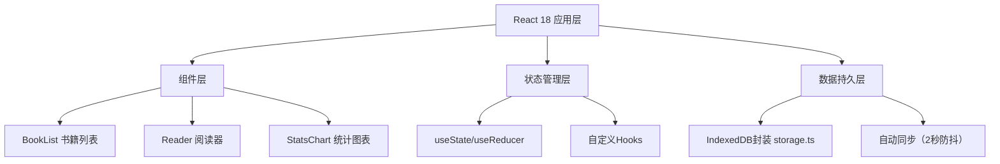
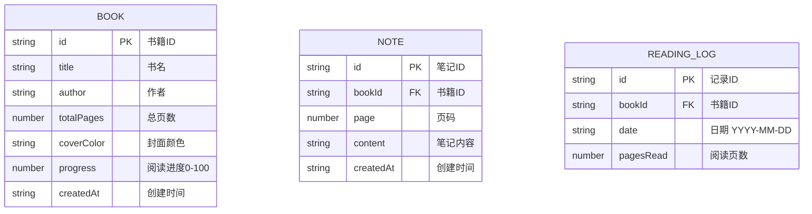

## 1. 架构设计



## 2. 技术描述

- **前端框架**：React 18 + TypeScript
- **构建工具**：Vite（端口5173，HMR热更新）
- **样式方案**：纯CSS + CSS变量 + 媒体查询（不使用Tailwind，按需定制）
- **数据存储**：浏览器 IndexedDB（本地持久化，无后端）
- **图表绘制**：原生 Canvas API
- **状态管理**：React 内置 useState + useCallback（轻量级，无需额外库）

## 3. 路由定义

| 路由 | 用途 |
|------|------|
| / (books) | 书籍列表主页 |
| /reader/:bookId | 阅读器页面 |
| /stats | 阅读统计页面 |

注：使用简单的状态驱动路由切换（hash 或自定义 state），无需引入 react-router-dom 以保持轻量。

## 4. 数据模型

### 4.1 数据模型定义



### 4.2 IndexedDB Schema

- **数据库名**：ReadingTrackerDB
- **版本**：1
- **对象仓库**：
  - `books`：keyPath = `id`，索引：`createdAt`
  - `notes`：keyPath = `id`，索引：`bookId`, `createdAt`
  - `readingLogs`：keyPath = `id`，索引：`bookId`, `date`

## 5. 项目文件结构

```
├── package.json
├── vite.config.js
├── tsconfig.json
├── index.html
└── src/
    ├── main.tsx              # React入口
    ├── App.tsx               # 主组件，路由与状态管理
    ├── styles/
    │   └── global.css        # 全局样式与CSS变量
    ├── components/
    │   ├── BookList.tsx      # 书籍列表
    │   ├── Reader.tsx        # 阅读器
    │   └── StatsChart.tsx    # 统计图表
    └── utils/
        └── storage.ts        # IndexedDB封装
```

## 6. 性能优化策略

- **IndexedDB 防抖写入**：变更操作后 2 秒内合并写入，避免频繁 I/O
- **Canvas 渲染优化**：requestAnimationFrame 调度，离屏缓存
- **组件懒渲染**：使用 React.memo 避免不必要重渲染
- **CSS 动画优化**：使用 transform 和 opacity 触发 GPU 加速
