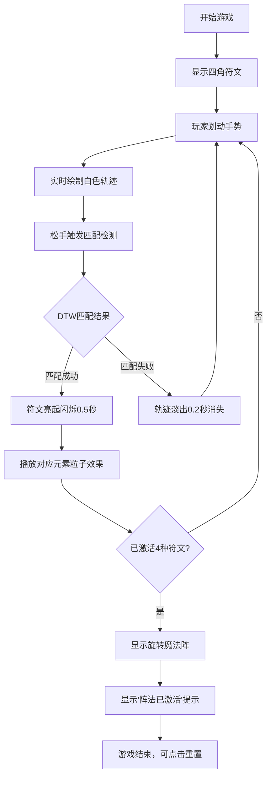

## 1. 产品概述

一款基于Canvas的奇幻世界法术符文激活谜题游戏，玩家通过在屏幕上按特定形状划动手势，依次激活火、水、风、土四种符文元素，最终激活完整魔法阵获得胜利。

- **目标用户**：独立游戏玩家、解谜爱好者
- **核心价值**：提供沉浸式的魔法手势交互体验，视觉反馈丰富流畅

## 2. 核心功能

### 2.1 用户角色
| 角色 | 权限 |
|------|------|
| 玩家 | 手势划动、符文激活、重置游戏 |

### 2.2 功能模块
1. **主画布交互区**：全屏Canvas，手势输入与渲染
2. **符文显示系统**：四种元素符文分布于四角
3. **手势识别引擎**：实时绘制轨迹，松手匹配判定
4. **元素粒子效果**：激活成功触发对应元素动画
5. **状态UI**：激活计数徽章、重置按钮、胜利魔法阵

### 2.3 页面详情
| 页面名称 | 模块名称 | 功能描述 |
|---------|----------|----------|
| 主游戏页 | 画布交互区 | 接收鼠标/触摸输入，实时绘制白色轨迹线 |
| 主游戏页 | 符文显示 | 四角显示半透明发光符文轮廓及Unicode图标 |
| 主游戏页 | 手势匹配 | 松开后使用DTW算法匹配符文形状 |
| 主游戏页 | 元素效果 | 匹配成功触发对应粒子动画（火迸发/水波纹/风螺旋/土塌陷） |
| 主游戏页 | 状态UI | 左上激活计数（弹性动画）、右上重置按钮 |
| 主游戏页 | 胜利状态 | 四符文激活后显示旋转魔法阵及胜利文字 |

## 3. 核心流程

玩家在画布上划动手势 → 系统实时绘制白色轨迹 → 松手后使用DTW算法匹配四种符文模板 → 匹配成功则符文亮起并播放对应元素粒子效果 → 累计激活四种符文 → 中央出现旋转魔法阵，显示"阵法已激活"胜利提示。

## 4. 用户界面设计

### 4.1 设计风格
- **主题色调**：暗色奇幻背景 `#0a0a0f`，符文区域边框 `#1a1a2e`
- **元素配色**：火 `#ff4500`、水 `#00bfff`、风 `#dcdcdc`、土 `#8b4513`、魔法阵 `#9b59b6`
- **视觉效果**：发光轮廓、阴影模糊、粒子动画、旋转魔法阵
- **字体**：加粗字体，白色/紫色文字
- **动画**：requestAnimationFrame驱动，60fps流畅度，弹性过渡效果

### 4.2 页面设计概述
| 页面名称 | 模块名称 | UI元素 |
|---------|----------|--------|
| 主游戏页 | 画布区域 | 全屏黑色背景，白色轨迹线（带辉光），四角半透明符文 |
| 主游戏页 | 符文 | 发光轮廓（阴影模糊8px），中心Unicode元素图标，激活时实线+阴影20px闪烁 |
| 主游戏页 | 计数徽章 | 左上圆形 `#2ecc71`，内部白色数字，激活时24px→36px弹性动画0.3秒 |
| 主游戏页 | 重置按钮 | 右上圆形 `#e74c3c`，白色↻字符 |
| 主游戏页 | 胜利效果 | 中央双圆旋转魔法阵，"阵法已激活"48px紫色文字淡入 |

### 4.3 响应式设计
- 最小画布尺寸：400×400px
- 最大画布尺寸：1920×1080px
- 符文位置按比例自适应，保持四角边距50px
- 同时支持鼠标与触摸输入

## 5. 性能约束
- 手势匹配响应延迟：≤50ms
- 粒子效果渲染帧率：≥55fps
- 单次手势采样点上限：200个（控制内存）
