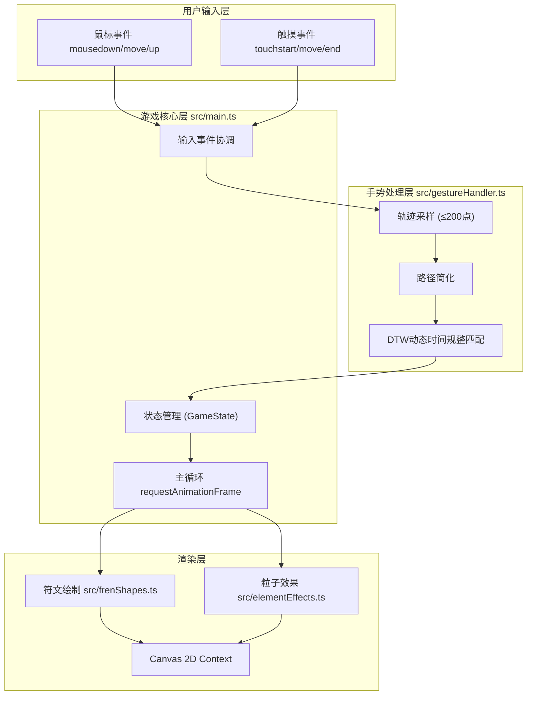

## 1. 架构设计



## 2. 技术选型
- **构建工具**：Vite@5，端口5173，HMR热更新
- **语言**：TypeScript，严格模式，target ES2020，module ESNext
- **渲染**：原生 HTML5 Canvas 2D API，无外部游戏引擎
- **手势识别**：自研 DTW（动态时间规整）算法实现，无外部手势库

## 3. 文件结构与调用关系

```
project-root/
├── index.html                    # 入口页面，全屏Canvas容器
├── package.json                  # 依赖与脚本配置
├── vite.config.js                # Vite基础配置
├── tsconfig.json                 # TypeScript严格模式配置
└── src/
    ├── main.ts                   # [核心] 游戏主循环、状态管理、事件协调
    │   ├── 导入: frenShapes.ts → drawRuneShape()
    │   ├── 导入: elementEffects.ts → ParticleSystem.render()
    │   ├── 导入: gestureHandler.ts → GestureMatcher.match()
    │   └── 导出: initGame(), GameState类型
    ├── frenShapes.ts             # [渲染] 四种符文形状绘制函数
    │   ├── drawFireRune(ctx, x, y)   → 锯齿火焰波路径
    │   ├── drawWaterRune(ctx, x, y)  → 蜿蜒波浪路径
    │   ├── drawWindRune(ctx, x, y)   → 螺旋曲线路径
    │   └── drawEarthRune(ctx, x, y)  → 六角形晶格路径
    ├── elementEffects.ts         # [渲染] 元素粒子效果系统
    │   ├── ParticleSystem 类
    │   ├── spawnFireEffect(center)   → 红橙迸发粒子
    │   ├── spawnWaterEffect(center)  → 蓝青扩散波纹
    │   ├── spawnWindEffect(center)   → 灰白螺旋粒子
    │   └── spawnEarthEffect(center)  → 棕色塌陷圆环
    └── gestureHandler.ts         # [逻辑] 手势识别模块
        ├── GestureMatcher 类
        ├── simplifyPath(points)      → 路径简化
        ├── dtwDistance(p1, p2)       → DTW相似度计算
        └── match(inputPoints)        → 返回匹配符文类型或null
```

**数据流向**：
1. 鼠标/触摸事件 → `main.ts` 收集坐标点 → `gestureHandler.ts` 处理
2. 松手 → `GestureMatcher.match()` 返回匹配结果 → 更新 `GameState.activatedRunes`
3. 状态变更 → `elementEffects.ts` 生成对应粒子 → `main.ts` 主循环逐帧渲染
4. 四符文激活 → `GameState.victory = true` → 渲染胜利魔法阵

## 4. 数据模型

### 4.1 类型定义

```typescript
// 符文类型枚举
enum RuneType {
  FIRE = 'fire',
  WATER = 'water',
  WIND = 'wind',
  EARTH = 'earth'
}

// 坐标点
interface Point {
  x: number;
  y: number;
}

// 符文实例
interface Rune {
  type: RuneType;
  position: Point;
  activated: boolean;
  flashTimer: number; // 激活闪烁计时器
}

// 粒子
interface Particle {
  x: number;
  y: number;
  vx: number;
  vy: number;
  life: number;
  maxLife: number;
  color: string;
  size: number;
  type: 'fire' | 'water' | 'wind' | 'earth';
  angle?: number; // 螺旋角度
  radius?: number; // 螺旋半径
}

// 游戏状态
interface GameState {
  runes: Rune[];
  currentStroke: Point[];
  isDrawing: boolean;
  strokeFadeTimer: number; // 失败淡出
  particles: Particle[];
  activatedCount: number;
  victory: boolean;
  magicCircleAngle: number; // 魔法阵旋转角度
  victoryTextAlpha: number; // 胜利文字透明度
  countBadgeScale: number;  // 计数徽章缩放动画
}
```

## 5. 核心算法

### 5.1 动态时间规整 (DTW)
用于计算玩家划动轨迹与四种符文模板路径的相似度，取最小距离的符文（低于阈值）作为匹配结果。

### 5.2 路径简化
使用 Ramer-Douglas-Peucker 算法简化采样点，减少DTW计算量，保证≤50ms响应。

## 6. 性能优化
- 单次手势最多采样200个点
- 粒子生命周期结束后立即从数组中移除
- requestAnimationFrame 统一驱动所有动画
- 使用离屏计算避免频繁布局重绘
