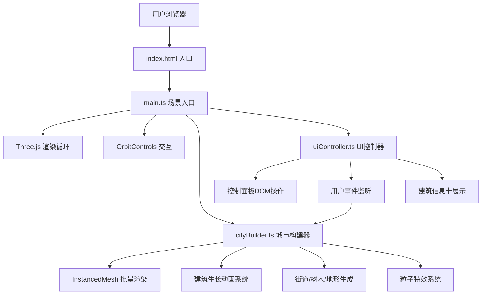

## 1. 架构设计



## 2. 技术描述

- **前端框架**：原生 TypeScript，无UI框架，直接操作DOM
- **3D引擎**：Three.js (three + @types/three)
- **构建工具**：Vite 5.x，开启 TypeScript 支持
- **控制面板**：自实现DOM UI（非 dat.GUI，用户可自选，默认自实现更贴合赛博朋克风格）
- **性能优化**：THREE.InstancedMesh 批量渲染建筑，几何体合并，材质复用

## 3. 项目文件结构

```
auto14/
├── .trae/documents/       # 文档目录
├── src/
│   ├── main.ts            # 入口：场景、相机、渲染器、轨道控制、主循环
│   ├── cityBuilder.ts     # 城市构建：建筑生成、动画、街道、树木、粒子
│   └── uiController.ts    # UI控制：控制面板、信息卡、事件绑定
├── index.html             # HTML入口
├── vite.config.js         # Vite配置
├── tsconfig.json          # TypeScript配置
└── package.json           # 项目依赖和脚本
```

## 4. 核心数据结构定义

### 4.1 BuildingData（建筑数据）

```typescript
interface BuildingData {
  id: number;
  name: string;
  position: THREE.Vector3;    // 世界坐标
  width: number;              // 底面宽度
  depth: number;              // 底面深度
  height: number;             // 最终高度
  color: THREE.Color;         // 建筑颜色
  buildOrder: number;         // 建造顺序
  buildTimestamp: number;     // 建造完成时间戳
  growthProgress: number;     // 生长进度 0~1
  isGrowing: boolean;         // 是否正在生长
  isCompleted: boolean;       // 是否生长完成
  floatOffset: number;        // 稳定后浮动相位
}
```

### 4.2 CityConfig（城市配置）

```typescript
interface CityConfig {
  seed: number;               // 随机种子
  buildingCount: number;      // 建筑总数（默认~200）
  growthSpeed: number;        // 生长速度倍率 0.5~3
  gridSize: number;           // 城市网格大小（地块数量）
  cellSize: number;           // 每个地块边长
  areaRadius: number;         // 城市区域半径
}
```

## 5. 核心模块职责

### 5.1 cityBuilder.ts 核心方法

| 方法 | 职责 |
|------|------|
| `constructor(scene, config)` | 初始化城市构建器，创建地面、网格材质 |
| `setSeed(seed)` | 设置随机种子，重置伪随机序列 |
| `setGrowthSpeed(speed)` | 调整生长速度倍率 |
| `startGrowth()` | 开始城市生长流程，触发建筑排队 |
| `reset()` | 清除所有建筑、街道、树木，回到初始状态 |
| `update(deltaTime)` | 每帧更新：推进建筑生长、浮动动画、粒子更新 |
| `getBuildingByRay(intersect)` | 根据射线交点获取建筑数据 |
| `generateBuildings()` | 根据种子生成所有建筑数据（位置、高度、颜色） |
| `growNextBuilding()` | 按顺序触发下一栋建筑开始生长 |
| `spawnStreetNetwork()` | 建筑完成后生成街道网格和行道树 |
| `spawnGrowthParticles(building)` | 建筑生长时生成升腾粒子 |

### 5.2 uiController.ts 核心方法

| 方法 | 职责 |
|------|------|
| `constructor(cityBuilder, camera, renderer)` | 初始化UI控制器，创建DOM元素 |
| `createControlPanel()` | 创建右下角控制面板：速度滑块、重置按钮、种子输入 |
| `createStartButton()` | 创建初始"开始生长"按钮 |
| `createInfoCard()` | 创建建筑信息卡DOM（初始隐藏） |
| `showInfoCard(buildingData, screenPos)` | 在指定屏幕位置显示建筑信息 |
| `hideInfoCard()` | 隐藏信息卡 |
| `bindEvents()` | 绑定所有UI事件和3D场景双击检测 |
| `updateGrowthSpeed(value)` | 回调：通知cityBuilder更新速度 |
| `onReset()` | 回调：重置场景 |
| `onSeedChange(value)` | 回调：更新随机种子 |

### 5.3 main.ts 主流程

```
1. 创建 Scene、PerspectiveCamera、WebGLRenderer
2. 配置渲染器：抗锯齿、像素比、自适应窗口
3. 添加环境光 + 方向光，设置雾效
4. 初始化 OrbitControls（阻尼、缩放限制）
5. 实例化 CityBuilder、UIController
6. 监听 window resize 更新相机和渲染器尺寸
7. 启动 requestAnimationFrame 主循环：
   - controls.update()
   - cityBuilder.update(delta)
   - renderer.render(scene, camera)
```

## 6. 性能优化策略

1. **InstancedMesh**：所有建筑使用同一个 BoxGeometry 实例，通过 matrix 变换实现差异化，draw call 从 O(n) 降至 O(1)
2. **材质复用**：建筑使用 MeshStandardMaterial 数组预生成有限颜色池，避免重复创建材质
3. **粒子池化**：ParticleSystem 使用对象池复用粒子对象，避免频繁 GC
4. **视锥剔除**：Three.js 内置 frustumCulling 默认开启
5. **像素比限制**：renderer.setPixelRatio(Math.min(window.devicePixelRatio, 2))，防止高分屏性能损耗
6. **动画插值**：生长进度使用缓动函数（easeOutElastic / easeOutBack）实现弹性效果，每帧仅更新矩阵
