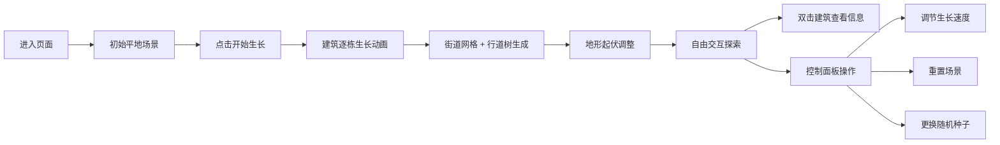

## 1. 产品概述

城市天际线实时生长模拟器是一个基于3D可视化的交互式Web应用，用户可以在虚拟场景中见证一座城市从平地逐步生长为功能完善的小型都市的全过程，呈现延时摄影般的城市扩张视觉效果。

- 核心目标：提供沉浸式的城市生长可视化体验，支持自定义参数和交互探索
- 目标用户：建筑/城市规划爱好者、数据可视化研究者、普通科技爱好者
- 产品价值：通过动态生长动画直观展示城市空间演变过程，兼具教育性和观赏性

## 2. 核心功能

### 2.1 功能模块

1. **3D场景主视图**：城市生长的核心展示区域，包含建筑、街道、树木、地形
2. **建筑生长系统**：随机位置/高度/颜色的建筑生成，带弹性拉伸动画和粒子光效
3. **城市基础设施生成**：网格街道纹理、行道树、外围地形起伏
4. **交互控制系统**：鼠标拖拽旋转视角、滚轮缩放、双击建筑查看详情
5. **参数控制面板**：生长速度调节、重置功能、随机种子输入

### 2.2 页面详情

| 页面名称 | 模块名称 | 功能描述 |
|-----------|-------------|---------------------|
| 主页面 | 3D场景渲染区 | 全屏Three.js渲染，实时显示城市生长过程 |
| 主页面 | 建筑信息卡 | 双击建筑弹出毛玻璃半透明信息卡，显示名称、高度、建造时间 |
| 主页面 | 控制面板 | 右下角悬浮控制区，含速度滑块、重置按钮、种子输入框 |
| 主页面 | 开始生长按钮 | 初始状态中央或顶部的触发按钮，启动城市生长 |

## 3. 核心流程

用户打开页面 → 看到平坦灰色地面和"开始生长"按钮 → 点击按钮启动生长 → 建筑按随机顺序逐栋升起（弹性动画+粒子特效）→ 所有建筑完成后生成街道网格和行道树 → 外围地形起伏 → 用户可自由旋转/缩放视角 → 双击任意建筑查看信息卡 → 可通过控制面板调整速度/重置/换种子重新生成

## 4. 用户界面设计

### 4.1 设计风格

- **主色调**：深蓝黑 #0B0C10 背景
- **强调色**：霓虹绿 #45A29E（粒子光效、按钮悬停、信息卡呼吸边框）
- **辅助色**：淡蓝 #66FCF1（街道网格线）、亮白 #FFFFFF（文字）
- **建筑色**：色相范围蓝灰至米黄随机
- **整体风格**：赛博朋克暗色调主题，科技感、未来感

### 4.2 视觉元素规范

- **按钮**：圆角矩形，亮白文字，悬停渐变至霓虹绿 #45A29E，轻微缩放动效
- **信息卡**：毛玻璃半透明背景（backdrop-filter: blur），霓虹绿边框带呼吸动画
- **粒子特效**：绿色 #45A29E 细小光点从地面升腾至建筑顶部消散
- **控制面板**：右下角悬浮，半透明深色背景，霓虹绿边框点缀

### 4.3 3D场景指导

- **环境**：深色雾效营造空间感，无外部HDRI，纯程序化光照
- **光照**：环境光 + 方向光模拟日光，建筑自发光材质增强科技感
- **相机**：PerspectiveCamera，初始45度俯视角，OrbitControls轨道控制
- **交互**：鼠标左键拖拽旋转、滚轮缩放、右键平移，双击射线检测建筑
- **性能**：InstancedMesh批量渲染建筑，目标200栋同时动画保持30FPS+

### 4.4 页面设计概览

| 页面名称 | 模块名称 | UI元素 |
|-----------|-------------|-------------|
| 主页面 | 3D场景区 | 全屏canvas，深蓝黑背景雾效，灰色地面 |
| 主页面 | 建筑对象 | 蓝灰-米黄色随机几何体，生长弹性动画，稳定后微浮动 |
| 主页面 | 街道系统 | 淡蓝色 #66FCF1 网格线，绿色圆柱行道树 |
| 主页面 | 信息卡 | 毛玻璃背景，霓虹绿呼吸边框，建筑名称/高度/建造时间 |
| 主页面 | 控制面板 | 右下角悬浮，速度滑块、重置按钮、种子输入框，圆角设计 |

### 4.5 响应式适配

- 桌面优先设计，目标分辨率 1920x1080 和 1366x768
- 3D Canvas 自适应窗口大小（window resize 监听）
- 控制面板使用百分比定位和 vmin 单位，小屏自动等比缩放
- 信息卡使用 max-width/max-height 限制，防止溢出屏幕
