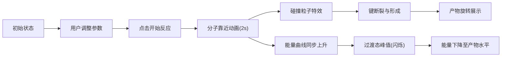

## 1. 产品概述

化学反应三维可视化教学工具，用于直观展示O₃臭氧与Cl原子反应过程中分子空间结构动态变化与能量状态关系，解决化学教学和科普展示中分子碰撞、键断裂与形成以及能量势垒变化难以直观理解的问题。

- 目标用户：化学教师、学生、科普爱好者
- 核心价值：将抽象的化学反应过程转化为可交互、可观察的3D动画，提升学习效率和兴趣

## 2. 核心功能

### 2.1 功能模块

1. **3D分子场景渲染模块**：Three.js渲染的三维空间，展示臭氧分子和氯原子的球棍模型
2. **反应动画模块**：分子靠近、碰撞特效、键断裂与形成的完整动画序列
3. **能量剖面图模块**：Canvas 2D绘制的反应坐标-能量曲线，实时同步动画进度
4. **交互控制模块**：三个参数滑块控制初始间距、反应速率、分子大小缩放
5. **状态显示模块**：顶部显示当前反应阶段的文字状态

### 2.2 页面详情

| 页面名称 | 模块名称 | 功能描述 |
|---------|---------|---------|
| 主页面 | 3D分子场景 | Three.js渲染深蓝色渐变背景3D空间，包含O3和Cl分子球棍模型，支持OrbitControls拖拽旋转和滚轮缩放 |
| 主页面 | 反应控制按钮 | 左下角"开始反应"按钮，点击触发2秒反应动画序列 |
| 主页面 | 能量剖面图 | 右侧固定面板，Canvas绘制反应坐标图，显示能量势垒曲线和过渡态闪烁点 |
| 主页面 | 参数滑块区 | 底部三个滑块：反应物初始间距、反应速率、分子大小缩放 |
| 主页面 | 状态指示器 | 顶部中央显示当前反应阶段文字 |

## 3. 核心流程

用户进入页面 → 观察初始3D分子结构（可拖拽旋转缩放） → 调整参数滑块 → 点击"开始反应"按钮 → 观看分子靠近动画 → 碰撞粒子特效 → 键断裂形成O₂和ClO → 能量曲线同步上升至过渡态峰值后下降 → 状态文字逐阶段切换 → 反应完成

## 4. 用户界面设计

### 4.1 设计风格

- **主色调**：深蓝科技风背景 #0a0e27 ~ #1a1e3e 渐变
- **文字色**：#e0e1dd（主文字）、#81b29a（状态文字）、#ffffff（标题）
- **交互色**：绿色系 #2d6a4f → #40916c（按钮渐变）、#81b29a（滑块手柄）
- **分子色**：#e07a5f（氧原子，带光泽）、#98c1d9（氯原子，金属质感）
- **按钮样式**：圆角8px，渐变背景，悬停放大1.05倍加深阴影
- **字体**：无衬线字体，状态文字间距2px
- **布局风格**：全屏3D画布 + 浮动UI面板（响应式适配）

### 4.2 页面设计概览

| 区域 | 位置 | UI元素 |
|-----|-----|--------|
| 3D场景 | 全屏背景 | 深蓝色渐变，分子球棍模型，环境光+平行光 |
| 状态文本 | 顶部中央 | 绿色18px字体，0.3s淡入淡出过渡 |
| 能量面板 | 右侧固定 | 280px宽半透明黑底，白色标题，Canvas曲线图 |
| 控制按钮 | 左下角 | 绿色渐变按钮，白色16px文字 |
| 参数滑块 | 底部 | 三个水平滑块，右侧显示实时数值 |

### 4.3 响应式设计

- **桌面端（≥800px）**：正常布局，右侧面板、左下按钮、底部滑块
- **移动端（<800px）**：所有UI元素缩小至80%，垂直堆叠排列

### 4.4 3D场景设计

- **环境**：深蓝渐变背景 #0a0e27 → #1a1e3e
- **光照**：环境光强度0.4，平行光从右上方照射强度0.8
- **相机**：初始位置(0,0,12)，PerspectiveCamera，OrbitControls阻尼0.15，缩放范围2-50
- **分子模型**：球棍模型，O原子红色半径0.3，Cl原子灰色半径0.4，键为圆柱
- **动画帧率**：50-60FPS，requestAnimationFrame驱动
