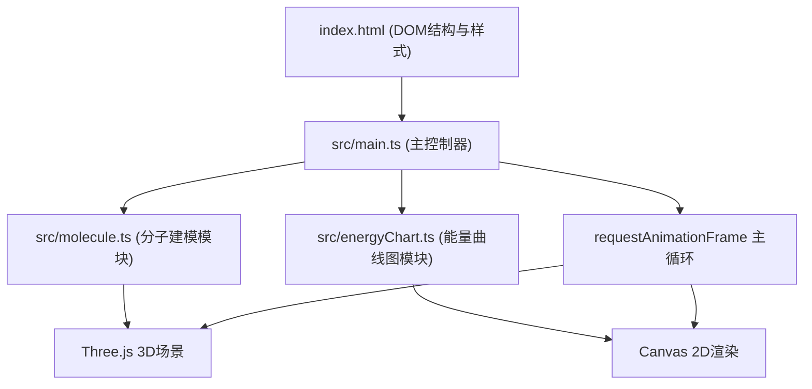

## 1. 架构设计



## 2. 技术说明

- **前端框架**：原生TypeScript（无UI框架）
- **构建工具**：Vite 5.x（端口5173，开启HMR，输出目录dist）
- **3D渲染**：Three.js 0.160.0
- **类型支持**：@types/three
- **语言标准**：TypeScript严格模式，target ES2020，moduleResolution bundler

## 3. 文件结构

```
/
├── package.json          # 项目依赖与脚本
├── vite.config.js        # Vite配置
├── tsconfig.json         # TypeScript配置
├── index.html            # 入口页面（DOM结构+内联样式）
└── src/
    ├── main.ts           # 应用入口：场景初始化、UI事件、主循环
    ├── molecule.ts       # 分子建模：球棍模型创建、动画、键断裂/形成
    └── energyChart.ts    # 能量图：Canvas 2D绘制、进度更新、闪烁效果
```

## 4. 模块职责与接口

### 4.1 molecule.ts

负责所有3D分子相关的创建与动画控制。

```typescript
// 创建臭氧分子 O3（三个O原子120°排列，键长1单位）
export function createOzoneMolecule(scale?: number): THREE.Group

// 创建氯原子 Cl
export function createChlorineAtom(scale?: number): THREE.Group

// 创建氧分子 O2（键长0.8单位）
export function createOxygenMolecule(scale?: number): THREE.Group

// 创建ClO分子（键长1.1单位）
export function createClOMolecule(scale?: number): THREE.Group

// 动画：分子从起始位置移动到目标位置
export function animateMoleculeMove(
  group: THREE.Group,
  from: THREE.Vector3,
  to: THREE.Vector3,
  duration: number,
  onComplete?: () => void
): (elapsed: number) => boolean

// 动画：分子绕Y轴旋转
export function animateMoleculeRotate(
  group: THREE.Group,
  degreesPerSecond: number
): (delta: number) => void

// 动画：键断裂 - 分离原子组
export function animateBondBreak(
  molecule: THREE.Group,
  splitAt: number,
  duration: number
): (elapsed: number) => boolean

// 创建碰撞粒子特效
export function createCollisionParticles(
  position: THREE.Vector3,
  count: number,
  lifetime: number
): { group: THREE.Group; update: (elapsed: number) => boolean }

// 缩放分子组
export function scaleMolecule(group: THREE.Group, scale: number): void
```

### 4.2 energyChart.ts

负责Canvas 2D能量曲线图的绘制与更新。

```typescript
export interface EnergyChartOptions {
  width: number
  height: number
  title?: string
}

export class EnergyChart {
  constructor(canvas: HTMLCanvasElement, options: EnergyChartOptions)
  
  // 设置反应进度 0~1，同步更新曲线显示
  setProgress(progress: number): void
  
  // 每帧渲染（处理过渡态闪烁动画）
  render(time: number): void
  
  // 响应尺寸变化
  resize(width: number, height: number): void
}
```

### 4.3 main.ts

主控制器，负责场景搭建、事件绑定、动画主循环。

```typescript
// 核心状态
interface AppState {
  reactionProgress: number      // 0~1 反应进度
  reactionPhase: number         // 0-4 五个阶段
  isReacting: boolean
  initialDistance: number       // 2~8
  reactionSpeed: number         // 0.5~2.0
  moleculeScale: number         // 0.5~1.5
}
```

## 5. 动画时序

```
总时长: 2.0s (可通过 reactionSpeed 缩放)

0.0s - 0.8s  阶段1：初始状态 → 分子靠近
0.8s        阶段2：碰撞中（触发粒子特效，能量曲线到达峰值）
0.8s - 1.3s 阶段3：键断裂
1.3s - 1.8s 阶段4：产物形成
1.8s - 2.0s 阶段5：反应完成，产物开始旋转
```

## 6. 性能优化

- 使用 `requestAnimationFrame` 驱动，delta time 计算确保动画速率一致
- 粒子特效使用 BufferGeometry 减少 draw call
- 避免每帧创建新对象，复用材质和几何体
- Canvas 2D 绘制采用脏矩形优化，仅在进度变化时重绘曲线
