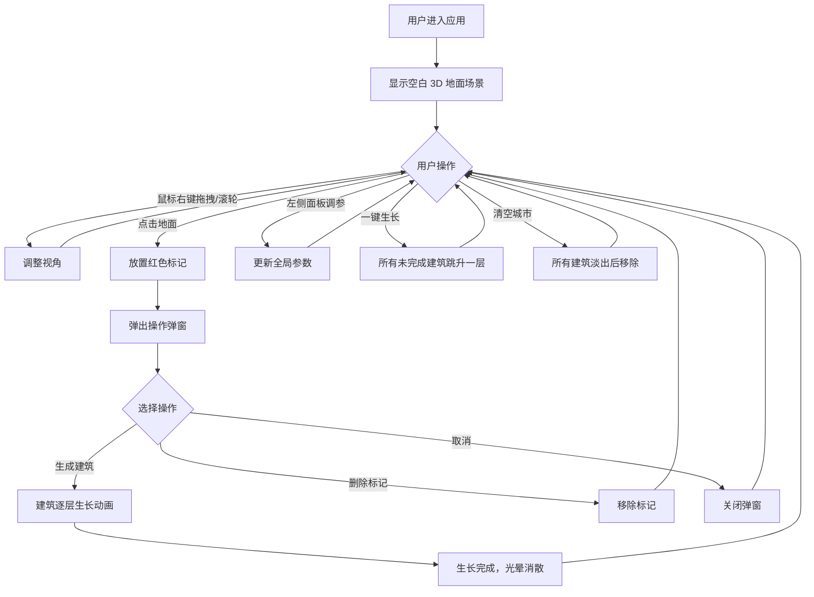

## 1. 产品概述

城市天际线动态生长可视化应用，用于城市规划教学和建筑概念展示。通过 Three.js 实现三维空间中建筑从地基到封顶的逐层拔高升长过程，支持用户交互式划定区域、设定建筑密度与高度变化规律，直观观察建筑集群逐步形成完整天际线的动态效果。

## 2. 核心功能

### 2.1 功能模块

1. **3D 场景渲染**: 灰色网格纹理地面、OrbitControls 视角控制（右键旋转、滚轮缩放）
2. **标记放置系统**: 鼠标点击地面放置红色半透明标记，支持生成建筑、删除标记操作
3. **建筑生长动画**: 逐层拔高升长、层间分割线、高度渐变色、顶部粒子光晕、ease-out 缩放动画
4. **全局参数控制**: 左侧面板调节生长速度、最大楼层数、颜色方案切换
5. **全局操作按钮**: 一键生长所有未完成建筑、清空城市重置场景

### 2.2 页面详情

| 页面名称 | 模块名称 | 功能描述 |
|-----------|-------------|---------------------|
| 主场景页 | 3D 渲染区域 | 显示 40x40 灰色网格地面，支持视角旋转缩放，放置标记和建筑 |
| 主场景页 | 左侧控制面板 | 16% 宽度，包含生长速度滑块、最大楼层数滑块、颜色方案切换按钮 |
| 主场景页 | 右下角操作按钮 | 一键生长、清空城市两个操作按钮 |
| 主场景页 | 标记弹窗 | 点击标记后弹出，包含生成建筑、删除标记、取消三个按钮 |

## 3. 核心流程

用户进入应用 → 看到空白灰色地面 → 鼠标右键拖拽旋转视角 / 滚轮缩放 → 点击地面放置红色标记 → 弹出操作弹窗 → 选择"生成建筑" → 建筑开始逐层生长动画（伴随粒子光晕）→ 生长完成光晕消散 → 可通过左侧面板调整后续建筑参数 → 可使用一键生长加速所有建筑 → 可使用清空城市重置所有内容

## 4. 用户界面设计

### 4.1 设计风格

- **主色调**: 深色科幻风格，主背景 `#0d0d1a`，地面 `#1a1a2e`
- **配色方案**:
  - 控制面板背景: `#1a1a2e`，半透明磨砂效果 `backdrop-filter: blur(6px)`
  - 按钮主色: `#3498db`（蓝色）、`#e74c3c`（红色）、`#95a5a6`（灰色）、`#27ae60`（绿色）
  - 建筑颜色预设: 灰阶 `#ecf0f1→#bdc3c7→#95a5a6`、暖橙 `#e67e22→#f39c12`、冷蓝 `#3498db→#9b59b6`
  - 分割线: `#2c3e50`，带微光发光效果
  - 文字: 白色
- **按钮样式**: 圆角 8px，悬停放大 1.05 倍并加深阴影，0.2s ease-out 过渡
- **字体**: 系统默认无衬线字体，12px（弹窗文字）、14px（按钮文字）
- **布局风格**: 左侧 16% 控制面板 + 主 3D 场景区域，右下角浮动操作按钮

### 4.2 页面设计概述

| 页面名称 | 模块名称 | UI 元素 |
|-----------|-------------|-------------|
| 主场景页 | 3D 渲染区域 | 灰色网格地面、标记红色半透明圆形、建筑 BoxGeometry + EdgeGeometry、粒子 Points |
| 主场景页 | 左侧控制面板 | 圆角 12px 半透明面板、滑块控件、方案切换按钮组、标签文字 |
| 主场景页 | 右下角操作按钮 | 绿色/红色圆角按钮、悬停放大动效、白色文字 |
| 主场景页 | 标记弹窗 | 圆角 8px 深色背景、三个色按钮、12px 白色文字 |

### 4.3 响应性

桌面端优先设计，全屏显示，响应窗口大小变化自适应 3D 渲染区域。

### 4.4 3D 场景指导

- **环境与氛围**: 深色科幻风格，低饱和度灰色地面配合网格纹理
- **光照设置**: 环境光 + 方向光，确保建筑各面有明暗层次
- **相机设置**: 初始俯角 45 度，距离 30 单位，OrbitControls 阻尼 0.12，缩放范围 5-60 单位
- **交互与动画**: 建筑每层 0.5s 生长，0.2s ease-out 缩放动画，粒子光晕效果
- **性能预算**: 同时最多 60 栋建筑，超过时隐藏最远建筑，帧率稳定 30FPS 以上
