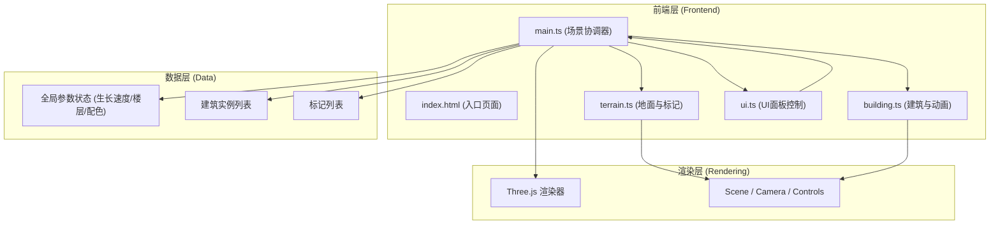

## 1. 架构设计



## 2. 技术描述

- **前端**: TypeScript + Vite + Three.js@0.160
- **初始化工具**: Vite (vanilla-ts 模板)
- **后端**: 无，纯前端 3D 可视化应用
- **数据库**: 无，状态在内存中维护

## 3. 文件结构

```
.
├── package.json
├── vite.config.js
├── tsconfig.json
├── index.html
└── src/
    ├── main.ts       # 应用入口：初始化场景、渲染器、控制器，协调调度
    ├── terrain.ts    # 地面与标记管理：网格地面、射线检测、标记列表
    ├── building.ts   # 建筑类与生长动画：楼层结构、颜色渐变、高度动画、粒子光晕
    └── ui.ts         # UI面板与全局控制：参数面板、按钮、弹窗、事件监听
```

## 4. 模块职责与数据流向

### 4.1 main.ts (场景协调器)
- **职责**: 初始化 Three.js 场景、相机、渲染器、控制器；统一调度 terrain/building/ui 模块；管理全局状态
- **输入**: UI 事件、用户交互事件
- **输出**: 渲染指令、参数更新、建筑/标记创建指令

### 4.2 terrain.ts (地面与标记)
- **职责**: 创建 40x40 灰色网格地面；处理鼠标点击射线检测交点；管理标记列表与标记弹窗
- **输入**: 鼠标点击事件
- **输出**: 地面交点坐标 → main.ts → 创建标记或建筑

### 4.3 building.ts (建筑与动画)
- **职责**: 定义建筑类（Building）；实现逐层生长动画（0.5s/层，0.6单位/层）；颜色渐变；层间 EdgeGeometry 分割线；顶部粒子光晕；一键生长/淡出移除
- **输入**: 位置坐标、全局参数（速度、最大层数、配色方案）
- **输出**: Three.js Group 对象加入场景，每帧动画更新

### 4.4 ui.ts (UI面板控制)
- **职责**: 渲染左侧 16% 参数面板（滑块、按钮组）；右下角全局操作按钮；标记弹窗；监听事件并回调 main.ts
- **输入**: 用户 UI 操作
- **输出**: 参数变更回调、全局操作回调

## 5. 关键数据结构

### 5.1 全局参数 (GlobalParams)
```typescript
interface GlobalParams {
  growthSpeed: number;      // 每层生长时间（秒），范围 0.2-2，默认 0.5
  maxFloors: number;        // 最大楼层数，范围 3-10，默认 6
  colorScheme: 'gray' | 'warm' | 'cool';  // 颜色方案
}
```

### 5.2 建筑类 (Building)
```typescript
class Building {
  group: THREE.Group;           // 建筑根节点
  position: THREE.Vector3;      // 建筑位置
  currentFloors: number;        // 当前已生长楼层数
  maxFloors: number;            // 最大楼层数
  floorHeight: number;          // 每层高度 0.6
  isGrowing: boolean;           // 是否正在生长
  haloParticles: THREE.Points;  // 顶部光晕粒子
  floors: Array<{
    mesh: THREE.Mesh;
    edges: THREE.LineSegments;
  }>;
}
```

### 5.3 标记 (Marker)
```typescript
interface Marker {
  mesh: THREE.Mesh;    // 红色半透明圆形标记
  position: THREE.Vector3;
}
```

## 6. 性能优化策略

1. **建筑数量限制**: 最多 60 栋，超出时根据相机距离隐藏最远建筑
2. **几何复用**: 预创建 BoxGeometry 与 EdgeGeometry 模板，实例化时复用
3. **材质复用**: 每种颜色方案预创建材质，避免重复创建
4. **动画调度**: 使用 requestAnimationFrame 统一调度所有建筑动画
5. **粒子优化**: 每个建筑仅 20 个粒子，使用 BufferGeometry
6. **材质透明度**: 按需开启 transparent，减少混合排序开销
