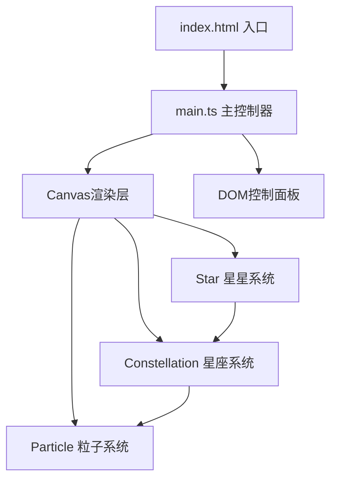

## 1. 架构设计



## 2. 技术描述
- **前端**：TypeScript + Vite，纯Canvas 2D实现，无外部游戏引擎或库
- **初始化工具**：Vite
- **后端**：无（纯前端项目）
- **数据库**：无（本地内存状态）

## 3. 文件结构

| 文件路径 | 作用 |
|----------|------|
| `index.html` | 入口HTML，包含Canvas容器和控制面板DOM |
| `package.json` | 项目依赖配置（typescript、vite） |
| `tsconfig.json` | TypeScript配置（严格模式、ES2020、ESNext） |
| `vite.config.js` | Vite配置（端口5173、HMR） |
| `src/main.ts` | 初始化Canvas、控制面板DOM，游戏主循环，模块协调 |
| `src/star.ts` | 星星类：位置、大小、颜色、呼吸动画、吸附拖拽逻辑 |
| `src/constellation.ts` | 星座逻辑：图案预设、位置匹配检测、进度计算、完成事件 |
| `src/particle.ts` | 粒子系统：生成、运动轨迹、颜色渐变、生命周期管理 |

## 4. 核心数据模型

### 4.1 Star 星星数据

```typescript
interface StarData {
    x: number;          // 位置X
    y: number;          // 位置Y
    size: number;       // 大小 2-4px
    color: string;      // 颜色 #ffffff ~ #fffacd
    baseOpacity: number; // 基础透明度
    isDragging: boolean; // 是否被拖拽
    targetX?: number;   // 星座目标位置X
    targetY?: number;   // 星座目标位置Y
    isPlaced: boolean;  // 是否已放置到正确位置
}
```

### 4.2 Constellation 星座数据

```typescript
interface ConstellationData {
    id: string;
    name: string;
    legend: string;         // 传说文字
    stars: { x: number; y: number }[];  // 目标星星位置（相对坐标）
    isUnlocked: boolean;
    progress: number;       // 0-1 完成度
}
```

### 4.3 Particle 粒子数据

```typescript
interface ParticleData {
    x: number;
    y: number;
    vx: number;
    vy: number;
    size: number;           // 6-12px随机
    color: string;          // #ff6b6b → #feca57 渐变
    life: number;           // 剩余生命周期
    maxLife: number;
    angle?: number;         // 旋转角度（星云动画用）
    radius?: number;        // 螺旋半径
}
```

### 4.4 TrailPoint 拖尾轨迹点

```typescript
interface TrailPoint {
    x: number;
    y: number;
    opacity: number;        // 从0.4逐渐衰减到0
    life: number;           // 0.5秒寿命
}
```

## 5. 游戏循环架构

```
requestAnimationFrame 主循环
    ├── 计算deltaTime
    ├── FPS监测与动态粒子数量调整
    ├── 更新阶段
    │   ├── 更新星星呼吸动画
    │   ├── 更新被拖拽星星位置
    │   ├── 更新拖尾轨迹点生命周期
    │   ├── 更新粒子运动与生命周期
    │   └── 检测隐藏挑战触发条件
    ├── 渲染阶段
    │   ├── 绘制径向渐变背景
    │   ├── 绘制画布边缘光晕
    │   ├── 绘制星座目标轮廓线（半透明）
    │   ├── 绘制所有星星（含呼吸效果）
    │   ├── 绘制拖拽拖尾轨迹
    │   └── 绘制所有粒子
    └── 更新DOM控制面板状态
```

## 6. 性能优化策略

1. **FPS监测**：每2秒统计平均帧率
2. **动态降级**：帧率<45FPS时粒子数量减半
3. **离屏Canvas**：背景渐变预渲染到离屏Canvas
4. **对象池**：粒子对象复用，避免频繁GC
5. **批量绘制**：同类型元素批量路径绘制
