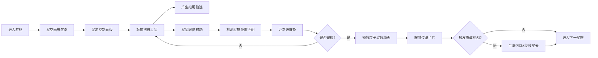

## 1. 产品概述

「星轨绘卷」是一款休闲放置类网页游戏，玩家在深蓝色星空中通过拖拽星星碎片拼合星座图案，解锁对应星座的传说文字卡片。适合放松、冥想或睡前使用。

- 目标用户：需要放松解压的玩家、喜欢星空和星座文化的用户
- 产品价值：通过精美的视觉效果和舒缓的交互节奏，帮助用户放松心情

## 2. 核心功能

### 2.1 功能模块

1. **星空画布**：全屏Canvas，径向渐变背景，散布呼吸动画的小星星，拖拽产生蓝色拖尾轨迹
2. **星星交互**：点击吸附星星、拖拽跟随移动、位置吸附检测
3. **星座拼合系统**：预设星座图案、进度检测、完成触发粒子动画
4. **控制面板**：已收集星星数量显示、星座进度条、星座图标选择
5. **粒子动画系统**：拼合完成粒子绽放、隐藏挑战旋转星云动画
6. **隐藏挑战模式**：10秒内连续拖拽5颗星星触发特殊动画和稀有碎片

### 2.2 页面详情

| 页面名称 | 模块名称 | 功能描述 |
|----------|----------|----------|
| 主游戏页面 | 星空画布 | 全屏Canvas，径向渐变背景，散布20-30颗呼吸动画星星 |
| 主游戏页面 | 拖拽交互 | 拖拽产生蓝色半透明拖尾轨迹，0.5秒渐隐消失 |
| 主游戏页面 | 星星吸附 | 拖拽到星星上自动吸附跟随移动 |
| 主游戏页面 | 控制面板 | 星星数量、进度条、星座图标按钮 |
| 主游戏页面 | 星座拼合 | 检测星星位置是否匹配预设图案，计算进度 |
| 主游戏页面 | 粒子动画 | 完成星座时播放粒子绽放动画 |
| 主游戏页面 | 隐藏挑战 | 10秒内连拖5颗触发全屏闪烁+旋转星云 |

## 3. 核心流程

玩家打开游戏 → 看到深蓝色星空和控制面板 → 拖拽星星碎片移动 → 拖到星座目标位置 → 检测匹配更新进度 → 完成星座触发粒子动画 → 解锁传说卡片 → 继续下一个星座或触发隐藏挑战

## 4. 用户界面设计

### 4.1 设计风格
- **主色调**：#1a1d3a（深蓝紫暗色主题）
- **辅助色**：#6a9cff（星空蓝）
- **强调色**：#f0e68c（金黄）、#ff6b6b（珊瑚红）
- **按钮风格**：圆角8px，0.2秒ease-out过渡
- **字体**：无衬线字体，数字使用#f0e68c色24px
- **布局**：全屏Canvas + 右侧220px控制面板
- **特效**：磨砂玻璃backdrop-filter、呼吸脉动、粒子效果

### 4.2 页面设计概览

| 页面名称 | 模块名称 | UI元素 |
|----------|----------|--------|
| 主游戏页面 | 星空画布 | 径向渐变背景#0b0d17→#1a1d3a，20-30颗2-4px星星，呼吸动画0.3秒 |
| 主游戏页面 | 拖拽轨迹 | 3px宽，#6a9cff，透明度0.4，0.5秒渐隐 |
| 主游戏页面 | 控制面板 | 宽220px，磨砂玻璃，边框1px rgba(255,255,255,0.2)，悬停上浮translateY(-2px) |
| 主游戏页面 | 进度条 | 高8px，#6a9cff→#c084fc渐变，圆角4px |
| 主游戏页面 | 星座按钮 | 64x64px圆形，2px rgba(255,255,255,0.3)边框，悬停放大1.05倍+发光 |
| 主游戏页面 | 画布边缘 | 10px柔和光晕 |

### 4.3 响应式
- 桌面优先设计，Canvas自适应窗口大小
- 控制面板固定右侧220px宽度

## 5. 性能要求
- 拖拽和粒子动画保持55FPS以上
- 帧率低于45FPS时自动降低粒子数量到50%
