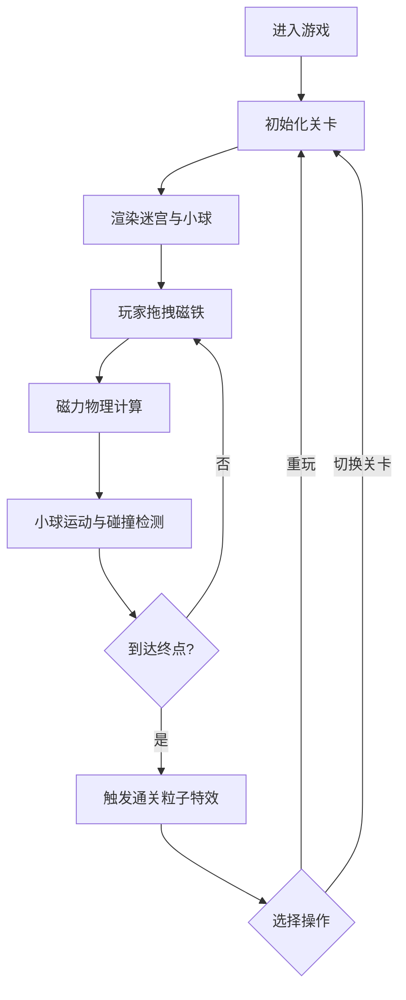

## 1. 产品概述

磁力迷宫是一款基于 Canvas 的物理推演益智游戏，玩家通过拖拽场景中的磁铁引导金属小球穿过障碍抵达终点。游戏融合了磁力物理模拟、碰撞检测与实时渲染技术，为用户提供沉浸式的物理互动体验。

- 核心目标：通过磁力交互引导小球到达终点
- 目标用户：喜欢物理益智游戏的玩家
- 产品价值：提供有趣的物理模拟互动和关卡挑战体验

## 2. 核心功能

### 2.1 功能模块

1. **游戏主场景**：15x15 网格迷宫、墙壁、起点、终点、旋转障碍叶片
2. **物理模拟系统**：磁力计算、小球运动、碰撞检测、边界约束
3. **磁铁交互系统**：磁铁拖拽、力场可视化、N极吸引/S极排斥
4. **UI 覆盖层**：计时器、步数统计、重玩按钮、关卡选择
5. **粒子特效系统**：通关心形粒子特效
6. **关卡系统**：3 个预设关卡切换

### 2.2 页面详情

| 页面名称 | 模块名称 | 功能描述 |
|---------|---------|---------|
| 游戏主界面 | 迷宫渲染 | 15x15 网格，深灰色墙壁圆角绘制，金属银渐变小球 |
| 游戏主界面 | 磁铁系统 | 2个可拖拽磁铁（红N/蓝S），36px圆角正方形，带字母标识 |
| 游戏主界面 | 力场指示 | 磁铁周围80px半径半透明渐变力场圈 |
| 游戏主界面 | 旋转障碍 | 2组旋转叶片（每组3片），匀速旋转，碰撞反弹 |
| 游戏主界面 | 终点区域 | 右下角3x3区域，淡金色闪烁背景 |
| 游戏主界面 | HUD界面 | 左上计时器(00:00)、右上步数统计、底部控制栏 |
| 游戏主界面 | 通关特效 | 20个金色心形粒子从终点扩散，3秒渐隐 |

## 3. 核心流程

玩家进入游戏 → 查看初始迷宫布局和小球位置 → 拖拽红色N极或蓝色S极磁铁 → 观察磁力作用下小球的运动轨迹 → 躲避旋转障碍叶片 → 引导小球进入右下角终点区域 → 触发通关粒子特效 → 选择重玩或切换关卡继续挑战

## 4. 用户界面设计

### 4.1 设计风格
- **主色调**：深色科技感主题，背景 `#1a1a2e`
- **迷宫地面**：`#2d2d44`
- **边框色**：`#6a4c93`（紫色）
- **墙壁色**：`#4a4a4a`（深灰）
- **小球色**：金属银渐变 `#c0c0c0` → `#e0e0e0`
- **磁铁色**：N极红色 `#ff4444`，S极蓝色 `#4444ff`
- **终点色**：淡金色 `#ffd700`（闪烁透明度 0.3~0.6）
- **障碍色**：浅灰色 `#d0d0d0`
- **字体**：等宽无衬线字体，科技感风格

### 4.2 页面设计概览

| 页面名称 | 模块名称 | UI元素 |
|---------|---------|-------|
| 游戏主界面 | 迷宫 | 15x15网格(30px/格)，4px紫色边框，圆角墙壁 |
| 游戏主界面 | 小球 | 直径12px，径向渐变高光，平滑运动过渡 |
| 游戏主界面 | 磁铁 | 36px圆角正方形(8px圆角)，拖拽放大1.1倍+半透明0.8 |
| 游戏主界面 | 力场圈 | 80px半径径向渐变透明，跟随鼠标实时更新 |
| 游戏主界面 | 障碍叶片 | 20x4px矩形，绕中心旋转，角速度0.02rad/帧 |
| 游戏主界面 | HUD | 左上计时器、右上步数、底部居左重玩按钮+居右关卡选择 |
| 游戏主界面 | 特效 | 心形粒子扩散+渐隐，小球磁力平滑过渡(lerp 0.9) |

### 4.3 响应性
- 桌面端全屏 Canvas 渲染
- 鼠标交互：悬停 grab 光标，拖拽 grabbing 光标
- 固定游戏分辨率：450x450px（15格×30px）+ UI 覆盖层

### 4.4 性能要求
- 游戏循环 60FPS
- 物理更新 ≤ 2ms/帧
- Canvas 渲染 ≤ 3ms/帧
- 整体帧率 ≥ 55FPS
