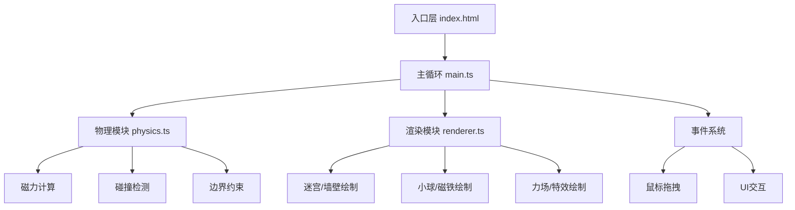

## 1. 架构设计



## 2. 技术描述

- **前端框架**：Vanilla TypeScript（无框架）
- **构建工具**：Vite 5.x
- **渲染引擎**：HTML5 Canvas 2D API（自研，不依赖外部游戏/物理引擎）
- **物理引擎**：自研轻量物理模拟
- **语言规范**：TypeScript 5.x，严格模式，target ES2020，module ESNext

## 3. 文件结构

```
.
├── package.json              # 依赖：typescript, vite；启动脚本
├── vite.config.js            # Vite 基础配置，端口5173，开启HMR
├── tsconfig.json             # TS 严格模式配置
├── index.html                # 入口页面，Canvas 容器 + UI 覆盖层
└── src/
    ├── main.ts               # 游戏主循环、关卡初始化、事件绑定
    ├── physics.ts            # 物理模拟：磁力、碰撞、边界
    └── renderer.ts           # Canvas 渲染：迷宫、小球、磁铁、特效
```

## 4. 核心数据模型

### 4.1 游戏状态类型

```typescript
interface Vector2 { x: number; y: number; }

interface Ball {
  pos: Vector2;
  vel: Vector2;
  radius: number;
}

interface Magnet {
  pos: Vector2;
  type: 'N' | 'S';
  size: number;
  isDragging: boolean;
}

interface Blade {
  center: Vector2;
  angle: number;
  angularVel: number;
  length: number;
  width: number;
}

interface Particle {
  pos: Vector2;
  vel: Vector2;
  life: number;
  maxLife: number;
  size: number;
}

interface Level {
  walls: number[][];        // 15x15 网格，1=墙 0=空
  start: Vector2;           // 起点格坐标
  endArea: { x: number; y: number; w: number; h: number };
  magnets: Magnet[];
  blades: Blade[];
}

interface GameState {
  level: Level;
  ball: Ball;
  magnets: Magnet[];
  blades: Blade[];
  particles: Particle[];
  timer: number;            // 秒
  steps: number;
  isComplete: boolean;
  currentLevel: number;
}
```

## 5. 物理算法说明

### 5.1 磁力计算
```
F = k / d² (最大限制 5px/帧)
N极：力方向指向磁铁（吸引）
S极：力方向背离磁铁（排斥）
速度平滑过渡：vel = lerp(vel, targetVel, 0.9) 每帧
```

### 5.2 碰撞检测
- **墙壁碰撞**：AABB 检测 + 位置回退 + 速度反射
- **叶片碰撞**：线段-圆检测，沿叶片法线反弹（保留80%速度）
- **边界约束**：小球限制在迷宫范围内

### 5.3 关卡数据
3个预设关卡，墙壁布局不同，均为15x15网格。
