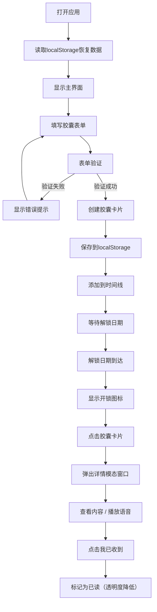

## 1. 产品概述

时间胶囊Web应用是一个让用户在浏览器中记录、封存数字记忆并在未来指定日期自动"解封"展示的在线工具。通过卡片式界面和情感化设计，帮助用户为自己或他人创造跨时空的情感连接与惊喜体验。

- 核心目标：提供直观、易用的数字记忆封存与定时解封体验
- 目标用户：所有希望留存特殊时刻记忆、给未来的自己或他人留下惊喜的用户

## 2. 核心功能

### 2.1 功能模块

1. **创建胶囊面板**：标题、描述、图片URL、语音链接、解锁日期、情绪标签输入与表单验证
2. **胶囊时间线**：按解锁日期升序排列的胶囊卡片列表，支持悬停动效
3. **胶囊详情模态窗口**：展示已解锁胶囊的完整内容，支持标记已读
4. **统计栏**：展示总胶囊数、已解锁数、未解锁数
5. **本地数据持久化**：所有胶囊数据通过localStorage存储与读取

### 2.2 页面详情

| 页面名称 | 模块名称 | 功能描述 |
|---------|---------|---------|
| 主界面 | 创建胶囊面板 | 左侧30%宽度，深灰背景(#2d3436)，包含表单输入与封存按钮 |
| 主界面 | 胶囊时间线 | 右侧70%宽度，浅灰背景(#dfe6e9)，按解锁日期排序展示卡片 |
| 主界面 | 统计栏 | 时间线顶部，展示总胶囊数、已解锁数、未解锁数 |
| 主界面 | 胶囊卡片 | 高120px圆角12px白色卡片，左侧情绪颜色条，锁/开锁图标标识状态 |
| 模态窗口 | 胶囊详情 | 宽600px，深灰背景圆角16px，fadeIn+scale入场动画，backdrop模糊 |

## 3. 核心流程

用户打开应用 → 在左侧面板填写胶囊信息（标题、描述、可选图片/语音链接、解锁日期、情绪标签）→ 点击"封存"按钮（表单验证通过后）→ 胶囊以卡片形式出现在右侧时间线 → 到达解锁日期后卡片显示开锁图标 → 点击已解锁卡片弹出详情模态窗口 → 查看完整内容并点击"我已收到"标记为已读 → 页面刷新后通过localStorage恢复所有数据

## 4. 用户界面设计

### 4.1 设计风格

- **主色调**：深灰(#2d3436)与浅灰(#dfe6e9)双色拼接
- **强调色**：封存按钮绿色(#00b894，按下#00a383)，统计数字蓝色(#0984e3)
- **情绪颜色映射**：快乐#fdcb6e、悲伤#74b9ff、平静#55efc4、愤怒#ff7675、默认#636e72
- **按钮样式**：圆角8px，封存按钮绿色背景白色文字
- **字体**：系统默认无衬线字体
- **布局风格**：左右分栏卡片式布局（30%/70%）
- **图标**：使用Unicode字符 🔒/🔓 表示锁状态

### 4.2 页面设计概述

| 页面名称 | 模块名称 | UI元素 |
|---------|---------|-------|
| 主界面 | 创建胶囊面板 | 深色背景、表单输入框、日期选择器、情绪下拉、绿色封存按钮、错误提示文字 |
| 主界面 | 胶囊时间线 | 浅色背景、统计栏、垂直滚动卡片列表 |
| 主界面 | 胶囊卡片 | 白色圆角卡片、左侧4px情绪颜色条、上下两行文字、锁/开锁图标、悬停放大+阴影动画 |
| 模态窗口 | 胶囊详情 | 深色背景圆角16px、fadeIn+scale入场动画、backdrop模糊、标题24px白色加粗、描述16px灰色、图片居中圆角、语音播放按钮、绿色"我已收到"按钮 |

### 4.3 响应式

- 桌面端优先设计
- 左右分栏固定比例（30%/70%）
- 模态窗口最大高度80vh，内部垂直滚动
