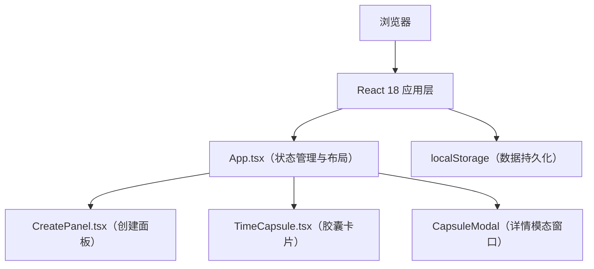

## 1. 架构设计



## 2. 技术描述

- **前端框架**：React 18 + TypeScript
- **构建工具**：Vite
- **初始化方式**：手动配置文件结构（用户指定具体文件组织方式）
- **后端**：无后端，纯前端应用
- **数据存储**：浏览器 localStorage

## 3. 路由定义

本应用为单页面应用，无路由配置。

## 4. 数据模型

### 4.1 胶囊数据结构

```typescript
interface TimeCapsuleData {
  id: string;
  title: string;
  description: string;
  imageUrl?: string;
  audioUrl?: string;
  createdAt: number;
  unlockDate: string;
  emotion: 'happy' | 'sad' | 'calm' | 'angry' | 'default';
  isRead: boolean;
}
```

### 4.2 情绪与颜色映射

```typescript
const emotionColors: Record<TimeCapsuleData['emotion'], string> = {
  happy: '#fdcb6e',
  sad: '#74b9ff',
  calm: '#55efc4',
  angry: '#ff7675',
  default: '#636e72',
};
```

## 5. 文件组织结构

```
e:\solo\VersionFast\tasks\auto159\
├── package.json          # 项目依赖与脚本
├── vite.config.js        # Vite构建配置（端口5173，开启HMR）
├── tsconfig.json         # TypeScript配置（严格模式，ES2020，ESNext模块）
├── index.html            # 入口HTML
└── src/
    ├── main.tsx          # React应用入口
    ├── App.tsx           # 主应用组件
    ├── CreatePanel.tsx   # 创建胶囊面板组件
    └── TimeCapsule.tsx   # 单个胶囊卡片组件
```

## 6. 性能要求

- 所有交互响应时间 ≤ 100ms
- localStorage读写 ≤ 5ms
- 日期选择器和状态切换无卡顿
- CSS动画使用GPU加速属性（transform, opacity）
