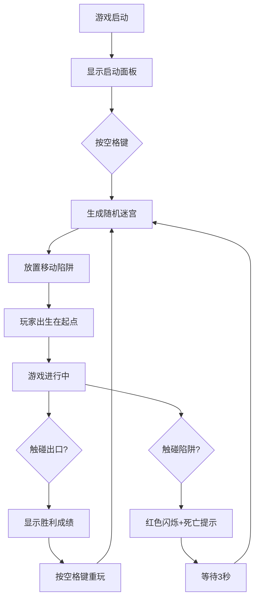

## 1. 产品概述
3D迷宫逃脱游戏是一款基于Web的第一人称解谜游戏，玩家需在随机生成的迷宫中寻找出口，同时躲避移动陷阱。游戏采用暗黑科幻主题，提供沉浸式的探索体验。
- 目标用户：喜欢解谜和探索类游戏的Web玩家
- 核心价值：每次游戏随机生成迷宫，提供无限重玩性；陷阱机制增加紧张刺激感

## 2. 核心功能

### 2.1 用户角色
| 角色 | 注册方式 | 核心权限 |
|------|----------|----------|
| 玩家 | 无需注册 | 进行游戏、查看计时成绩 |

### 2.2 功能模块
1. **主游戏场景**：3D迷宫渲染、玩家视角控制、场景交互
2. **迷宫生成系统**：递归回溯算法生成随机迷宫、出口定位
3. **玩家控制系统**：WASD移动、鼠标视角旋转、碰撞检测
4. **陷阱系统**：随机生成移动/旋转陷阱、碰撞检测、死亡重置
5. **UI界面**：计时器、迷你地图、启动面板、死亡提示、胜利提示

### 2.3 页面详情
| 页面名称 | 模块名称 | 功能描述 |
|----------|----------|----------|
| 游戏主界面 | 3D场景渲染 | 渲染迷宫、玩家、陷阱、出口等3D元素 |
| 游戏主界面 | 启动面板 | 显示"按空格键开始"提示，半透明覆盖层 |
| 游戏主界面 | 计时器 | 左上角显示游戏时间，精确到0.1秒 |
| 游戏主界面 | 迷你地图 | 右下角俯视小地图，显示迷宫布局、玩家、陷阱、出口位置 |
| 游戏主界面 | 准星 | 屏幕中央十字准星 |
| 游戏主界面 | 死亡提示 | 红色闪烁遮罩 + "死亡"文本，3秒后重置 |
| 游戏主界面 | 胜利提示 | 弹出计时成绩对话框 |

## 3. 核心流程
玩家打开页面 → 显示启动面板 → 按空格键开始游戏 → 随机生成迷宫和陷阱 → 玩家WASD移动+鼠标控制视角 → 躲避陷阱寻找出口 → 触碰出口显示胜利成绩 / 触碰陷阱显示死亡并3秒后重置

## 4. 用户界面设计

### 4.1 设计风格
- **主色调**：深灰色背景(#1a1a1a)，暗金色文字描边(#b8860b)，绿色出口(#00ff00)，红色陷阱(#ff0000)，蓝色玩家标记
- **材质风格**：墙壁略带粗糙凹凸纹理，地面浅灰棋盘格，天花板黑色封闭
- **字体**：等宽科幻字体 Orbitron
- **动画效果**：陷阱红色光泽闪烁，出口绿色光晕脉动，死亡时红色遮罩闪现
- **光效**：出口绿色发光，陷阱红色闪烁光泽，UI暗金色描边

### 4.2 页面设计概述
| 页面名称 | 模块名称 | UI元素 |
|----------|----------|--------|
| 游戏主界面 | 3D场景 | 深灰背景，暗金属质感，FPS第一人称视角 |
| 游戏主界面 | 启动面板 | 半透明黑色遮罩，居中显示暗金色"按空格键开始"文字，Orbitron字体 |
| 游戏主界面 | 计时器 | 左上角悬浮，暗金色描边，Orbitron字体，显示X.X秒 |
| 游戏主界面 | 迷你地图 | 右下角150x150像素，白色路径、灰色墙壁、绿色出口、红色陷阱、蓝色玩家点 |
| 游戏主界面 | 准星 | 屏幕中央白色十字线，细小精致 |
| 游戏主界面 | 死亡提示 | 全屏红色半透明遮罩闪烁，居中显示红色"死亡"文字 |
| 游戏主界面 | 胜利提示 | 居中半透明面板，显示"胜利! 用时: X.X秒"，暗金色描边 |

### 4.3 响应式
- 桌面端优先设计，全屏显示
- 自适应窗口大小，3D场景随窗口调整
- 迷你地图固定尺寸150x150像素，不随窗口缩放

### 4.4 3D场景指引
- **环境氛围**：暗黑科幻，深灰背景，封闭空间感
- **光照设置**：环境光+方向光，突出墙壁凹凸纹理，出口和陷阱自发光
- **相机设置**：第一人称视角，玩家高度1.6格，视角FOV 75度，上下旋转限制-60°~+60°
- **构图焦点**：玩家前方迷宫通道，出口绿色光晕作为视觉引导
- **交互动画**：陷阱平移/旋转动画，出口光晕脉动，死亡红色闪烁
- **后处理效果**：轻微泛光，增强科幻感
- **性能预算**：N=21迷宫8个陷阱时保持60FPS以上，迷宫生成时间<500ms
