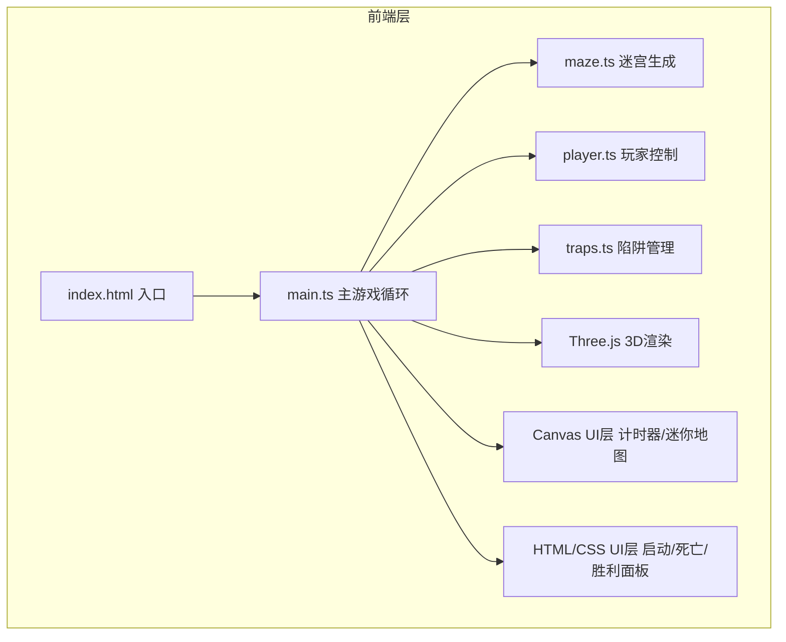

## 1. 架构设计



## 2. 技术说明
- **前端框架**: 原生TypeScript + Three.js，无需React/Vue
- **构建工具**: Vite 5.x (SSR: false)
- **3D引擎**: three@0.160+，@types/three类型定义
- **语言目标**: TypeScript严格模式，target ES2020，module ESNext
- **后端**: 无后端，纯前端游戏

## 3. 文件结构
| 文件路径 | 用途 |
|----------|------|
| /package.json | 依赖配置: three, @types/three, vite, typescript |
| /vite.config.js | Vite基础配置，关闭SSR |
| /tsconfig.json | TS严格模式，ES2020 target |
| /index.html | 全屏入口页面，引用主模块，加载Orbitron字体 |
| /src/main.ts | 游戏入口: 初始化场景/相机/渲染器，游戏主循环，UI管理 |
| /src/maze.ts | 迷宫生成: 递归回溯算法，二维数组输出，墙壁/路径/出口数据 |
| /src/player.ts | 玩家控制: WASD键盘输入，鼠标视角，碰撞检测，位置更新 |
| /src/traps.ts | 陷阱管理: 随机生成平移/旋转陷阱，动画更新，碰撞检测 |

## 4. 模块API定义

### 4.1 maze.ts 迷宫模块
```typescript
export type CellType = 0 | 1; // 0=路径, 1=墙壁

export interface MazeData {
  grid: CellType[][];       // NxN网格
  size: number;             // 网格大小N
  start: { x: number; z: number };  // 起点坐标
  exit: { x: number; z: number };   // 出口坐标
  pathCells: { x: number; z: number }[]; // 所有路径格子列表
}

export function generateMaze(size: number): MazeData;
```

### 4.2 player.ts 玩家模块
```typescript
import * as THREE from 'three';

export interface PlayerConfig {
  radius: number;       // 碰撞半径(格)，默认0.3
  speed: number;        // 移动速度(格/秒)，默认2
  height: number;       // 玩家眼睛高度(格)，默认1.6
  pitchLimit: number;   // 上下视角限制(度)，默认60
}

export class PlayerController {
  constructor(camera: THREE.PerspectiveCamera, config?: Partial<PlayerConfig>);
  public position: THREE.Vector3;
  public setMazeGrid(grid: number[][], cellSize: number): void;
  public update(deltaTime: number): void;
  public reset(x: number, z: number): void;
}
```

### 4.3 traps.ts 陷阱模块
```typescript
import * as THREE from 'three';

export type TrapType = 'translate' | 'rotate';

export interface Trap {
  mesh: THREE.Mesh;
  type: TrapType;
  axis: 'x' | 'z';        // 平移陷阱的移动轴
  basePos: THREE.Vector3; // 基准位置
  range: number;          // 平移范围(格)，默认1
  speed: number;          // 移动速度(格/秒)，默认0.8；旋转速度(度/秒)，默认90
  phase: number;          // 动画相位
}

export class TrapManager {
  constructor(scene: THREE.Scene);
  public traps: Trap[];
  public spawnTraps(pathCells: { x: number; z: number }[], cellSize: number, count: number, startPos: { x: number; z: number }, exitPos: { x: number; z: number }): void;
  public update(deltaTime: number): void;
  public checkCollision(playerPos: THREE.Vector3, playerRadius: number): boolean;
  public clear(): void;
}
```

### 4.4 main.ts 主模块
负责:
- 创建Three.js场景、相机、WebGLRenderer
- 初始化迷宫、玩家、陷阱管理器
- 实现requestAnimationFrame游戏循环
- 管理游戏状态(待机/进行中/死亡/胜利)
- 渲染UI: 计时器(Canvas/DOM)、迷你地图(Canvas)、启动/死亡/胜利面板(DOM)
- 处理全局键盘事件(空格开始/重玩)

## 5. 数据模型

### 5.1 游戏状态
```typescript
type GameState = 'idle' | 'playing' | 'dead' | 'won';
```

### 5.2 迷你地图渲染数据
- 墙壁格子: 灰色填充
- 路径格子: 白色填充
- 出口位置: 绿色方块
- 陷阱位置: 红色方块
- 玩家位置: 蓝色圆点 + 朝向指示

## 6. 性能优化策略
1. **迷宫渲染**: 墙壁使用合并几何体(BufferGeometryUtils.mergeGeometries)减少draw call
2. **碰撞检测**: 使用网格空间哈希，只检测相邻格子的墙壁
3. **陷阱动画**: 使用CPU端矩阵更新，避免不必要的Three.js遍历开销
4. **迷你地图**: 迷宫静态部分只绘制一次到离屏Canvas，动态元素(玩家/陷阱)每帧覆盖
5. **帧率控制**: 固定deltaTime上限防止卡顿穿墙，使用performance.now()高精度计时
