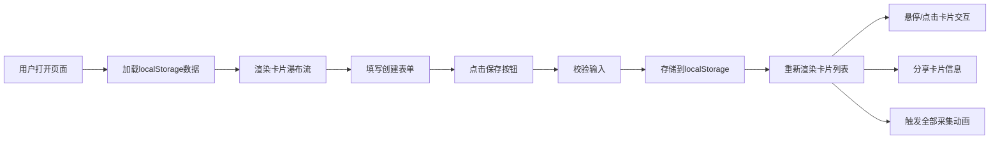

## 1. 产品概述

「气味档案馆」是一个轻量级的数字情感收藏Web应用，让用户通过浏览器创建虚拟气味卡片，记录生活中值得珍藏的嗅觉记忆。每张卡片记录一种气味的文字描述、相关记忆和图片，并随着时间呈现复古老化效果，最终生成可分享的怀旧卡片。

- 核心价值：为用户提供一个独特的数字记忆载体，将无形的气味体验转化为可收藏、可分享的视觉艺术品
- 目标用户：喜欢记录生活、追求情感表达、热爱复古美学的个人用户

## 2. 核心功能

### 2.1 用户角色
| 角色 | 注册方式 | 核心权限 |
|------|----------|----------|
| 普通用户 | 无需注册，浏览器直接使用 | 创建、查看、分享气味卡片 |

### 2.2 功能模块
1. **主页展示区**：复古信纸风格背景，瀑布流卡片网格，时间倒序排列
2. **创建面板**：表单输入（气味名称、记忆文字、图片URL），保存功能
3. **卡片交互**：悬停上浮、点击放大展示、分享复制、实时计时显示
4. **视觉动画**：全部采集动画（收缩消失→旋转弹出）、卡片老化效果
5. **数据持久化**：localStorage存储，最多20张卡片，超出自动删除最旧

### 2.3 页面详情
| 页面名称 | 模块名称 | 功能描述 |
|---------|----------|----------|
| 主页 | 展示区（左侧70%） | 复古信纸背景、瀑布流卡片网格、"全部采集"按钮 |
| 主页 | 创建面板（右侧320px） | 羽毛笔图标标题、三个输入框、保存按钮 |
| 主页 | 卡片组件 | 实时计时器、标题、记忆摘要、圆形图片、分享图标 |
| 主页 | 放大蒙层 | 全屏暗色背景、居中放大卡片、0.3秒ease-out动画 |
| 主页 | Toast提示 | 顶部居中提示、0.3秒淡入、2秒显示、淡出 |

## 3. 核心流程

用户打开应用→在右侧创建面板填写气味信息→点击保存按钮→卡片出现在左侧展示区顶部→悬停查看效果/点击放大查看详情→点击分享图标复制卡片信息→点击"全部采集"按钮触发视觉刷新→关闭/刷新页面后数据保留

## 4. 用户界面设计

### 4.1 设计风格
- **主色调**：暖茶色系列
  - 背景色：#f9f3e3 → #e8dcc8（渐变）
  - 卡片色：#fdf4e3 → #f5e6c0（渐变）
  - 边框/按钮：#c9a96e、#a67c52
  - 文字色：#4a3728（标题）、#6b5b4e（正文）
- **按钮风格**：圆角胶囊形（22px圆角），悬停变色+轻微缩放，点击闪光
- **字体搭配**：
  - 标题：Google Fonts Caveat 手写体
  - 正文：Georgia 衬线体
- **布局风格**：桌面端两栏布局（左70%展示区 + 右320px面板），移动端单栏纵向
- **装饰元素**：纸质边框、横线纹理、磨砂玻璃效果、圆形图片、羽毛笔图标

### 4.2 页面设计概览
| 页面名称 | 模块名称 | UI元素 |
|---------|----------|--------|
| 主页 | 展示区 | 12px纸质边框#c9a96e、细横线纹理背景、瀑布流网格（260px宽卡片）、圆角12px、浅投影、悬停translateY(-4px) |
| 主页 | 创建面板 | 固定宽320px、rgba(255,248,235,0.95)背景、圆角16px、backdrop-filter: blur(8px)、细边框#dcc7a0 |
| 主页 | 卡片 | 创建时间计时器、Caveat手写标题22px粗体#4a3728、两行省略记忆文字14px#6b5b4e、80px圆形图片带6px边框#c9a96e、28px圆形分享图标#dcc7a0 |
| 主页 | "全部采集"按钮 | 圆角8px、背景#c9a96e→#b8945a、白色文字 |
| 主页 | "保存卡片"按钮 | 宽160px高44px、圆角22px、背景#a67c52→#8b5e3c、hover缩放1.02、点击闪#d4a373 |

### 4.3 响应式设计
- **桌面端（≥768px）**：左右两栏布局，左70%展示区 + 右320px固定创建面板
- **移动端（<768px）**：单栏纵向布局，卡片宽度100%（最大380px），创建面板固定在底部高度自适应
- **触摸优化**：增大点击区域，移除hover依赖，触摸反馈明显

### 4.4 动画与性能
- **过渡效果**：所有交互统一0.3秒ease过渡
- **卡片弹出**：1.5秒总时长，0.2秒间隔依次消失（透明+缩放0.5）→ 从中心旋转弹出（-5°~5°随机）
- **放大展示**：0.3秒ease-out居中放大动画
- **Toast提示**：0.3秒淡入，2秒显示，淡出
- **性能要求**：50张卡片滚动≥45fps，动画保持60fps流畅
