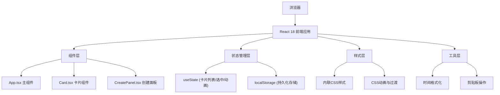
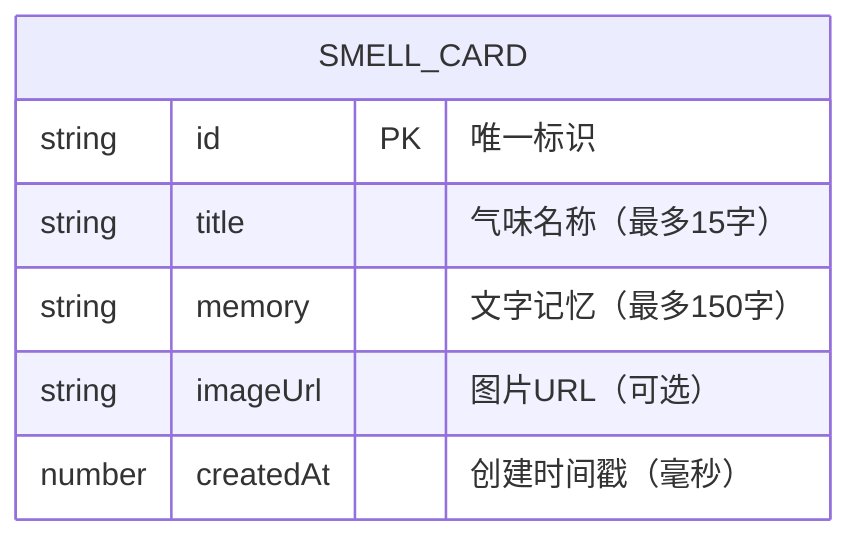

## 1. 架构设计



## 2. 技术说明

- **前端框架**：React 18 + TypeScript
- **构建工具**：Vite 5
- **开发语言**：TypeScript（严格模式，target ES2020，module ESNext）
- **数据存储**：浏览器 localStorage（无后端，纯前端应用）
- **字体资源**：Google Fonts（Caveat手写体 + Georgia衬线体）
- **图标方案**：内联SVG（羽毛笔、分享链接链图标）

## 3. 路由定义
| 路由 | 用途 |
|-----|------|
| / | 主页，包含展示区和创建面板 |

本应用为单页面应用，无多路由需求。

## 4. 数据模型

### 4.1 数据模型定义



### 4.2 TypeScript 类型定义

```typescript
interface SmellCard {
  id: string;
  title: string;
  memory: string;
  imageUrl?: string;
  createdAt: number;
}
```

### 4.3 localStorage 存储方案
- **存储Key**：`smell-archive-cards`
- **数据格式**：JSON序列化的SmellCard数组
- **容量限制**：最多20张卡片，超出时自动删除`createdAt`最小的记录
- **读写时机**：应用启动时读取，每次增删时同步写入
